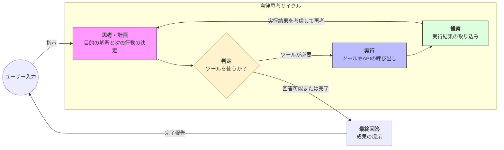

Strands SDKにおける**エージェント・ループ（Agent Loop）** は、エージェントが自律的にタスクを完了させるための「思考のサイクル」を定義する中心的な概念です。

# 概要

エージェント・ループとは、ユーザーの最終目的に到達するまで、エージェントが「思考・計画（Plan）」→「ツール実行（Action）」→「結果の観察（Observation）」というステップを自律的に繰り返すプロセスのことです。これにより、一度の推論では解決できない複雑な問題に対しても、試行錯誤しながら正解に辿り着くことができます。

- **エントリーフェーズ**: ユーザーが「〜をやって」という抽象的な指示を投入し、ループが開始されます。

- **思考フェーズ（Plan）**: エージェントが現状を分析し、最終目標に到達するために今何を行うべきか（どのツールを使い、どのパラメータを渡すか）を計画します。

- **分岐フェーズ（Decision）**: 「外部情報の取得が必要か」または「すでに回答可能か」を判断します。

- **実行・観察フェーズ（Action & Observation）**: ツールを呼び出して外部からデータを得たり処理を行ったりし、その結果（事実）を新しい情報として自身のコンテキストに追加します。

- **フィードバックループ**: 観察された事実を元に、再び思考（Plan）に戻ります。解決するまでこのサイクルを回し続けます。

- **アウトプットフェーズ**: すべての情報が揃い、目標が達成されたと判断した時点でループを抜け、最終成果物を提示します。

# 実装のポイント

- **自律的なオーケストレーション**: 開発者が「if文」を連ねて条件分岐を書く必要はなく、エージェントが「自分の知らないこと」をツールで補完する流れを自動的に制御します。

- **最大反復数（Max Iterations）の設定**: 無限ループを避け、APIコストを制御するために、1つのリクエストに対してループを回す最大回数を制限することが重要です。

- **途中経過の可視化**: ループの各ステップ（思考内容やツールの戻り値）をログとして追跡することで、複雑な推論プロセスのデバッグや透明性の確保が可能になります。

# まとめ

エージェント・ループは、AIを単なる「チャットボット」から「自律的な作業遂行者」へと変えるための心臓部です。このループ構造により、Strands Agentsは不確実な環境下でも自ら判断し、適切な道具を使いこなしながら、ユーザーの期待するゴールへと確実に突き進みます。