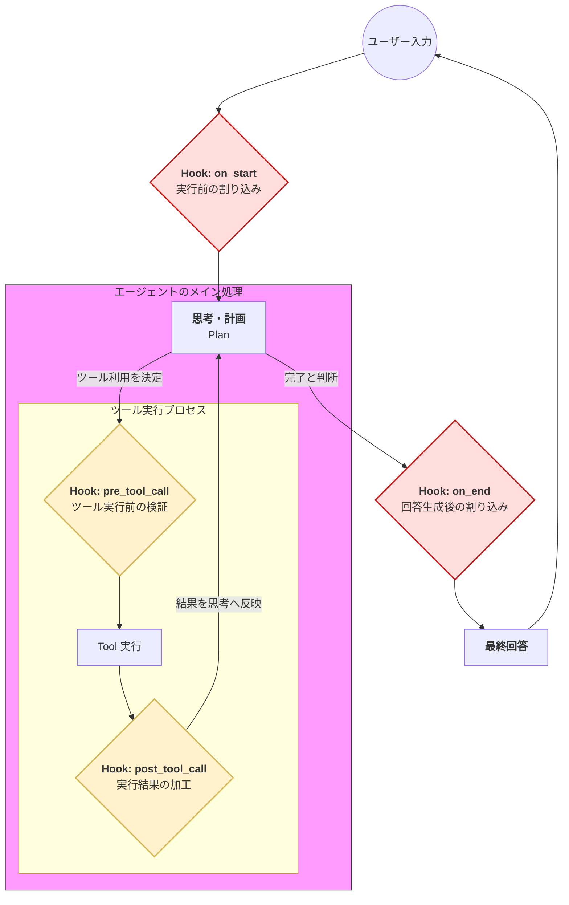

Strands SDKにおける**フック（Hooks）** は、エージェントの実行プロセスの特定のタイミングに独自の処理を割り込ませるための拡張メカニズムです。

# 概要

フックとは、エージェントの思考や実行のライフサイクル（開始直後、ツール呼び出し前、回答生成後など）に、ユーザーが定義したカスタムロジックを注入する機能です。これにより、ログの記録、データの加工、外部システムへの通知、あるいは特定の条件下での実行遮断などを、メインの推論ロジックを汚さずに実装できます。

- **Hook: on_start (開始フック)**: エージェントが動き出す一番最初のポイントです。入力内容の検閲（ガードレール）や、実行に必要なコンテキストの最終調整などに利用します。

- **Hook: pre_tool_call (ツール実行前フック)**: エージェントが「ツールを使おう」とした瞬間に割り込みます。ツールの引数が正しいかチェックしたり、高リスクな操作（削除など）に「人間の承認」を挟むのに適しています。

- **Hook: post_tool_call (ツール実行後フック)**: ツールが結果を返してきた直後に割り込みます。膨大なAPIレスポンスをエージェントが読みやすいように要約したり、エラー内容を分かりやすく翻訳したりする場合に有効です。

- **Hook: on_end (終了フック)**: エージェントが回答を作り終えた直後のポイントです。最終的な回答を外部のDBに記録したり、Slackなどの通知ツールへ連携したりする際に使用します。

# 実装のポイント

- **関心事の分離 (Separation of Concerns)**: エージェント本体のプロンプトをシンプルに保ちつつ、ログ出力や監査などの「運用に必要な処理」をフック側に分離できます。

- **ガードレールとしての活用**: `pre_tool_call` を使って、特定の高リスクな操作（例：本番DBへの書き込み）が行われそうになった際、人間の承認を求めるステップを挿入することが可能です。

- **データの正規化**: `post_tool_call` を利用して、外部APIから返ってきた冗長なデータをエージェントが理解しやすい形に圧縮・加工してから渡すことができます。

# まとめ

フック（Hooks）は、Strandsエージェントを「制御可能なシステム」へと昇華させるための重要なツールです。この機能があることで、AIの自由な推論を尊重しつつも、エンタープライズレベルの監視、セキュリティ、およびシステム連携を柔軟かつ堅牢に実装できるようになります。