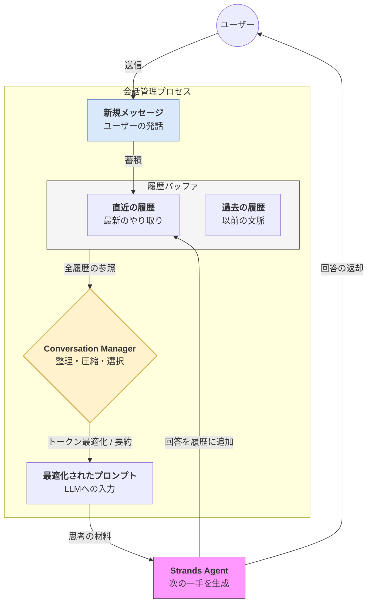

Strands SDKにおける**会話管理（Conversation Management）** は、AIとユーザーのやり取りを単なる一問一答ではなく、文脈を維持した継続的な「対話」として制御するための仕組みです。

# 概要

会話管理とは、過去のメッセージ履歴をどのように保持・整理し、LLMの限られた記憶容量（コンテキストウィンドウ）に最適化して受け渡すかを制御するプロセスです。Strandsでは、履歴の保存だけでなく、トークン制限を超えないための要約や、古いメッセージの削除、特定のトピックへのフォーカスなどを自動的または明示的に管理します。

- **メッセージの蓄積**: ユーザーの入力とエージェントの回答が「履歴（Recent/Archive）」として自動的に State へ保存されます。

- **履歴バッファ**: 会話が長くなると履歴が膨大になるため、どの範囲を「現在の文脈」として保持するかを管理します。

- **最適化プロセス（Manager）**: LLMの最大トークン数に収まるよう、古い会話を削除したり、過去の流れを短い要約に変換したりして、プロンプトの「鮮度」と「密度」を調整します。

- **コンテキストの提供**: 整理された「最適化されたプロンプト」をエージェントに渡すことで、AIは常に「今、何の話をしているか」を正確に把握できます。

- **ループバック**: 生成された回答もまた履歴の一部となり、次のターンの文脈を形成します。

# 実装のポイント

- **自動履歴管理**: デフォルトで直近の対話がプロンプトに含まれるため、開発者は手動でメッセージをリスト化して連結するコードを書く必要がありません。

- **履歴の明示的クリア**: ユーザーが「話題を変えたい」と言った場合や、セッションをリセットしたい場合に、特定の履歴を削除してコンテキストをクリーンに保つことができます。

- **情報の重み付け**: 重要な情報（ユーザーの属性など）は `State` の変数として永続化し、移ろいやすい会話の流れ（History）とは別に管理することで、長期的な一貫性を確保します。

# まとめ

会話管理は、エージェントが「話が通じる相手」であり続けるための重要な機能です。Strands SDK が裏側で履歴の整理を担うことで、開発者は複雑なトークン管理のロジックに悩まされることなく、ユーザーとの自然で深いコミュニケーションの設計に集中できます。
