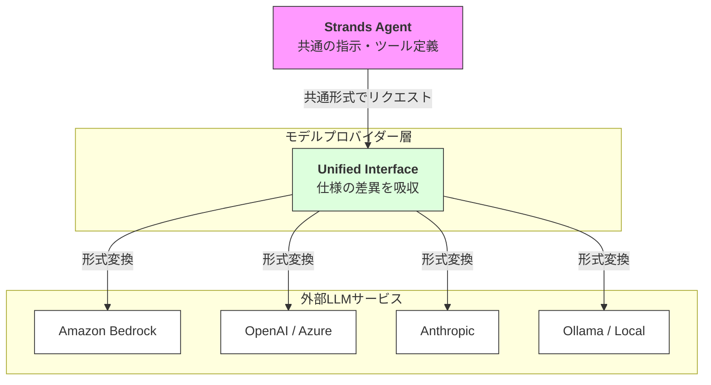

# 概要

**モデルプロバイダー**とは、各AIベンダー（OpenAI, Anthropic, Googleなど）が提供する独自のAPI仕様をStrands SDKが吸収し、**統一された方法で操作できるようにする抽象化レイヤー**です。

通常、モデルごとにツール呼び出し（Tool Calling）やメッセージの形式が異なりますが、プロバイダー層がこれらを変換するため、開発者はモデルを切り替えてもコードの大部分を書き換える必要がありません。

### サポートしているモデルプロバイダーのリンク一覧

Strandsは、エンタープライズ向けからローカル環境向けまで、幅広くサポートしています。

- **[Amazon Bedrock](https://strandsagents.com/latest/documentation/docs/user-guide/concepts/model-providers/amazon-bedrock/)**（AWS環境でClaudeやLlamaを活用）

- **[Anthropic](https://strandsagents.com/latest/documentation/docs/user-guide/concepts/model-providers/anthropic/)**（Claude 3.5 Sonnetなど）

- **[OpenAI](https://strandsagents.com/latest/documentation/docs/user-guide/concepts/model-providers/openai/)**（GPT-4o / GPT-4o mini）

- **[Azure OpenAI](https://www.google.com/search?q=https://strandsagents.com/latest/documentation/docs/user-guide/concepts/model-providers/azure-openai/)**（Microsoft Azure環境）

- **[Google Vertex AI](https://www.google.com/search?q=https://strandsagents.com/latest/documentation/docs/user-guide/concepts/model-providers/google-vertex-ai/)**（Geminiシリーズ）

- **[Mistral AI](https://www.google.com/search?q=https://strandsagents.com/latest/documentation/docs/user-guide/concepts/model-providers/mistral-ai/)**（Mistral Large 2など）

- **[Ollama](https://strandsagents.com/latest/documentation/docs/user-guide/concepts/model-providers/ollama/)**（ローカルPCでの実行）

- **[Groq](https://www.google.com/search?q=https://strandsagents.com/latest/documentation/docs/user-guide/concepts/model-providers/groq/)**（LPUによる超高速推論）

- **[Cohere](https://strandsagents.com/latest/documentation/docs/user-guide/concepts/model-providers/cohere/)**（Command R+など）

さらに詳しいことは、本系を参照してください。
[https://strandsagents.com/latest/documentation/docs/user-guide/concepts/model-providers/](https://strandsagents.com/latest/documentation/docs/user-guide/concepts/model-providers/)

# 実装のポイント

- **ベンダーロックインの回避**: モデルプロバイダーを介することで、ビジネスの要件やコスト、性能に応じて、数行の修正で接続先モデルを変更できます。

- **一貫した機能提供**: 本来モデルによって得意不得意がある「ツール実行（Tool Use）」や「構造化出力（Structured Output）」を、SDK側で最適な形に橋渡しします。

- **多言語サポート**: **Python** と **TypeScript** の両方のSDKで、これらすべての主要プロバイダーがサポートされています。

# まとめ

モデルプロバイダーは、エージェント開発における「柔軟性」と「安定性」を支える基盤です。Strands SDKを活用することで、クラウド上の最強モデルからローカルのプライベートモデルまで、同じ開発体験でシームレスに使い分けることが可能になります。
