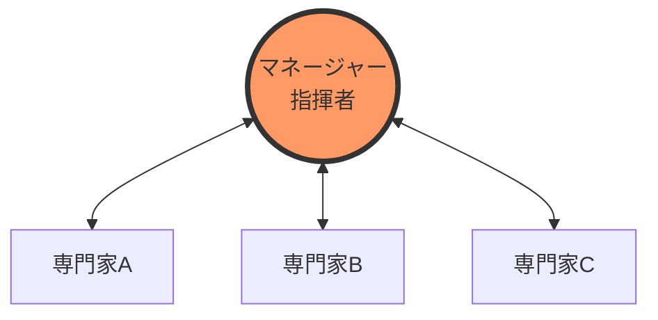
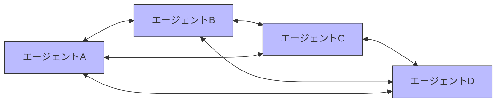
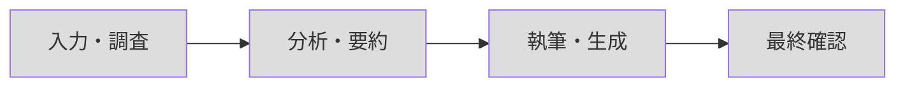
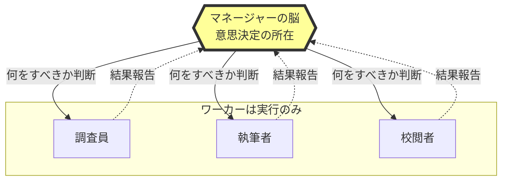
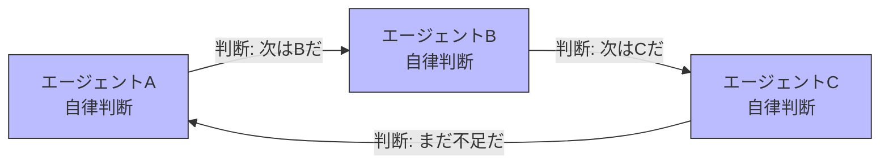
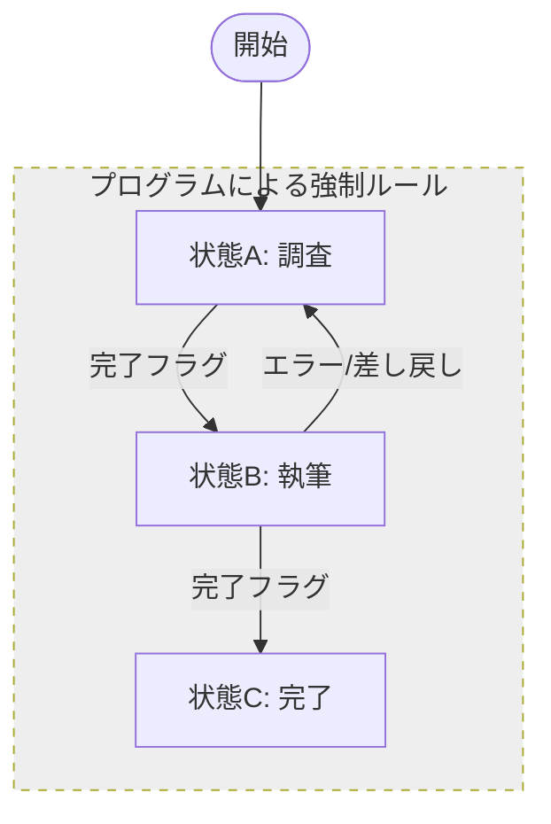
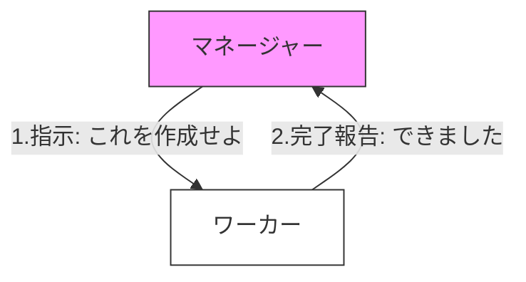
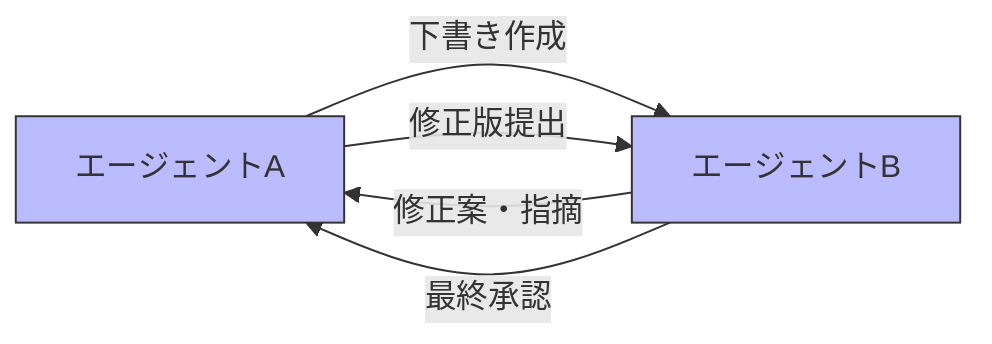
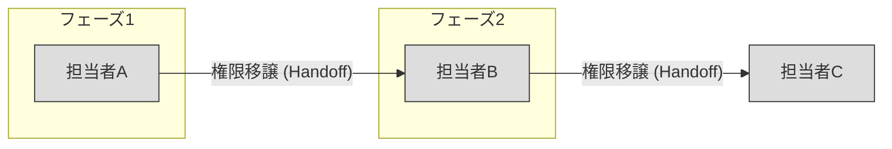

ここでは、Strandsの公式ドキュメント『[010-050-030.マルチエージェントパターン](010-050-030.マルチエージェントパターン.md)』に触発され、もう少し踏み込んで調査・考察を進めてみました。

# 制御構造の視点：トポロジー（Topology）

「誰が誰とつながり、どう命令が流れるか」という**ネットワークの形**で分類する考え方です。

### ハブ・アンド・スポーク（Hub-and-Spoke）

中心のマネージャーが全権を握り、各専門家へ指示を飛ばす「オーケストレーション/階層型」のモデルです。

###  メッシュ（Mesh）

中央の指揮者がおらず、各エージェントが自律的に判断して次へバトンを渡す「Swarm/コレオグラフィ」のモデルです。

### パイプライン（Pipeline / Linear Chain）

柔軟な判断を介さず、決まった手順でデータが一方通行に流れる「逐次処理」のモデルです。

### まとめと活用シーン

| **トポロジー**       | **向いているタスク**            | **制御の難易度**           |
| --------------- | ----------------------- | -------------------- |
| **ハブ・アンド・スポーク** | 複雑な品質管理が必要なビジネス文書作成など   | **低〜中** (中央で管理しやすい)  |
| **メッシュ**        | 多角的な視点が必要な自律的な討論・アイデア出し | **高** (無限ループに注意が必要)  |
| **パイプライン**      | 定型的なデータ変換や、ステップが明確な定型業務 | **極めて低** (堅牢で予測しやすい) |

# 権限委譲の視点：コントロール・プレーン（Control Plane）

### セントラル（Centralized Control）

中心のマネージャーが常に「全体像」を把握し、個々のワーカーに指示を出します。ワーカーは自分が全体のどの位置にいるかを知る必要がありません。

### ディストリビューテッド（Distributed / Peer-to-Peer）

各エージェントが「知性」を持ち、自分の仕事が終わった時点で「次は誰が適任か」を自分で判断して権限を譲渡（ハンドオフ）します。

### ステートマシン（State Machine）

AIの判断ではなく、**プログラムのコード（if文や遷移定義）**　によって「Aの次はB」と厳格に決まっています。AIは決められた枠組みの中でのみ思考します。

### 特徴の比較

|**概念**|**意思決定の場所**|**メリット**|**デメリット**|
|---|---|---|---|
|**セントラル**|特定の親Agent|管理が容易、一貫性が高い|親Agentの負荷が高い|
|**ディストリビュート**|各Agentの推論|柔軟、予期せぬ事態に強い|迷走（ループ）のリスクがある|
|**ステートマシン**|コード(固定ルール)|確実、100%予測可能|柔軟性がなく、想定外に弱い|

# 協調モデルの視点：インタラクション・デザイン（Interaction Design）

### デリゲーション（Delegation: 委託）

上位のエージェントが下位のエージェントにタスクを「投げる」スタイルです。指示は一方通行に近く、受け手は完了報告のみを返します。

### コラボレーション（Collaboration: 共同）

複数のエージェントが対等、あるいは密接にやり取りを重ね、成果物を練り上げていくスタイルです。何度も往復するフィードバックループが特徴です。

###  ハンドオフ（Handoff: 移譲）

「ここまでは自分の仕事、ここからは君の仕事」と、権限とコンテキストを完全に次の担当者へ引き継ぐスタイルです。リレーのように、バトンが渡った後は前の担当者は関与しません。

### コミュニケーションの性質比較

|**概念**|**関係性**|**主な目的**|**Strandsでの実装例**|
|---|---|---|---|
|**デリゲーション**|主従関係|効率的なタスク処理|`manager` が `writer` ツールを呼ぶ|
|**コラボレーション**|パートナー|品質の向上・多角化|`editor` と `writer` の修正ループ|
|**ハンドオフ**|リレー形式|専門性の切り替え|`Swarm` パターンの `transfer_to_...`|
