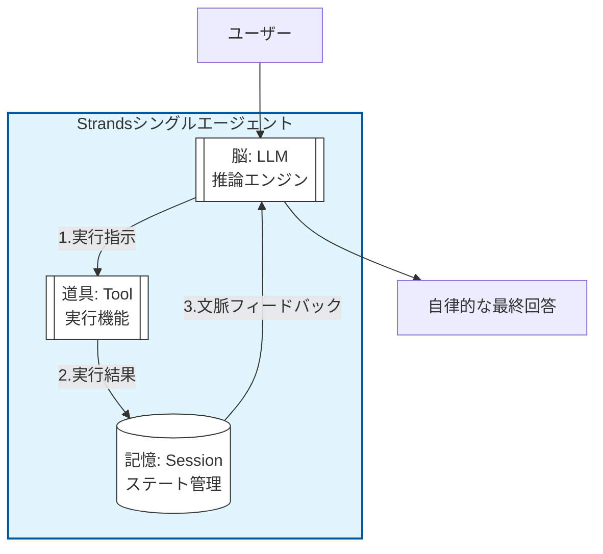
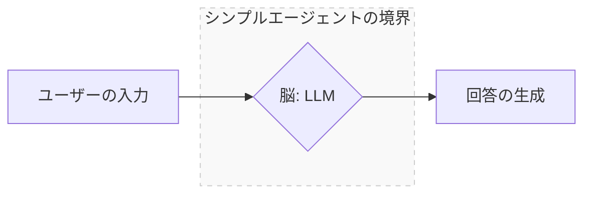

# Strandsにおけるシングルエージェントの定義

本書では、単なるAPI呼び出しを「シンプルエージェント」と呼び、実務的な「シングルエージェント」とは厳格に区別しています。マルチエージェント・システムを構成する最小の自律ユニット（＝シングルエージェント）であるためには、**「脳（LLM）」「道具（Tool）」「記憶（Session）」**　の3大要素が不可欠であるからです。

- 脳（LLM）: 外部からの入力を解析し、次のアクションを決定する「推論エンジン」

- 道具（Tool）: 定義されたインターフェースを介し、外部システムを操作する「実行機能」

- 記憶（Session/State）: 実行結果を保持し、次ステップの入力へフィードバックする「ステート管理」

これらが揃って初めて、エージェントは単一の「命令（Prompt）」をこなすだけの存在から、目標達成まで自律的に試行錯誤を繰り返す「ループ（Loop）」へと進化します。

マルチエージェント・デザインにおいて、個々の構成要素がこの3要素を欠いている場合、全体を制御するオーケストレーター側で全ての微細なエラー処理や状態保持までを担わなければならず、システムの複雑性が爆発的に増加します。

### シングルエージェント

各エージェントが3大要素を備えた **「完結した自律ユニット」** として確立されているからこそ、疎結合で堅牢なマルチエージェント・システムが実現可能になります。

- 特徴: 「記憶」を介したフィードバックループ。

- 利点: 道具を使った結果を自分で評価し、次の行動を修正できる。この「自己完結性」があるからこそ、マルチエージェントにおける信頼性の高い「部品」として機能する。

>代表的なシングルエージェントの例：『[900-010-020.シングルエージェント（レシピボット）](../900.サンプルコード/900-010-020.シングルエージェント（レシピボット）.md)』

### シンプルエージェント

本書では、以下に示すような「単なるAPI呼び出し」のみで完結する構造を「シンプルエージェント」と定義しています。これは、Strandsが提唱する「マルチエージェントを構成するための最小単位（シングルエージェント）」とは明確に区別される概念です。

- 特徴：一問一答のステートレス構造 入力に対して出力を即座に返す、一過性の処理に特化しています。

- 課題：自律性と連続性の欠如 自身の実行結果を振り返る「記憶（Session）」や、外部環境へ働きかける「手足（Tool）」を持たないため、複雑なタスクの遂行中に出力の一貫性が失われたり、本来の目的を見失ったりしやすいという限界があります。

