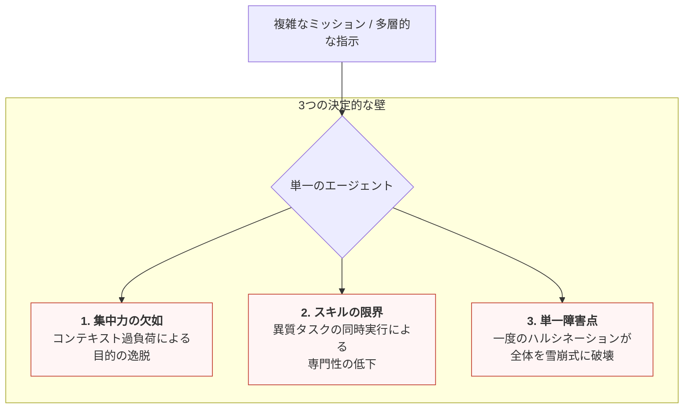
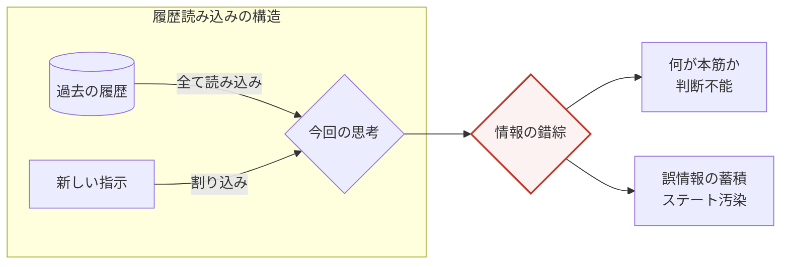

# シングルエージェントが抱える構造的な限界

一人のエージェントに複雑なミッションの全てを委ねる設計は、実務運用において三つの決定的な「壁」に突き当たります。

1. 集中力の欠如（コンテキスト・オーバーロード） AIの処理能力には限界があります。入力される情報量が増え、指示が多層的になると、エージェントは文脈を維持できず、優先すべき目的を見失います。これは情報の「重み」を正しく判定できなくなる構造的な欠陥です。

2. スキルの限界（専門性の不足） 単一の思考プロセスで、リサーチ、計算、コード実行といった異質なタスクを同時にこなそうとすると、処理の精度が著しく低下します。一人の人間に万能を求めることが不可能なように、AIもまた、特定のタスクに特化しなければ専門的な品質を維持できません。

3. 単一障害点（連鎖的崩壊） 最も深刻なのが、一度のミスが全体に波及する「全崩壊」のリスクです。工程の途中で一度でもハルシネーション（もっともらしい嘘）が混じると、エージェントはその誤情報を「事実」としてステートに蓄積し、以降の全工程が誤った前提の上に積み上がってしまいます。

### 実務運用において三つの決定的な「壁」

### 構造的な問題

これらの課題の根底には、生成AIとのコミュニケーションの仕組みがあります。AIは本質的に「前回の自分」を自律的に記憶しているわけではありません。履歴を全て読み込ませることで文脈を作りますが、その履歴内で複数の話題や指示が錯綜すると、AIは本筋を識別する力を失ってしまいます。

このようなシングルエージェントの構造的な限界を克服するために考案された概念がマルチエージェントです。
