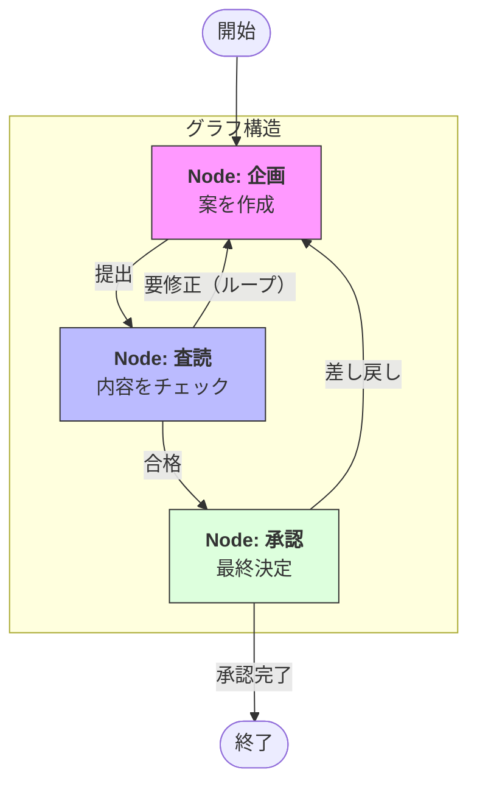

Strands SDKにおける**Graph（グラフ）** は、エージェントや処理ステップを「ノード（点）」、それらの遷移条件を「エッジ（線）」として定義し、複雑な制御フローを地図のように構造化するマルチエージェント・パターンです。

# 概要

Graph（グラフ）とは、ステートマシン（状態遷移）の考え方をマルチエージェントに応用したものです。自由度の高いSwarm（スウォーム）とは対照的に、**「どの状態から、どの条件で、どのエージェントへ移るか」を明示的に定義** します。

これにより、複雑な条件分岐、エラー時のリトライ（ループ）、特定のステップへの強制的な戻りといった、高度なビジネスロジックを堅牢に実装できます。

- **Node（ノード）**: 具体的な作業単位です。単一のエージェントであることもあれば、特定のPython関数であることもあります。

- **Edge（エッジ/遷移）**: ノード間の移動経路です。エージェントの出力結果や特定の変数条件（State）に基づいて、次に進むべきノードを決定します。

- **Conditional Edge（条件付き遷移）**: 「もし内容が不十分なら企画ノードに戻る、十分なら承認ノードに進む」といった分岐ロジックを担当します。

- **Cycle（サイクル/ループ）**: グラフ形式の最大の特徴であり、目標が達成されるまで特定の工程を繰り返す（リトライする）構造を容易に作れます。

# 実装のポイント

- **状態の共有（Shared State）**: グラフ内を移動する際、すべてのノードが同じ `State` オブジェクトにアクセスします。これにより、前段のノードで作成したデータを後段のノードが正確に受け継ぐことができます。

- **コンパイルと検証**: グラフを定義した後、実行前に「行き止まりがないか」「不正な遷移がないか」をシステム的に検証できるため、複雑なロジックでもバグを未然に防げます。

- **人間の介入（Human-in-the-loop）**: 特定のノードで「人間の承認を待つ」という状態（中断と再開）を作りやすく、AIと人間が協力するワークフローの構築に適しています。

- **可視化**: グラフ構造は視覚的に理解しやすいため、開発者間での要件定義や、エージェントが現在どのプロセスにいるかのトラッキングが容易になります。

# まとめ

Graph（グラフ）パターンは、マルチエージェント・オーケストレーションにおいて**最も高度で厳格な制御**を可能にします。予測不可能な動きを制限し、決められたルールや品質基準（ガードレール）に沿ってエージェントを動かしたいエンタープライズ用途において、このパターンは不可欠な選択肢となります。
