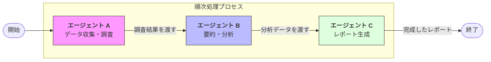

Strands SDKにおける**Workflow（ワークフロー）** は、あらかじめ定義された固定の順序に従ってタスクを処理していく、マルチエージェント連携の中で最も「確実性」と「再現性」が高いパターンです。

# 概要

Workflow（ワークフロー）とは、一連のステップを一直線のパイプラインとして定義し、各ステップを担当するエージェントが順番にタスクをこなしていく仕組みです。

自由度の高い「Swarm」や、複雑な分岐を持つ「Graph」とは異なり、**「Aが終わったら必ずBを行う」といった定型的なプロセス**を自動化するのに適しています。エージェント間のデータの受け渡しがルール化されているため、実行結果が安定しやすく、品質管理が容易なのが特徴です。

- **開始 (Start)**: ユーザーからのリクエストを受け取り、最初のステップへと投入します。

- **順次実行 (Sequential Execution)**: エージェントAが仕事を終えると、その出力が自動的にエージェントBの入力として渡されます。このようにバトンを繋ぐことで、大規模なタスクを分業化します。

- **データの継承**: 各ステップを通過するごとに、成果物が `State` に蓄積されていきます。後半のエージェントは、前半のすべての工程の結果を参照しながら作業ができます。

- **終了 (End)**: すべてのステップが完了した時点で、最終的な成果物がユーザーに返されます。

# 実装のポイント

- **決定論的なプロセス**: 「次は何をするか」をAIに考えさせるのではなく、開発者がルートを固定するため、意図しない挙動（たらい回しなど）が発生しません。

- **各ステップの専門化**: 1つの大きなプロンプトを書く代わりに、各ステップのエージェントに「収集だけ」「要約だけ」といった小さな、専門的な役割を与えることで、回答精度が飛躍的に向上します。

- **エラーハンドリングの容易さ**: どのステップで失敗したかが明確なため、特定の工程だけをデバッグしたり、パラメータを調整したりすることが簡単です。

- **入力・出力の型定義**: 構造化出力（Structured Output）と組み合わせることで、ステップ間で渡されるデータの整合性を厳密に保つことができます。

# まとめ

Workflow（ワークフロー）パターンは、**「手順が決まっている業務」をAIでスケールさせるための最短ルート**です。記事作成、市場調査レポートの自動生成、コードレビューのパイプラインなど、決まった成果物を安定して生み出す必要があるユースケースで最も力を発揮します。

