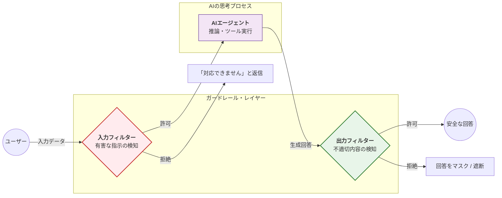

Strands SDKにおける**ガードレール（Guardrails）** は、AIエージェントの入出力に対してリアルタイムでフィルタリングを行い、安全性を確保するための重要な制御レイヤーです。

# 概要

ガードレールとは、LLM（大規模言語モデル）の推論プロセスの前後に配置される「安全装置」です。不適切なプロンプト、有害なコンテンツ、情報の漏洩、あるいは特定のトピック（競合他社や政治、投資アドバイスなど）への言及を自動的に検知・遮断します。Strandsでは、Amazon Bedrock Guardrailsなどのクラウドサービスとネイティブに統合されており、最小限のコードで堅牢なセキュリティを実装できます。

- **入力フィルター (Input Filter)**: ユーザーからのメッセージがLLMに届く前にスキャンします。プロンプトインジェクション（指示の書き換え）や、禁止されたトピックの質問をここで食い止めます。

- **AIエージェント (Processing)**: フィルターを通過したクリーンな入力に対してのみ、AIが思考し回答を作成します。

- **出力フィルター (Output Filter)**: AIが作成した回答をユーザーに見せる前に再スキャンします。ハルシネーション（嘘）による不適切なアドバイスや、機密情報の漏洩が含まれていないかを確認します。

- **拒絶時のアクション**: 基準に違反した場合は、処理を即座に中断し、あらかじめ設定された定型文（例：「その質問にはお答えできません」）を返します。

# 実装のポイント

- **二段構えの検証**: 入力（Input）と出力（Output）の両方にガードレールを適用することで、悪意あるユーザーと、予測不能なAIの挙動の両方からシステムを守ります。

- **トピック管理**: 「金融アドバイスはしない」「自社製品以外の比較はしない」といった具体的なビジネスルールをガードレールに定義し、エージェントの専門性を逸脱させないようにします。

- **しきい値の調整**: 検知の感度（Confidence Score）を調整することで、過度な制限（誤検知）と安全性のバランスを最適化します。

- **ストリーミング対応**: Strandsはストリーミング回答中であってもリアルタイムでガードレールを適用できるため、安全性を保ちながらUX（応答性）を損なうことがありません。

# まとめ

ガードレールは、AIエージェントをビジネス現場で「独り立ち」させるための必須機能です。

プロンプトエンジニアリング（指示出し）だけでは防ぎきれない予期せぬ挙動を、システム的な「外枠」で物理的に封じ込めます。これにより、法規制の遵守やブランドイメージの保護を自動化し、安全かつ信頼性の高いAI体験を提供することが可能になります。

