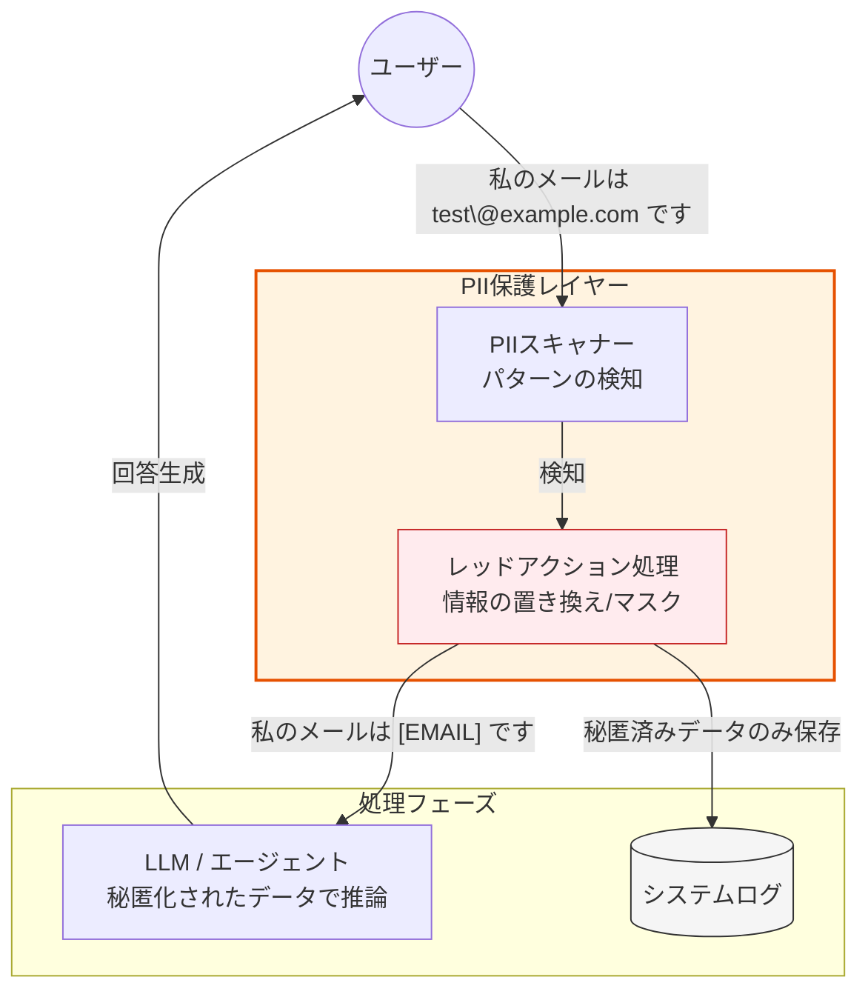

Strands SDKにおける**PII Redaction（個人識別情報の秘匿化）** は、ユーザーのプライバシーを保護し、機密データがLLM（大規模言語モデル）に送信されたり、ログに記録されたりすることを防ぐための強力なセキュリティ機能です。

# 概要

PII Redactionとは、テキストに含まれる氏名、住所、電話番号、クレジットカード番号、メールアドレスなどの**個人識別情報（PII: Personally Identifiable Information）** を自動的に検出し、マスク処理（例：`[EMAIL]` や `[PHONE_NUMBER]` への置き換え）を行う仕組みです。これにより、データ漏洩のリスクを最小限に抑えつつ、AIエージェントの利便性を維持することができます。

- **ユーザー入力**: 意図的、あるいは無意識に個人情報が含まれたメッセージが送信されます。

- **PIIスキャナー**: 自然言語処理（NLP）や正規表現を用いて、テキスト内から機密情報のパターンをリアルタイムで特定します。

- **レッドアクション（秘匿化）処理**: 特定された情報を意味のあるラベル（`[CITY]`, `[SSN]` など）に置き換えます。これにより、情報の種類をAIに伝えつつ、具体的な値は隠蔽します。

- **LLM / システムログ**: LLMには具体的な個人情報が渡らないため、学習データへの混入を防げます。また、開発者が確認するログにも秘匿化後のデータが残るため、運用時の安全性が担保されます。

# 実装のポイント

- **双方向の処理**: ユーザーからの入力だけでなく、LLMが誤って内部情報を出力してしまった場合（出力側）にもレッドアクションを適用し、ユーザーへの漏洩を防ぎます。

- **ラベルの保持**: 単に「XXXX」と隠すのではなく、`[ADDRESS]` のように情報の「型」を残すことで、LLMはそれが住所であることを理解したまま、適切な文脈で回答を生成できます。

- **コンプライアンスの遵守**: GDPR、CCPA、個人情報保護法などの規制に対応するための技術的対策として非常に有効です。

- **エンティティのカスタマイズ**: 標準的な項目（氏名、電話番号）以外にも、業界固有の識別子（会員番号、注文IDなど）をカスタムパターンとして登録し、秘匿対象に加えることができます。

# まとめ

PII Redactionは、AIエージェントの「安全な目隠し」です。

この機能を有効にすることで、開発者はユーザーのプライバシーを最優先に考えた設計（Privacy by Design）を容易に実現できます。「AIに機密情報を渡したくない」という企業のセキュリティ要件を満たしながら、高度なAI活用を推進するための不可欠なパーツと言えます。
