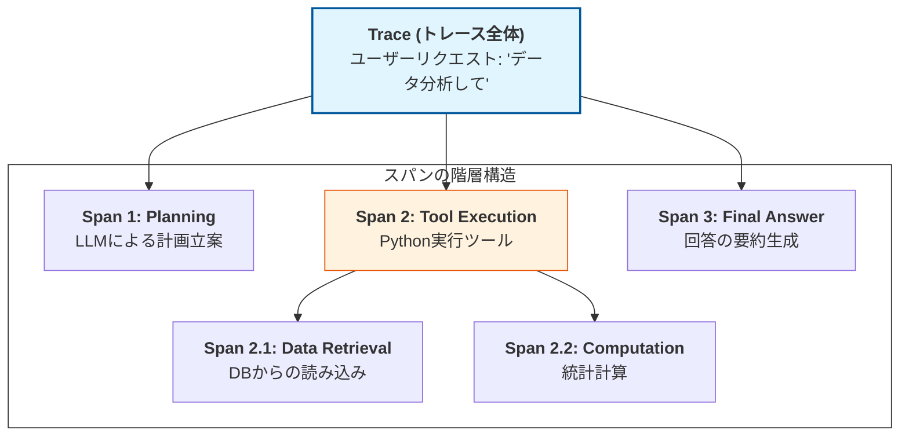

Strandsにおける**Traces（トレース）**　は、エージェントが実行した一連の処理（思考の連鎖、ツール呼び出し、サブプロセスの実行など）を、親子関係を持つ「木構造」として可視化する仕組みです。

# 概要

Tracesは、可観測性のなかでも **「処理の流れとコンテキスト」**  を把握するために最も重要なコンポーネントです。

1つのリクエストに対して、エージェントが内部でどのようなステップを踏んだのかを「スパン（Span）」と呼ばれる単位で記録します。これにより、複雑な自律型エージェントにおいて、「どの推論ステップで時間がかかったのか」「どのツール呼び出しが失敗の引き金になったのか」をピンポイントで特定できます。

- **Trace（トレース全体）**: ユーザーからの1つのリクエストの開始から終了までを包含する一連の処理の総称です。

- **Span（スパン）**: トレース内における個別の作業単位（LLM呼び出し、関数実行など）です。開始時間、終了時間、および入出力データを持ちます。

- **親子関係（階層構造）**: ツール実行（親）の中に、DBアクセス（子）が含まれるといった依存関係を可視化します。これにより「どの処理がボトルネックか」が視覚的にわかります。

- **コンテキストの保持**: 親スパンの情報が子スパンに引き継がれることで、深い階層の処理でも「元々の意図」を見失わずに追跡できます。

# 実装のポイント

Strandsのドキュメントが示す、トレース実装における重要事項は以下の通りです。

- スパンのライフサイクル管理:

    - 処理の開始時（Start）と終了時（End）を正しくマークし、それぞれのタイミングでの入出力（プロンプトやJSONレスポンス）を属性（Attributes）として付与します。

- メタデータの付与:

    - 単なる入出力だけでなく、モデル名、Temperature設定、トークン数、ツール実行の成否などのメタデータをスパンに含めることで、後の分析精度を向上させます。

- 非同期処理の追跡:

    - エージェントが複数のタスクを並列で実行する場合でも、共通の trace_id を伝播させることで、分散したログを1つのタイムライン上に統合して表示できるようにします。

# まとめ

StrandsのTracesは、エージェントの **「思考の道筋」を可視化するX線写真** のようなものです。

- **構造的理解**: 複雑に絡み合うエージェントの処理を、整理されたツリー構造で把握できる。

- **デバッグの迅速化**: 実行結果だけでなく「過程」が見えるため、修正すべきステップを即座に特定できる。

- **透明性の確保**: エージェントが自律的に行った判断の根拠を、後からすべて遡って検証可能にする。

