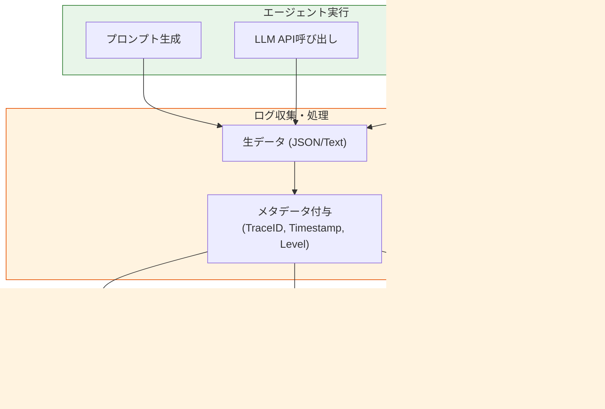

Strandsにおける**Logs（ログ）** は、可観測性（Observability）のなかでも最も低レイヤーかつ詳細な情報を扱うコンポーネントです。実行時の「生データ」を記録し、問題の根本原因を特定するための最後の砦となります。

#  概要

Strandsのログ機能は、エージェントの実行中に発生する個々のイベント、エラー、警告、および情報のメッセージを時系列で記録する仕組みです。

Tracesが「処理の流れ」を俯瞰するものであるのに対し、Logsは**「特定の瞬間に何が起きたか」** という点にフォーカスします。特にLLMのRawプロンプトや、ツール実行時の詳細な入出力パラメータを記録することで、再現性の低いバグの調査を可能にします。

- **Agent Execution**: ログが生成される現場です。プロンプトの組み立て、モデルからの応答、例外処理など、あらゆるステップでログイベントが発行されます。

- **Log Aggregator**: 生成されたログに、検索性を高めるための「メタデータ（Trace ID、タイムスタンプ、ログレベル等）」を付与します。これにより、膨大なログから特定のセッションを絞り込むことが可能になります。

- **Storage / Interface**: 開発時はコンソールでリアルタイムに確認し、本番環境ではクラウドストレージやStrands専用のUIに集約して長期保存・分析を行います。

# 実装のポイント

Strandsのログ運用において、特に意識すべき実装上のポイントは以下の3点です。

- **ログレベルの適切な使い分け**:

    - `DEBUG`: プロンプトの全文やトークン数など、開発時の詳細情報。

    - `INFO`: タスクの開始・完了、ツールの呼び出し成功など。

    - `ERROR`: APIのタイムアウトやバリデーションエラーなど、要対応事項。

- コンテキスト（Trace ID）の紐付け:

    - ログ単体では「どのユーザーのどのリクエスト」かが分かりにくいため、必ずTrace IDをログに含めます。これにより、特定のトレース（実行フロー）に関連するすべてのログを一括で引き出すことができます。

- 機密情報のマスキング（Sanitization）:

    - ログにはLLMへの入力が含まれるため、PII（個人情報）やAPIキーが誤って記録されないよう、ロガーの出力層でフィルタリングをかけることが推奨されます。

# まとめ

StrandsのLogsは、エージェントの「健康診断書」であり「ブラックボックスの解剖図」です。

- **詳細性**: トレースでは見えない、変数の状態やエラーのスタックトレースを保持する。

- **検索性**: Trace IDとの紐付けにより、複雑な非同期処理の中でも原因を特定できる。

- **信頼性**: 実行の全記録をエビデンスとして残すことで、システムの透明性を担保する。

デバッグの効率化だけでなく、コンプライアンスや監査の観点からも、ログ設計はエージェント構築における不可欠な工程となります。
