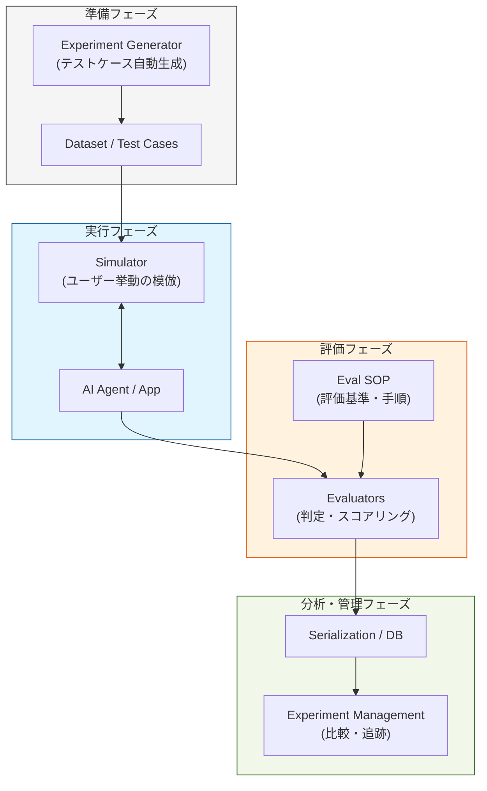

Strands Evals SDKは、AIエージェントの品質を「勘」ではなく「科学」に基づいて測定・改善するための強力なツールキットです。開発サイクルの中に「実験」と「評価」を組み込み、本番環境での信頼性を担保します。

# 概要

Strands Evals SDKは、AIエージェントのパフォーマンスを客観的に評価し、最適化するためのエンドツーエンドのフレームワークです。

単なるテストツールではなく、**シミュレーターによるテストデータの自動生成、多様な評価指標（Evaluators）による判定、実験のバージョン管理（Experiment Management）**　を統合しており、プロンプトやモデルの変更がもたらす影響を定量的かつシームレスに分析できます。

- **Setup**: 実験に必要なデータセットを用意します。`Experiment Generator` を使うことで、少数のサンプルから多様なテストシナリオを自動で拡張生成できます。

- **Execution**: `Simulator` が仮想ユーザーとして振る舞い、エージェントとの対話を実行します。これにより、手動テストなしで複雑なマルチターンの対話を検証できます。

- **Evaluation**: `Evaluators` が、あらかじめ定義された `Eval SOP`（評価基準）に基づき、エージェントの回答が適切かどうかをスコアリングします。

- **Analysis**: 実験結果は `Serialization` を通じて保存され、`Experiment Management` で過去の実験結果と比較されます。どの変更が精度向上に寄与したかを明確にします。

# 主要な機能の種類

- **Evaluators (評価器)**:

    - 決定論的なチェック（キーワード、形式）から、LLMを使用した定性的な評価（正確性、丁寧さ、安全性など）まで多岐にわたります。
        
- **Simulators (シミュレーター)**:

    - 実際の人間の挙動を模倣し、エージェントを「困らせる」ようなエッジケースを自動で生成・実行します。
    
- **Experiment Generator (実験生成器)**:

    - 既存のデータからバリエーション豊かなテストケースを合成し、評価の網羅性を高めます。

- **Experiment Management (実験管理)**:

    - 異なるプロンプト、モデル、パラメータ設定での実験結果を履歴として管理し、リーダーボード形式で比較します。

# 実装のポイント

- Eval SOP（標準作業手順書）の策定:

    - LLM評価器を使用する場合、何を「良し」とするかの基準（SOP）を明確に記述することが、評価のブレ（不整合）を防ぐ鍵となります。

- シミュレーションのリアリティ:

    - シミュレーターに対して適切な「ペルソナ」や「ゴール」を与えることで、実運用に近い高度なテストが可能になります。

- シリアライゼーションの活用:

    - 大規模な評価結果を保存・共有するために、結果をJSONや特定のDB形式に正しくシリアライズし、再現性を確保することが重要です。

# まとめ

Strands Evals SDKは、**「AI開発に再現性と透明性をもたらす」**ための基盤です。

- **自動化**: シミュレーターと生成器により、テストの工数を大幅に削減します。

- **客観性**: SOPに基づいた評価器により、人による評価のムラを排除します。

- **進化の追跡**: 実験管理機能により、エージェントが時間とともに改善されていることを数値で証明します。

