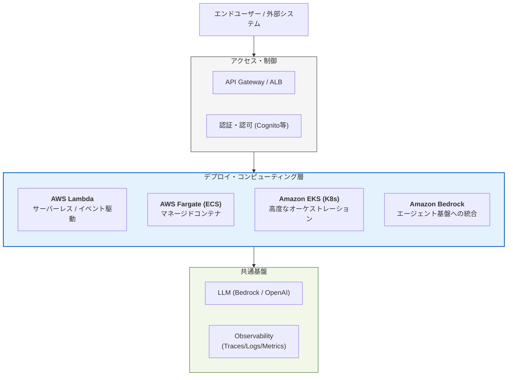

Strandsにおける**Deploy（デプロイ）**　は、開発・評価されたエージェントを本番環境へ移行し、スケーラブルかつセキュアに運用するためのプロセスです。Strandsは「特定の環境に依存しない」設計思想を持っており、ワークロードの特性（コスト重視か、安定性重視かなど）に合わせて柔軟な選択肢を提供しています。

# 概要

Strandsのデプロイメントは、エージェントを単なる「スクリプト」から「堅牢な本番サービス」へと昇華させます。

AWSを中心としたクラウドネイティブな構成を強力にサポートしており、APIサーバーとしての公開、サーバーレスでの実行、あるいはコンテナオーケストレーションによる大規模運用まで、ビジネスの成長段階に合わせたインフラ選択を可能にします。

- **Access Layer**: セキュリティとトラフィック制御の入り口です。API Gatewayやロードバランサーを通じて、エージェントへのアクセスを管理します。

- **Compute Options**: Strandsエージェントが実際に動作するエンジンです。ニーズ（コスト、スケーラビリティ、管理負荷）に応じて選択します。

- **Backend Resources**: エージェントが利用するLLMモデルや、これまでに説明した「可観測性（Observability）」の基盤です。どのデプロイ形態でも共通して連携します。

# デプロイの種類と特徴

|**種類**|**特徴**|**向いているケース**|
|---|---|---|
|**AWS Lambda**|サーバーレス。使った分だけの課金。|低頻度なリクエスト、コストを最小化したい場合。|
|**AWS Fargate**|サーバー管理不要のコンテナ実行。|中〜高頻度のリクエスト、長時間実行が必要なタスク。|
|**Amazon EKS**|Kubernetesによる高度な管理。|複雑なマイクロサービス群の一部として運用する場合。|
|**Amazon Bedrock (AgentCore)**|AWSのマネージドAI基盤への統合。|AWSネイティブな機能を最大限活用し、構築を簡略化したい場合。|
|**Amazon EC2**|従来の仮想サーバー。|特殊なハードウェア要件や、既存インフラの踏襲が必要な場合。|

# 実装のポイント

- ステートレスな設計:

    - デプロイ先のコンピューティング（LambdaやFargate）がスケールアウトしても問題ないよう、エージェントの会話履歴や状態は外部データベース（DynamoDBなど）で管理します。

- 環境変数の管理:

    - APIキーやモデルID、接続先エンドポイントなどはコードに埋め込まず、AWS Secrets ManagerやParameter Storeを利用して安全に注入します。

- シリアライゼーションの徹底:

    - エージェントの構成や中間データを、ネットワーク越しに受け渡し可能な形式（JSON等）に正しくシリアライズ/デシリアライズできるよう実装します。

- プロダクション運用（Operating in Production）:

    - 単に動かすだけでなく、タイムアウト設定、リトライ戦略、デッドレターキュー（DLQ）などのエラーハンドリングをデプロイ構成に組み込みます。

# まとめ

Strandsのデプロイ戦略は、**「柔軟なスケーラビリティ」と「高い運用性」** の両立を目的としています。

- **小規模開始**: Lambdaなどのサーバーレスでコストを抑えてスタート。

- **成長に伴う移行**: 処理量が増えたらFargateやEKSへ、コードを大きく変えずに移行可能。

- **一貫した監視**: どの環境でもStrandsのObservability（可観測性）が機能し、本番特有のバグを追跡できる。

