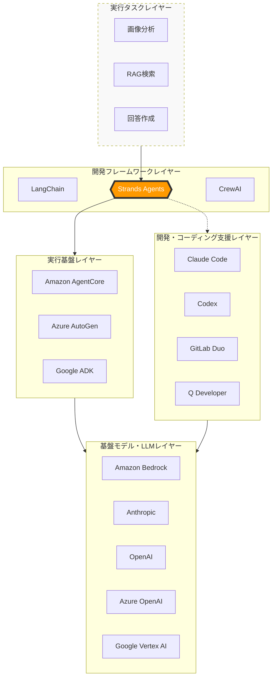
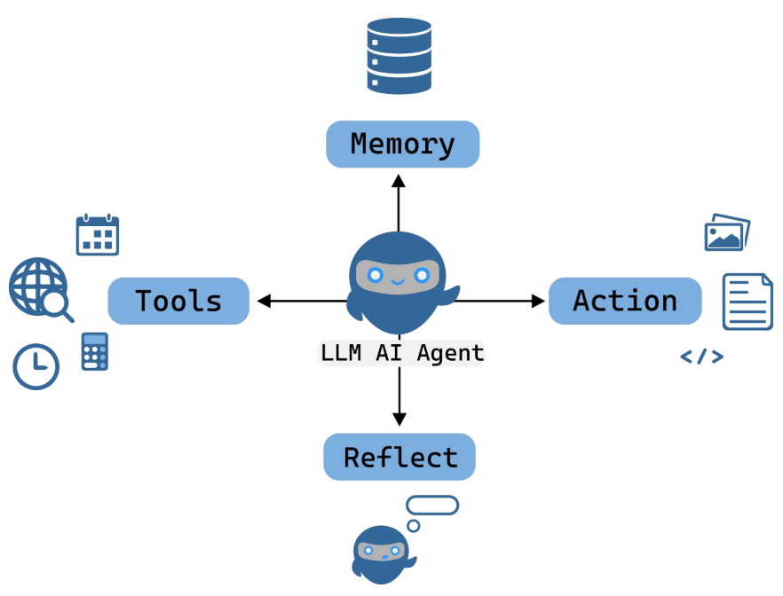
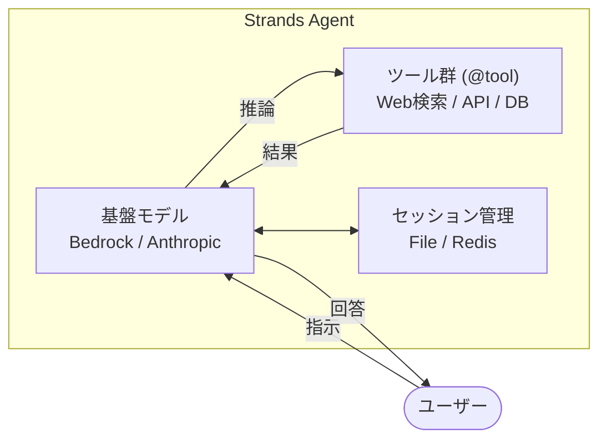
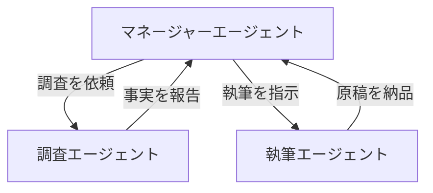
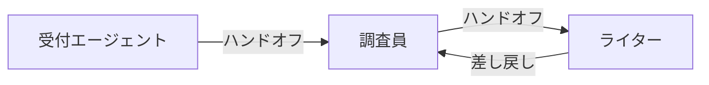

**Apache Strands Agents（通称 Strands Agent）** は、AWS 主導で開発されたオープンソースの AI エージェント開発フレームワークで、2025年5月16日に一般公開されました。実体は Python や TypeScript のライブラリであり、Python パッケージをインストールすればすぐにコーディングを開始し、AIエージェントの開発を行えます。Claude Code などの支援ツールを活用して、アシストを受けながら進めることも可能です。

AI時代においてなぜフレームワークが必要かといえば、多様なAIを自律的に動かしながら、期待通りに制御するには、やはりコーディングが最も確実な手段だからです。ただし、そのコーディング手法は従来の開発スタイルとは大きく異なる点も多くあります。なお、Python の構文自体はシンプルで、初心者でも十分に扱えるレベルです。

# AIエージェントの本質と課題

AIエージェントは、単なる「チャットボット」ではありません。

AIエージェントとは、**「自律的に目標を理解し、環境に合わせて適切なツールを選択・実行し、試行錯誤しながら完遂する動的なシステム」** であると言えます。

しかし、この「複雑なタスク」を実務レベルで実行しようとすると、従来の開発手法では以下の問題に直面します。

- **制御のブラックボックス化**: モデルが自律的に動くほど、なぜその行動をとったのか、どこで失敗したのかの追跡（可観測性）が困難になる。
    
- **コードのスパゲッティ化**: 状態管理やツール実行の例外処理を「Chain（連鎖）」として記述しすぎると、拡張や修正が不可能になる。

# AIエージェント開発フレームワークの役割

### 「脳（AI）」に「手足（ツール）」を繋ぐ

AIモデル単体では、外部のシステム（DB、API、検索）を操作できません。 フレームワークは、AIが理解できる形式でツールを提示し、安全に実行させるための　**「共通インターフェース」**　を提供します。これがないと、接続コードをすべて自作することになり膨大な手間がかかります。

###  「迷子」を防いで「完遂」させる

複雑なタスクを頼むと、AIは途中で何をすべきか忘れたり、同じことを繰り返したりします（無限ループ）。 フレームワークは、**「思考 → 実行 → 確認」という正しい手順（型）**　をエージェントに叩き込み、ゴールまで脱線させないための「レールの役割」を果たします。

### 「記憶（コンテキスト）」を一貫させる

一連の業務には、過去の経緯や現在の進捗状況の保持が不可欠です。 フレームワークは、**「セッション管理」**　という仕組みを提供し、エージェントが「さっき何を調べて、今はどの段階か」を常に把握できるようにします。

# Strands Agents(ストランズエージェント)とは

**Strandsエージェント** は、Amazon Bedrockなどの強力な基盤モデル（LLM）を「手足」となるツールや「記憶」となるセッションと組み合わせ、自律的にタスクを遂行させるためのフレームワークです。

なぜAIエージェント開発フレームワーク（Apache Strandsなど）が必要なのか、3つのポイントでシンプルにまとめます。

- **フレームワークなし**：バラバラの部品（AI、ツール、履歴）を、その都度つぎはぎで繋ぐ作業が必要。
    
- **フレームワークあり**：Strandsという「型」に流し込むだけで、**「動く、壊れにくい、拡張しやすい」**　システムが手に入る。

現在、AIを活用しようとすると、次々に新しいツールや概念が登場し、それぞれの役割や位置づけが、ITエンジニアでさえ把握しきれない状況になりつつあります。

「Claude を使えば十分なのか？」「Amazon Bedrock とは何が違う？」「LangChain や Strands Agents はどこで使うべきか？」

こうした疑問に明確に答えるためには、各技術の関連性を正しく理解することが重要です。そこで本書では、AIエージェントを構成するテクノロジー群を **5つのレイヤー** に分類し、体系的に整理しました。

- **実行タスクレイヤー**: 具体的な業務目的の定義
    
- **開発フレームワークレイヤー**: 推論プロセスと実行の司令塔（オーケストレーション）
    
- **開発・コーディング支援レイヤー**: エージェント構築と実装の効率化
    
- **実行基盤レイヤー**: 安全で堅牢な実行環境とインフラの提供
    
- **基盤モデル・LLMレイヤー**: 思考・判断を司る「知能」の提供

## AIエージェント開発フレームワークの比較

現在、多くのフレームワークが存在しますが、Apache Strandsは「現場での使いやすさと堅牢性」において際立っています。

| **特徴**   | **LangChain**    | **CrewAI**      | **Apache Strands**       |
| -------- | ---------------- | --------------- | ------------------------ |
| **主な対象** | LLM 全般、RAG、Chain | 複数エージェントの共同作業   | **Bedrock 最適化、堅牢な単体・連携** |
| **複雑さ**  | 非常に高い（多機能すぎ）     | 中（役割分担に特化）      | **シンプルかつ軽量（DX重視）**       |
| **設計思想** | 汎用的な部品の結合        | 役割（Role）ベースの自動化 | **推論の透過性と開発のしやすさ**       |
| **信頼性**  | 破壊的変更が多い         | 抽象度が高く挙動が見えにくい  | **AWS内での実績に基づいた安定性**     |

>[注]
筆者が Strands エージェントに出会ったきっかけは、Amazon Bedrock AgentCore を徹底的に使いこなすためでした。当初は AgentCore の動作確認を目的にサンプルコードを探していただけでしたが、触っていくうちに **Strands エージェントのマルチエージェント実装のシンプルさ** に驚かされました。
AI時代の到来とともに LangChain にも取り組んできましたが、次第に機能は肥大化し、構造も複雑に。何より、**マルチエージェントの設計・実装という観点では、大きな進展を感じることができませんでした**。おそらく、プログラマが本業ではない筆者にとって、LangChain の敷居は少々高かったのだと思います。
そんな中、ちょうど諦めかけていたタイミングで出会ったのが Strands エージェントでした。しかも AgentCore 自体が Strands エージェントをベースにしているため、理解もスムーズに進みました。**まさに一振りで二兎を得たような体験**でした。

## Strandsエージェント誕生の背景：LangChainへの「対抗馬」

AIエージェント開発が普及し始めた初期、主流だったのは **LangChain** などの「連鎖型（Chain）」フレームワークでした。しかし、これらは複雑なタスクにおいて「コードが肥大化しすぎる」「エージェントの動きが制御しにくい」といった課題を抱えていました。

Strandsエージェントは、これらの課題を解決するために **「もっとシンプルに、かつ人間のように自律的に動くエージェントを作りたい」**  という開発者の想いから、モダンなアーキテクチャとして設計されました。

## 年表ベースの流れ

- 2023 年初頭
    
    - ReAct 論文公開をきっかけに、Amazon Q Developer チームが内部向けの AI エージェント実装を開始し、複雑なオーケストレーションや JSON パースなどを自前で抱えた仕組みを作り込んでいた。
    
- 2023〜2024 年
    
    - Q Developer や AWS 内部サービス（AWS Glue、VPC Reachability Analyzer など）で使うエージェント基盤として「Strands」の原型が育ち、モデルのプランニング能力を最大限活かす設計思想が固まっていった。​
        
- 2025 年 5 月 16 日（2025 年度）
    
    - 「Strands Agents」としてオープンソース SDK として正式リリース。Python ベースで、モデル・ツール・プロンプトの 3 要素からエージェントを定義する形が明示される。​
        
- 2025 年後半（2025 年 12 月 3 日 など）
    
    - TypeScript サポート（プレビュー）やマルチエージェント連携、エッジデバイス対応、Strands Steering / Evaluations などが順次追加され、言語・機能面で急速に拡張。

##  コアコンセプト：自律性とスケーラビリティ

Strandsエージェントは、単一のエージェントを賢くするだけでなく、**「複数のエージェントが協力して働く（マルチエージェント）」**　ことを前提に設計されています。

- **プロンプト主導型**: コードでガチガチに制御するのではなく、LLMの推論能力を最大限に活かす設計（Swarmパターンなど）を重視。
    
- **イベント駆動**: エージェントの動作をイベント（思考、ツール実行、発言）として捉え、非同期で効率的に処理する仕組みを導入しました。
    

## 現在：エンタープライズ対応とエコシステムの拡大

現在、Strandsエージェントは単なる実験的フレームワークを超え、ビジネス現場での利用を見据えた進化を遂げています。

- **Amazon Bedrockとの密接な連携**: AWS環境でClaudeなどの強力なモデルをセキュアに動かすための最適化が進んでいます。
    
- **MCP（Model Context Protocol）の統合**: 外部ツールやデータとエージェントを瞬時に接続するための標準プロトコルをいち早く取り入れ、拡張性を飛躍的に高めました。
    
## Strandsエージェントが目指すもの

Strandsエージェントを一言で表すと、**「複雑なエージェント・オーケストレーションを、誰でも簡単に、かつプロフェッショナルな品質で実装できるようにすること」** にあります。

Strandsエージェントの基本構成を、**「個別のエージェント構成」** と **「マルチエージェントの連携」** の2つの視点で図解します。

## 単一エージェント（Agent）の基本構造

Strandsのエージェントは、LLM（脳）、Tool（手足）、Session（記憶）の3つのコンポーネントで構成されます。

- **Model (LLM)**: エージェントの「脳」です。`system_prompt` によって「あなたはジャーナリストです」といった人格や振る舞いが定義されます。
    
- **Tools**: エージェントが外部世界とやり取りするための「手足」です。Pythonの関数に `@tool` デコレータをつけるだけで実装できます。
    
- **Session Manager**: エージェントの「記憶（文脈）」を司ります。会話履歴を保存し、再起動後も以前の会話を覚えている状態を作ります。
    
## マルチエージェントの連携パターン

複数のエージェントが協力して働く場合、Strandsでは主に**「オーケストレーション型」**と**「Swarm（メッシュ）型」**の2つの構成が取られます。

### オーケストレーション型（指揮者パターン）

一人のマネージャーが、部下の専門家エージェントに仕事を割り振る中央集権的な構造です。

### Swarm型（自律ハンドオフ・メッシュ）

マネージャーを置かず、エージェント同士が「ここからは君の領分だ」と自律的にバトンを渡し合う構造です。

## Strandsの実装における重要なポイント

- **ステートフル（状態保持）**: `state` オブジェクトをエージェント間で共有することで、チーム全体で「今何が起きているか」という情報を同期できます。
    
- **イベントループ**: Strandsは内部で非同期のイベントループを回しており、モデルの推論とツールの実行を効率よく制御します。
    
- **MCP (Model Context Protocol) 対応**: 外部のツールサーバーから動的にツールを取得して、エージェントを即座に強化できる柔軟性を持っています。
    

# 節の構成について

- **10:基本構成**
- **20:ツール**
- **30:モデルプロバイダー**
- **40:ストリーミング**
- **50:マルチエージェント**
- **60:インタラプト**
