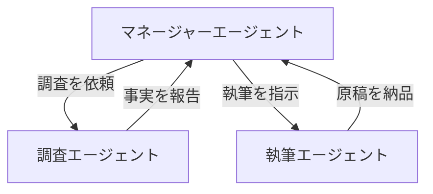
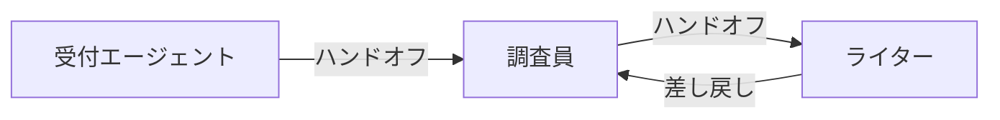

Apache Strands Agents（いわゆる Strands Agent）は、AWS が主導して開発したオープンソースの AI エージェント SDK で、2025 年 5 月 16 日に一般公開されました。

# 概要

Strandsエージェント（Strands→本サイトでは「ストランズ」と読む）は、Amazon Bedrockなどの強力な基盤モデル（LLM）を「手足」となるツールや「記憶」となるセッションと組み合わせ、自律的にタスクを遂行させるためのフレームワークです。

# 誕生の背景：LangChainへの「対抗馬」

AIエージェント開発が普及し始めた初期、主流だったのは **LangChain** などの「連鎖型（Chain）」フレームワークでした。しかし、これらは複雑なタスクにおいて「コードが肥大化しすぎる」「エージェントの動きが制御しにくい」といった課題を抱えていました。

Strandsエージェントは、これらの課題を解決するために **「もっとシンプルに、かつ人間のように自律的に動くエージェントを作りたい」**  という開発者の想いから、モダンなアーキテクチャとして設計されました。

# 年表ベースの流れ

- 2023 年初頭
    
    - ReAct 論文公開をきっかけに、Amazon Q Developer チームが内部向けの AI エージェント実装を開始し、複雑なオーケストレーションや JSON パースなどを自前で抱えた仕組みを作り込んでいた。
    
- 2023〜2024 年
    
    - Q Developer や AWS 内部サービス（AWS Glue、VPC Reachability Analyzer など）で使うエージェント基盤として「Strands」の原型が育ち、モデルのプランニング能力を最大限活かす設計思想が固まっていった。​
        
- 2025 年 5 月 16 日（2025 年度）
    
    - 「Strands Agents」としてオープンソース SDK として正式リリース。Python ベースで、モデル・ツール・プロンプトの 3 要素からエージェントを定義する形が明示される。​
        
- 2025 年後半（2025 年 12 月 3 日 など）
    
    - TypeScript サポート（プレビュー）やマルチエージェント連携、エッジデバイス対応、Strands Steering / Evaluations などが順次追加され、言語・機能面で急速に拡張。

# コンセプト：自律性とスケーラビリティ

Strandsエージェントは、単一のエージェントを賢くするだけでなく、**「複数のエージェントが協力して働く（マルチエージェント）」**　ことを前提に設計されています。

- **プロンプト主導型**: コードでガチガチに制御するのではなく、LLMの推論能力を最大限に活かす設計（Swarmパターンなど）を重視。
    
- **イベント駆動**: エージェントの動作をイベント（思考、ツール実行、発言）として捉え、非同期で効率的に処理する仕組みを導入しました。
    

# 現在：エンタープライズ対応とエコシステムの拡大

現在、Strandsエージェントは単なる実験的フレームワークを超え、ビジネス現場での利用を見据えた進化を遂げています。

- **Amazon Bedrockとの密接な連携**: AWS環境でClaudeなどの強力なモデルをセキュアに動かすための最適化が進んでいます。
    
- **MCP（Model Context Protocol）の統合**: 外部ツールやデータとエージェントを瞬時に接続するための標準プロトコルをいち早く取り入れ、拡張性を飛躍的に高めました。
    
# Strandsエージェントが目指すもの

Strandsエージェントを一言で表すと、**「複雑なエージェント・オーケストレーションを、誰でも簡単に、かつプロフェッショナルな品質で実装できるようにすること」** にあります。

Strandsエージェントの基本構成を、**「個別のエージェント構成」**と**「マルチエージェントの連携」**の2つの視点で図解します。

## 単一エージェント（Agent）の基本構造

Strandsのエージェントは、LLM（脳）、Tool（手足）、Session（記憶）の3つのコンポーネントで構成されます。

- **Model (LLM)**: エージェントの「脳」です。`system_prompt` によって「あなたはジャーナリストです」といった人格や振る舞いが定義されます。
    
- **Tools**: エージェントが外部世界とやり取りするための「手足」です。Pythonの関数に `@tool` デコレータをつけるだけで実装できます。
    
- **Session Manager**: エージェントの「記憶（文脈）」を司ります。会話履歴を保存し、再起動後も以前の会話を覚えている状態を作ります。
    
## マルチエージェントの連携パターン

複数のエージェントが協力して働く場合、Strandsでは主に**「オーケストレーション型」**と**「Swarm（メッシュ）型」**の2つの構成が取られます。

### オーケストレーション型（指揮者パターン）

一人のマネージャーが、部下の専門家エージェントに仕事を割り振る中央集権的な構造です。

### Swarm型（自律ハンドオフ・メッシュ）

マネージャーを置かず、エージェント同士が「ここからは君の領分だ」と自律的にバトンを渡し合う構造です。

## Strandsの実装における重要なポイント

1. **ステートフル（状態保持）**: `state` オブジェクトをエージェント間で共有することで、チーム全体で「今何が起きているか」という情報を同期できます。
    
2. **イベントループ**: Strandsは内部で非同期のイベントループを回しており、モデルの推論とツールの実行を効率よく制御します。
    
3. **MCP (Model Context Protocol) 対応**: 外部のツールサーバーから動的にツールを取得して、エージェントを即座に強化できる柔軟性を持っています。
    
# 節の構成について

- **10:基本構成**
- **20:ツール**
- **30:モデルプロバイダー**
- **40:ストリーミング**
- **50:マルチエージェント**
- **60:インタラプト**
