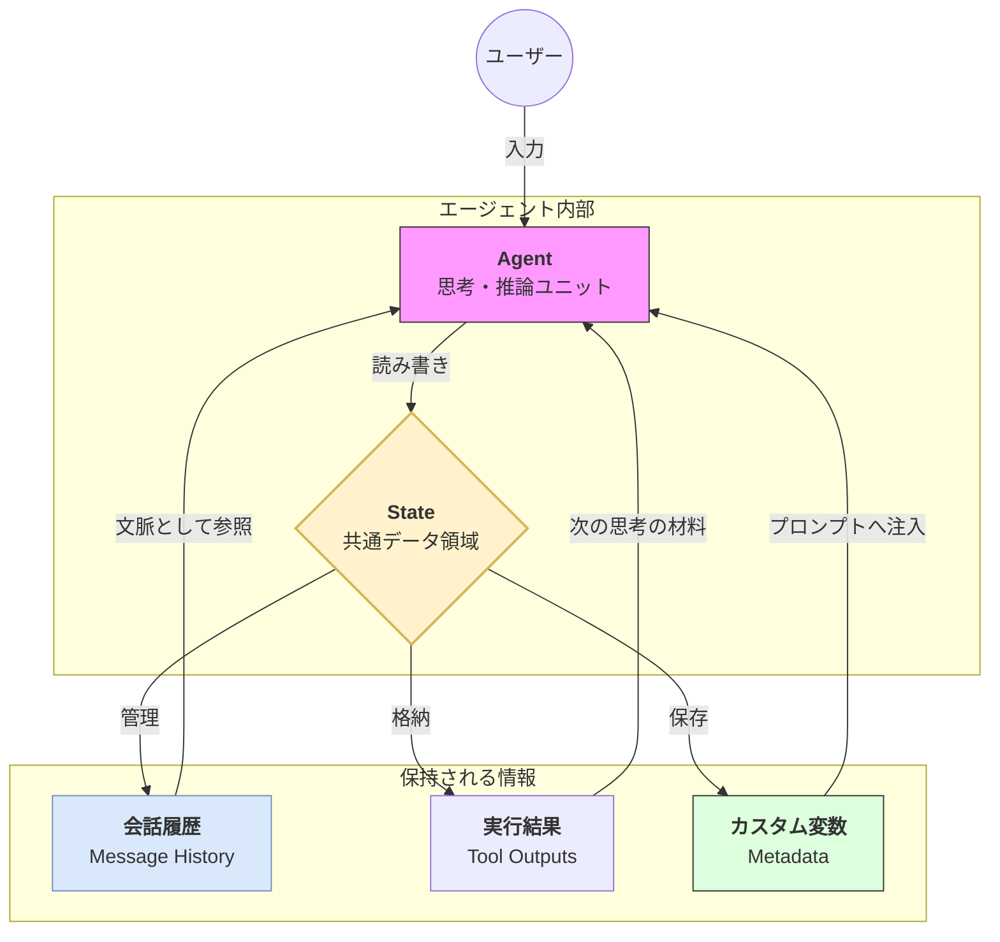

Strands SDKにおける **ステート（State）** は、エージェントが対話の文脈を理解し、一貫性を保つための「記憶の基盤」です。

# 概要

ステート（State）とは、ユーザーとの会話履歴、ツールの実行結果、およびカスタム定義された変数を一元管理するデータ構造です。エージェントは「ステートレス（過去を忘れる）」なLLMに対し、この State をインプットとして与え続けることで、文脈を維持した高度な推論やマルチステップのタスク実行を可能にします。

---

- **入力フェーズ**: ユーザーからの発話や指示がエージェントに届きます。
    
- **共有データ領域 (State)**: エージェントの推論と並行して存在し、あらゆる情報の「ハブ」として機能します。
    
- **会話履歴 (History)**: これまでのやり取りを保持し、エージェントが「さっきの件だけど」といった代名詞や文脈を理解できるようにします。
    
- **実行結果 (Tool Outputs)**: エージェント・ループ内でツールが取得した「外の世界の事実」を一時保存し、次の思考ステップの根拠として提供します。
    
- **カスタム変数 (Variables)**: ユーザー名や特定のステータスなど、構造化された属性情報を永続的または一時的に保持します。
    
- **プロンプト注入**: State 内の情報は、推論のたびに最新のコンテキストとしてエージェントのプロンプトへ動的に合成されます。
    

# 実装のポイント

- **自動的な文脈管理**: Strands では会話履歴が自動的に State に蓄積されるため、開発者が手動で過去のメッセージを結合して LLM に送る手間が省けます。
    
- **テンプレート連携**: `system_prompt` の中で `{{ state.user_name }}` のように記述することで、State 内の値を動的にプロンプトへ埋め込み、パーソナライズされた指示出しが可能です。
    
- **永続化との親和性**: `state.save()` や `state.load()` を使用することで、メモリ上の State を JSON ファイル等に書き出し、プログラム再起動後も「前回の続き」を再現できます。
    

# まとめ

ステート（State）は、エージェントにとっての「短期記憶」であり「作業机」です。この基盤があることで、エージェントは断片的な情報をつなぎ合わせ、過去の経緯を踏まえた賢い振る舞いができるようになります。State を使いこなすことは、実用レベルのステートフルな AI システムを構築するための鍵となります。
