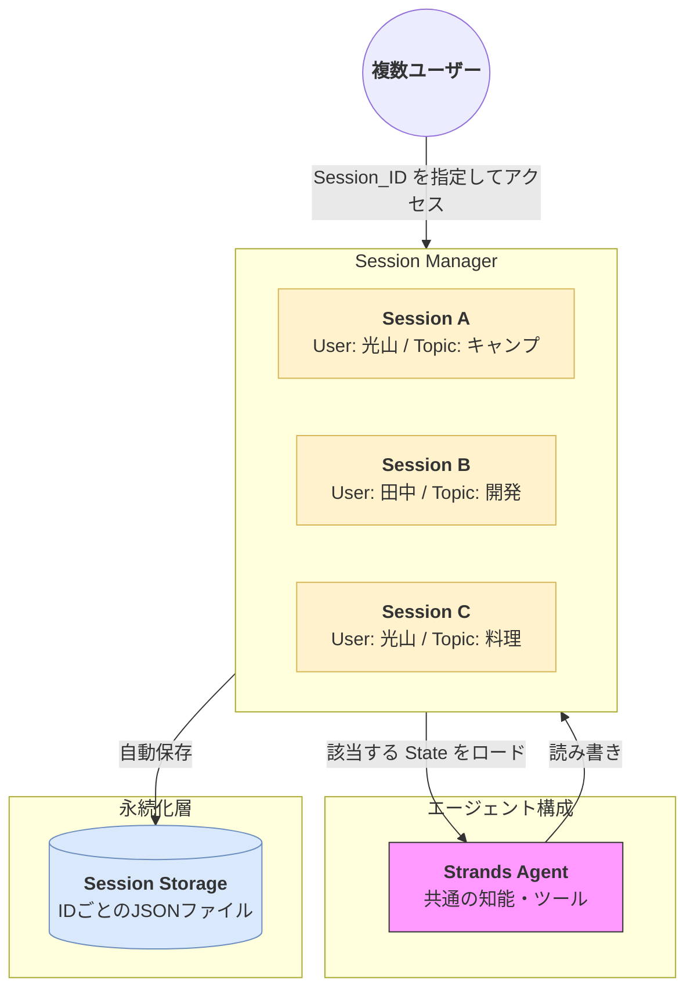

Strands SDKにおける**セッション管理（Session Management）**は、複数のユーザーや異なる会話スレッドを効率的に、かつ安全に分離して管理するための仕組みです。

# 概要

セッション管理とは、特定のアカウントや会話ごとに独立した「記憶（State）」と「対話履歴（History）」を割り当てる機能です。これにより、一人のユーザーが複数の異なる目的でエージェントを使ったり、不特定多数のユーザーが同時にアクセスしたりしても、情報が混ざることなく正確にコンテキストを維持することができます。

---

- **アクセスフェーズ**: ユーザーは自分を識別するための「セッションID（Session ID）」と共にリクエストを送ります。
    
- **セッション・マネージャー**: 渡されたIDに基づき、メモリ内またはストレージから該当するセッション（State）を特定します。
    
- **コンテキスト・ロード**: 特定されたセッション専用の会話履歴や変数をエージェントへ注入し、その人だけの「文脈」を復元します。
    
- **独立した実行**: 同じエージェント（知能）を使いながらも、内部的にはセッションごとに分離された環境で思考・実行が行われます。
    
- **自動永続化**: 対話が終わるたびに、各セッションの状態は個別のファイルやデータベースへ自動的に保存されます。
    

---

# 実装のポイント

- **スレッドの分離**: 「前回の会話」をどこまで引き継ぐかをセッション単位で制御できます。新しいトピックを開始する際は、新しいセッションIDを生成するだけでクリーンな状態から始められます。
    
- **スケーラビリティ**: セッション情報をファイルやRedisなどの外部DBに保存することで、サーバーを跨いだ大規模なユーザーベースへの対応が可能になります。
    
- **セキュリティとプライバシー**: ユーザーAの秘密情報（Stateに保存された変数など）がユーザーBのプロンプトに漏洩するのを防ぐ物理的な境界線として機能します。
    

---

# まとめ

セッション管理は、エージェントを実用的なアプリケーション（Webアプリ、チャットツール、SaaS等）としてリリースするために不可欠な要素です。Strands SDKのセッション管理を活用することで、開発者は「情報の混線」を心配することなく、何千人ものユーザーに対してパーソナライズされた体験を同時に提供することができます。

