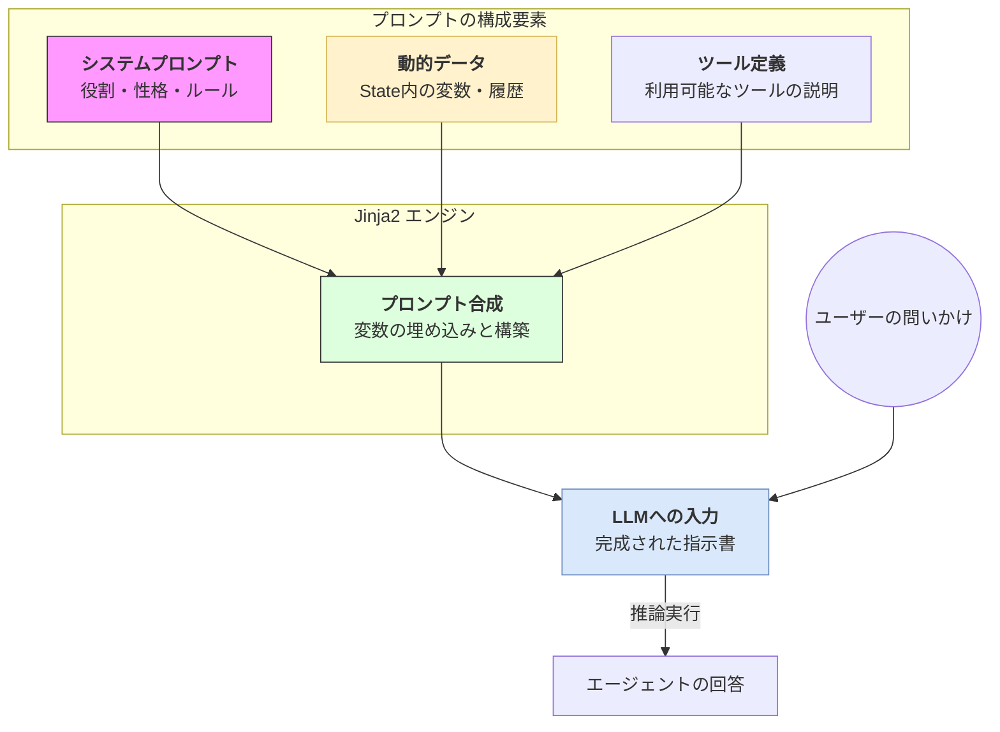

Strands SDKにおける**プロンプト（Prompts）**は、エージェントの性格、知識、そして振る舞いを決定づける最も重要な「命令セット」です。

# 概要

プロンプトとは、LLMに対して与える指示の総称です。Strandsでは、固定の「システムプロンプト」だけでなく、エージェントの「状態（State）」や「外部ツール」の情報、さらには「ユーザーの入力」を動的に組み合わせて、実行の瞬間に最適な指示書を生成します。テンプレートエンジン（Jinja2）を活用することで、文脈に応じた柔軟な制御が可能になっています。

---

- **システムプロンプト（System Prompt）**: エージェントの根本的な役割（例：「あなたは優秀なカスタマーサポートです」）や、守るべき制約事項を定義します。
    
- **動的データ（State Data）**: `State` オブジェクトに保存されているユーザー名や過去の対話履歴などを指します。これにより「前回の続き」を反映した指示が作られます。
    
- **ツール定義（Tools Info）**: エージェントが使用できるツールの名前や使い方の説明です。SDKが自動的にプロンプトへ組み込み、エージェントに「道具の使い方」を教えます。
    
- **プロンプト合成（Renderer）**: 固定の文章と動的な変数を Jinja2 テンプレートによって結合し、LLMが理解できる最終的なテキストへとレンダリングします。
    
- **LLMへの入力**: 合成された詳細な指示書とユーザーの最新の問いかけがセットになり、AIの「思考」へと渡されます。
    

---

# 実装のポイント

- **Jinja2 テンプレートの活用**: `{{ state.user_name }}` や `...` のように、条件分岐や変数をプロンプト内で直接扱うことができます。
    
- **プロンプトの階層化**: 複雑なタスクでは、役割を定義する「システムプロンプト」と、具体的な手順を示す「指示（Instructions）」を分けて管理することで、メンテナンス性が向上します。
    
- **Stateとの密結合**: プロンプト内で直接 `State` の中身を参照できるため、コード側でわざわざ文字列を組み立てる必要がなく、宣言的にエージェントの振る舞いを記述できます。
    

---

# まとめ

プロンプトは、エージェントの「知能」に「文脈」と「制約」を与えるガイドラインです。Strands SDKにおいてプロンプトをマスターすることは、動的な `State` をいかにして AI の知能に同期させるかを理解することに他なりません。適切に設計されたプロンプトは、エージェントを一貫性のある、信頼できるパートナーへと進化させます。
