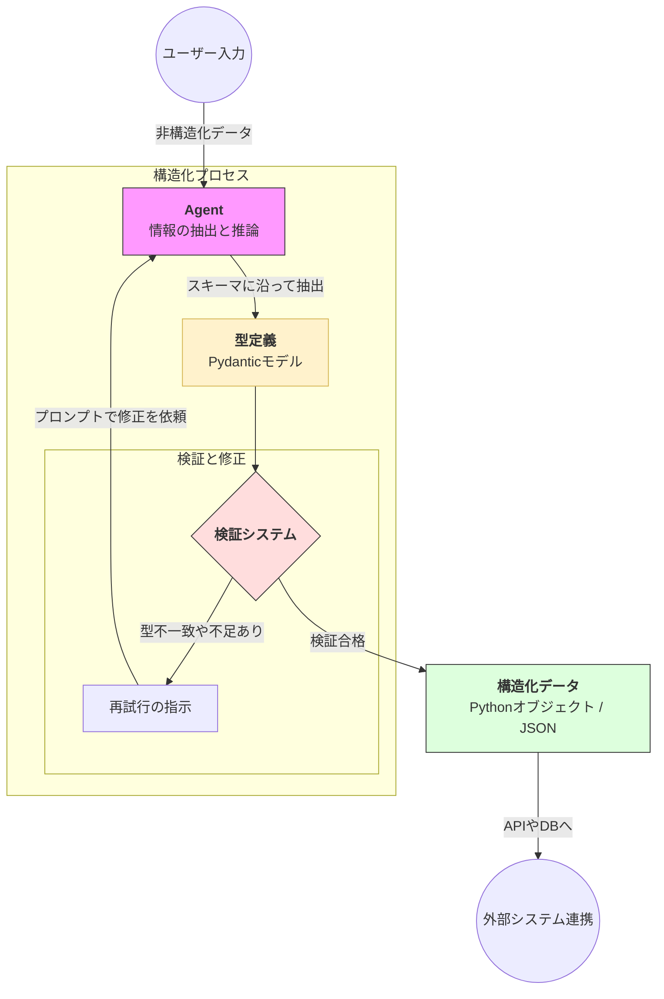

Strands SDKにおける**構造化出力（Structured Output）** は、エージェントの回答を自由な文章ではなく、特定の「型」に沿ったデータ形式で抽出・生成するための機能です。

# 概要

構造化出力とは、LLMが生成するテキストを Python の **Pydantic** モデルなどで定義したスキーマ（構造）に強制的に適合させる仕組みです。これにより、AIの回答をそのままデータベースに保存したり、他のシステムのAPIに渡したりすることが可能になり、AIと既存システム間の「データの不一致」を解消します。

- **非構造化データの入力**: ユーザーからの自由な文章（メール本文、会議録など）をエージェントが受け取ります。
    
- **型定義（Schema）**: 抽出したい情報の項目（例：日付、金額、担当者名）とその型（str, int, listなど）をあらかじめ定義しておきます。
    
- **情報の抽出と生成**: エージェントは「型定義」を理解し、入力された文章から必要な情報を枠組みに当てはめて抽出します。
    
- **検証システム（Validator）**: 生成されたデータが定義通りかをチェックします。型が違ったり、必須項目が欠けている場合は、自動的にエージェントへ修正を指示（再試行）します。
    
- **構造化データの出力**: 検証をクリアしたデータは、プログラムでそのまま扱える Python オブジェクトや JSON として出力されます。
    

# 実装のポイント

- **Pydanticとの強力な連携**: Strands は Pydantic を標準サポートしているため、クラスを定義してエージェントに渡すだけで、複雑なネスト構造（リストの中に辞書がある等）のデータも正確に抽出できます。
    
- **自動再試行ロジック**: LLMがフォーマットを間違えた場合でも、SDK内部で自動的にエラーメッセージと共に再プロンプトを投げるため、開発者が複雑な例外処理を書く必要がありません。
    
- **「推論」と「抽出」の同時実行**: 単なるデータ抽出だけでなく、「このお問い合わせの内容を分析し、緊急度（1〜5）を判定して、要約と共に構造化して」といった、AIの判断を含めた構造化が可能です。
    
# まとめ

構造化出力は、エージェントを「ただのチャット相手」から「業務システムの入力インターフェース」へと変えるための重要な技術です。AI特有の「ゆらぎ」を型定義によってコントロールすることで、信頼性の高い、自動化に適したデータ連携が実現します。
