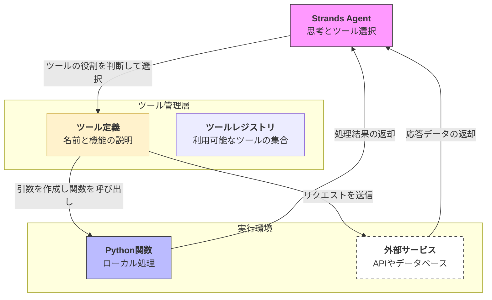

Strands SDKにおける**ツール（Tools）**は、エージェントが「考える」だけでなく、外部の世界に対して「行動」を起こすための手段です。

# 概要

ツールとは、エージェントが特定のタスク（検索、計算、ファイル操作、API実行など）を遂行するために呼び出すことができるPython関数や外部機能のことです。LLMは本来テキストの生成しかできませんが、ツールを装備することで「現実世界のデータを取得し、外部システムを操作する」実務的な能力を獲得します。

---

- **ツール選択**: エージェントはユーザーの依頼を解決するために、レジストリの中から最適なツールを自律的に選びます。
    
- **ツール定義**: 各ツールには「何ができるか」の説明（Docstring）と、必要な「引数（Arguments）」の定義が含まれており、エージェントはこれを見て使いかたを理解します。
    
- **実行環境**: ツールはローカルのPythonスクリプトとして動くものや、ネットワーク越しのAPI、あるいは共通規格であるMCPサーバーとして動作するものがあります。
    
- **結果の還元**: ツールの実行結果はエージェントに戻され、次の思考ステップの材料（コンテキスト）として活用されます。
    

---

# ツールの種類

Strandsでは、用途に応じて以下のような形式でツールを定義・利用できます。

1. **Python関数ツール**: `@tool` デコレータを付けるだけで、既存のPython関数をエージェントの道具として公開できます。
    
2. **MCP (Model Context Protocol) ツール**: 他の言語や環境で公開されているMCPサーバーの機能を、設定一つで取り込むことができます。
    
3. **クラスベースツール**: 複雑な状態保持や初期化が必要な場合、クラス形式でツールを構築し、高度な機能を提供できます。
    
4. **ビルトインツール**: ファイル操作やWeb検索など、SDKが標準で提供する便利なツール群です。
    

---

# 実装のポイント

- **詳細なDocstring**: エージェントは関数の説明文（Docstring）を読んで使いかたを判断します。「何を、どのように、何のために」使うのかを明確に書くことが、ツールの的中率を上げる鍵です。
    
- **型ヒントの活用**: Pythonの型ヒント（`str`, `int`, `list`など）を正確に付けることで、エージェントが生成する引数のエラーを劇的に減らすことができます。
    
- **エラーハンドリング**: ツール内で例外が発生した場合、そのエラーメッセージをエージェントに返すように設計すると、エージェント自身が原因を分析し、修正して再試行することが可能になります。
    

---

# まとめ

ツールはエージェントにとっての「手足」であり、Strands SDKはその手足と脳を繋ぐ「神経系」の役割を果たします。適切なツールを設計し、エージェントに持たせることで、単なるチャットAIを超えた、ビジネスプロセスを自動化する真の「AIエージェント」が完成します。

これでStrandsのコアコンセプトがほぼ完璧に網羅されました。実際に具体的なツール（例えば、特定の天気APIを叩くツールなど）を一緒に書いてみますか？