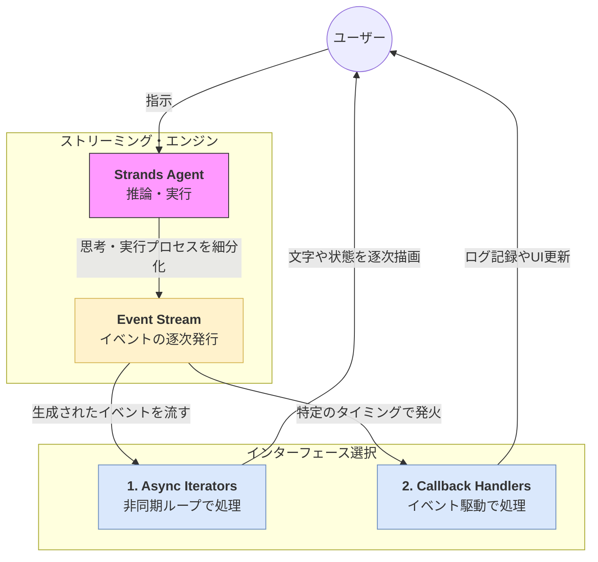

Strands SDKにおける**ストリーミング（Streaming）** は、エージェントが回答を生成する際、すべての文章が完成するのを待たずに、生成された断片（トークン）をリアルタイムで逐次送信する機能です。

# 概要

ストリーミングとは、エージェントの思考や回答の生成プロセスを、完了を待たずにリアルタイムで受け取る仕組みです。Strands SDKでは、この出力を「イベント」として定義しており、開発者は **「非同期イテレータ」**または **「コールバックハンドラ」** のいずれかを選択して、これらのイベントを購読（購読）します。

---

- **Event Stream**: エージェントが「思考開始」「ツール呼び出し」「テキスト生成」「完了」といった各段階で発行する情報の流れです。
    
- **Async Iterators**: `async for` ループを使用して、ストリームから流れてくるイベントを一つずつ「手動で」受け取って処理するプル型の方式です。
    
- **Callback Handlers**: あらかじめ「ツールが動いたらこの関数を実行する」といった定義をしておき、イベント発生時に「自動で」関数が呼ばれるプッシュ型の方式です。
    
# ストリーミングの実現方式

Strands SDKでは、用途に応じて以下の2つの方式を使い分けます。

### 1. 非同期イテレータ (Async Iterators)

Pythonの `async for` 構文を利用して、エージェントの出力を直接ループで回す方式です。

- **特徴**: コードが直感的で、回答テキストのリアルタイム表示（チャットUI）に最も適しています。
    
- **主な用途**: ストリームからテキストの断片（Delta）を取り出し、そのままクライアントに送信する場合。
    
### 2. コールバックハンドラ (Callback Handlers)

エージェントのライフサイクル（開始、ツール実行、終了など）に特定の関数を登録しておく方式です。

- **特徴**: 処理がイベントごとに分離されるため、大規模なアプリケーションでの監視やロギング、複雑なUI制御に適しています。
    
- **主な用途**: ツールが実行されたらSlackに通知する、特定のステップでデータベースにログを書き込むなど。
    
# 実装のポイント

- **イベントの選別**: ストリームには「テキスト」だけでなく「ツールの引数」や「実行結果」も流れます。非同期イテレータを使う場合は、イベントの型をチェックして必要な情報だけを抽出します。
    
- **非同期(Async)環境**: どちらの方式も、基本的には非同期プログラミング（`asyncio`）環境下での動作が前提となります。
    
- **併用の検討**: 基本的な回答表示には「非同期イテレータ」を使い、裏側での監査ログ記録には「コールバックハンドラ」を使うといった併用も可能です。
    
# まとめ

Strandsのストリーミングは、単なるテキスト配信機能ではなく、エージェントの全挙動をリアルタイムに同期させるための**イベント基盤**です。**「逐次処理に強い非同期イテレータ」** と **「イベント管理に強いコールバックハンドラ」** を理解することで、より高度でレスポンスの良いエージェント体験を構築できるようになります。