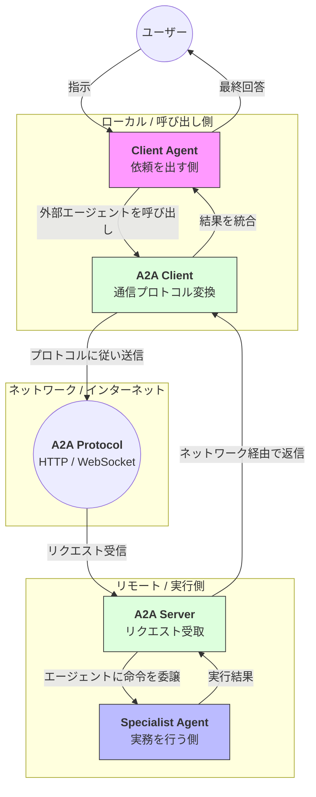

Strands SDKにおける**Agent-to-Agent (A2A)** は、ネットワークを介して物理的に離れた場所に存在するエージェント同士を連携させるための通信プロトコルおよび仕組みです。

# 概要

Agent-to-Agent（A2A）とは、異なるサーバー、異なるプラットフォーム、さらには異なるベンダーで構築されたAIエージェント同士が、**標準化された共通プロトコル**を用いて対話・協力するための機能です。

通常、マルチエージェント構成は同一プログラム内（In-Process）で完結することが多いですが、A2Aを利用することで、各エージェントを独立したマイクロサービスとしてデプロイし、必要に応じてお互いを呼び出し合う「分散型エージェントネットワーク」を構築できます。

---

- **Client Agent**: リモートにいる別のエージェントを、まるで「自分のツール」であるかのように呼び出します。
    
- **A2A Client / Server**: 通信の橋渡し役です。エージェントの「思考」をネットワーク送信可能な形式に変換し、受け取り側で再び「命令」へと復元します。
    
- **A2A Protocol**: HTTPやWebSocketをベースにした、エージェント間の「会話のルール（共通語）」です。
    
- **Specialist Agent**: リモートサーバー上で稼働する専門エージェント。呼び出し側のコンテキストを理解し、自身のツールを使って処理を実行します。
    

---

# 実装のポイント

- **`A2AServer` による公開**: 既存のエージェントを `A2AServer` クラスでラップするだけで、簡単にネットワーク越しに利用可能な状態にできます。内部的にはFastAPIなどが動作し、エンドポイントを提供します。
    
- **疎結合な設計**: 各エージェントが独立したエンドポイントを持つため、特定の技術スタック（言語やLLMモデル）に縛られず、個別にアップデートやスケーリングが可能です。
    
- **ストリーミング対応**: A2A経由であっても、エージェントの回答を逐次受け取るストリーミング機能が維持されるため、遠隔地のエージェントの回答をリアルタイムで表示できます。
    
- **セキュリティ**: 通信がネットワークを介するため、認証や認可、通信の暗号化などの標準的なウェブセキュリティ対策との併用が前提となります。
    

---

# まとめ

Agent-to-Agent（A2A）は、AIエージェントを単なるライブラリから**「独立したサービス（Agent as a Service）」**へと進化させるための基盤です。この機能により、社内の別部署が作ったエージェントや、サードパーティが提供する専門エージェントをシームレスに自社システムへ統合し、巨大なエージェント・エコシステムを形成することが可能になります。
