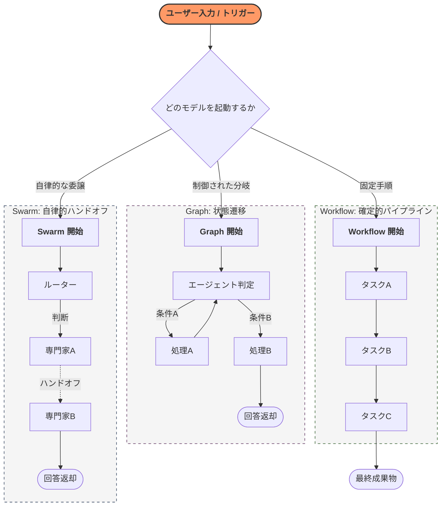

Strands SDK における **「マルチエージェント・パターン（Multi-agent Design Patterns）」** とは、複数のエージェントをどのように連携させ、実行の流れ（パス）を制御するかを定義する**設計図**です。

# 概要

マルチエージェントパターンの核心的な違いは、**「実行パス（次にどの処理を行うか）がどのように決定されるか」** という点に集約されます。開発者が厳格にフローを固める「決定論的モデル」から、AIが自律的に判断してタスクを渡す「自律型モデル」まで、業務の性質に応じて最適な接続方法を選択します。

---

- **ユーザー入力 / トリガー**: すべてのプロセスの出発点です。ここから開発者が選択した接続モデルへとリクエストが投入されます。
    
- **Workflow（確定的・直列）**: 開始から終了まで、**一本の線**でつながっています。並列処理はあっても、戻り（サイクル）やユーザーの介入による進路変更は想定されていません。
    
- **Graph（条件的・循環）**: ノードから別のノードへ**実線（エッジ）**でつながっています。特徴は「Node 2 → Node 1」のように、戻りの線が引けることで、納得がいくまで繰り返すループ構造が表現されます。
    
- **Swarm（自律的・点線）**: エージェント間の関係は**点線（ハンドオフ）**で表現されます。これは事前にルートが固定されているわけではなく、実行時にAIが動的に「次は誰に繋ぐか」を決めるためです。
---

# エージェントデザインパターンの比較

どのように設計するか」という**メタレベルの意思決定は、100%人間のエンジニアの役割** です。

| **項目 (Field)** | **Graph (グラフ)**                                      | **Swarm (スウォーム)**                                               | **Workflow (ワークフロー)**                                        |
| -------------- | ---------------------------------------------------- | --------------------------------------------------------------- | ------------------------------------------------------------ |
| ** コアコンセプト**   | 構造化され、開発者が定義したフローチャート。エージェントが次に進む道を決める。              | エージェントの動的で協力的なチーム。自律的にタスクを引き継ぐ。                                 | 事前に定義されたタスクグラフ（DAG）。単一の非対話型ツールとして実行される。                      |
| ** 構造**        | 開発者がすべてのノード（エージェント）とエッジ（遷移）を事前に定義する。                 | 開発者がエージェントのプールを提供し、エージェント自身がパスを決定する。                            | 開発者がすべてのタスクとその依存関係をコードで定義する。                                 |
| **実行フロー**      | **制御されつつ動的**。フローはグラフのエッジに従うが、各ノードでのLLMの決定がパスを左右する。   | **逐次的かつ自律的**。エージェントがタスクを実行し、`handoff_to_agent` ツールで最適な仲間に権限を渡す。 | **確定的かつ並列的**。フローは依存グラフによって固定される。独立したタスクは並列実行される。             |
| **サイクルの許容**    | **可能 (Yes)**                                         | **可能 (Yes)**                                                    | **不可 (No)**                                                  |
| **状態共有メカニズム**  | 単一の共有辞書（dict）オブジェクトが全エージェントに渡され、自由に読み書きできる。          | 「共有コンテキスト（作業メモリ）」を全エージェントが利用可能。元の依頼や履歴、先行者の知見を含む。               | ツールの出力が自動的にキャプチャされ、依存する次のタスクの入力として渡される。                      |
| **会話履歴**       | **完全な書き起こし**。対話履歴全体が共有状態内のキーとなり、全エージェントが完全な文脈を持てる。   | **共有された書き起こし**。現在の担当者は、これまでの引き継ぎ経緯や先行エージェントが貢献した知見をすべて参照できる。    | **タスク固有のコンテキスト**。各タスクは、依存関係にあるタスクからの関連結果の要約のみを受け取り、全履歴は持たない。 |
| **振る舞いの制御**    | 各ステップでのユーザー入力が、グラフの次のパスに直接影響を与えることができる。              | ユーザーの初期プロンプトが目標を定義するが、以降は自律的に実行される。                             | ユーザーのプロンプトが起動の引き金となるが、内部構造を改変することはできない。                      |
| **スケーラビリティ**   | プロセスの複雑さ（多くの分岐や条件）に合わせてスケールする。                       | チーム内の専門エージェントの数や、協力タスクの複雑さに合わせてスケールする。                          | 繰り返し可能な、複雑なオペレーションに対してよくスケールする。                              |
| **エラーハンドリング**  | **制御可能**。ステップが失敗した場合に特定のノードへ流すための明示的な「エラー」エッジを定義できる。 | **エージェント主導**。AIが専門家に引き継ぐか判断する。無限ループ防止のためタイムアウトや回数制限に依存する。       | **システム的**。一つのタスクの失敗は後続をすべて停止させ、ワークフロー全体が「失敗」状態となる。           |

# 実装のポイント

- **パス決定の所在**: 開発者がフローを支配したい場合は Graph、AIの自律性に任せたい場合は Swarm を選択します。
    
- **並列処理の活用**: Workflow は依存関係のないタスクを並列実行できるため、大量のデータ処理や複雑なパイプラインで高いパフォーマンスを発揮します。
    
- **状態（State）の設計**: 履歴をすべて持たせるか（対話重視）、必要な結果だけを渡すか（タスク重視）によってモデルを使い分けます。
    
# まとめ：いつどのモデルを使うべきか

Strandsのドキュメントが言う「実行パスの決定」とは、**「人間が引いた線の上をどう進むか（または線そのものをAIがその場で作るか）」**　というソフトウェア・アーキテクチャ上の分類を指しています。

「AIが勝手にシステムを作って動く」というフェーズではなく、**「人間が『AIが自律的に動ける遊び場』をどこまで厳格に（あるいは寛容に）作るか」**　を設計するのが、現在のマルチエージェントパターンの本質です。

### Graph を使うべき時

- 実行パスを開発者が厳密に制御（ガードレール）しつつ、ユーザーの入力に応じて柔軟に分岐させたい場合。
    
- 承認プロセスや、失敗時の特定ステップへの「戻り（サイクル）」が必要な場合。
    
### Swarm を使うべき時

- 事前にフローを予測しきれず、専門家エージェント同士が状況を見て「誰が最適か」を判断しながら進める必要がある場合。
    
- 動的なカスタマーサポートや、オープンな課題解決チームを構築する場合。
    
### Workflow を使うべき時

- 一連のタスクが固定されており、対話なしで「入力から出力まで」を一気に、かつ確実に実行したい場合。
    
- 独立したステップを並列処理し、実行の再現性と信頼性を最優先する場合。

>[注]
このセクションの公式ドキュメントに対して、筆者は「多様な AI エージェントのデザインパターンを学べるのでは」と期待していましたが、正直なところ、やや物足りなさを感じています。  
特に、「ワークフロー」という抽象度の高い言葉を用い、単純な AI エージェントの一パターンとして位置づけている点に、強い違和感を覚えます。
スウォーム型やグラフ型といった構成も、広義にはワークフローの一種ではないでしょうか。  
そもそも、言語として上位にあるべき概念を、下位の構成要素に押し込めてしまっている点に、整理としての矛盾を感じます。
[10-50-011.補足](10-50-011.補足.md)