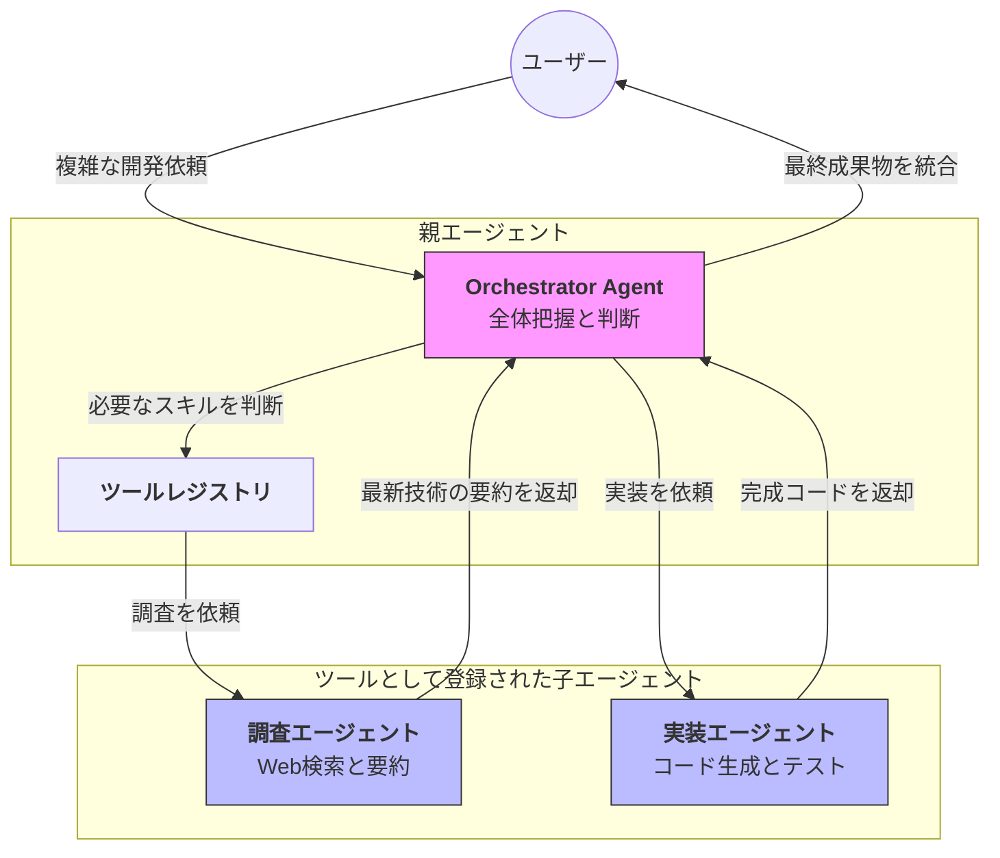

Strands SDKにおける**Agents as Tools（エージェントのツール化）** は、あるエージェント（親）から見て、別のエージェント（子）をあたかも「一つの道具（ツール）」であるかのように扱う、最も基本的で強力なマルチエージェント・パターンです。

# 概要

**Agents as Tools** とは、特定分野に特化したエージェントを、メインエージェントが呼び出し可能な「ツール」として定義する仕組みです。

通常のツールが「関数の実行（計算やAPI呼び出し）」であるのに対し、このパターンでは「思考を伴うタスクの丸投げ（委譲）」が行われます。親エージェントは、子エージェントがどのようなプロンプトで動いているかを気にする必要はなく、単に「この問題を解決してくれ」と依頼するだけで済みます。

---

- **Orchestrator Agent（親）**: 全体のゴールを理解し、どのタイミングでどの「専門家（子）」を呼ぶべきかを司令塔として判断します。
    
- **ツールレジストリ**: 子エージェントを「関数」として登録する場所です。親からは他のツール（計算機など）と同じインターフェースで見えます。
    
- **調査 / 実装エージェント（子）**: それぞれが独自のプロンプトや専門ツールを持ちます。親からの依頼を受けて「思考」し、結果を返します。
    
- **成果物の統合**: 親エージェントは、複数の子エージェントから戻ってきた断片的な成果を整理し、一つの回答にまとめ上げます。
    
# 実装のポイント

- **抽象化のメリット**: 親エージェントのプロンプトに「調査の手順」を細かく書く必要がなくなります。親は「調査エージェントに頼む」という一文だけで機能します。
    
- **再帰的な構造**: ツールとして登録された「子エージェント」が、さらに別のエージェントをツールとして持っている、といった階層構造（ツリー構造）も容易に構築可能です。
    
- **一貫したインターフェース**: `to_tool()` メソッドなどを使用して、エージェントを簡単にツールへ変換できます。これにより、既存のシングルエージェント構成を壊さずにマルチエージェント化できます。
    
- **コンテキストの分離**: 子エージェントは独立した「ステート（State）」を持つため、親の会話履歴が長くなってトークンを圧迫しても、子の推論には影響を与えにくいというメリットがあります。
    
# まとめ

Agents as Toolsは、複雑な問題を「小さな専門家たちの協力」によって解決するための第一歩です。このパターンを使うことで、エージェントの役割分担が明確になり、メンテナンス性が高く、かつ精度の高いシステムを構築できるようになります。
