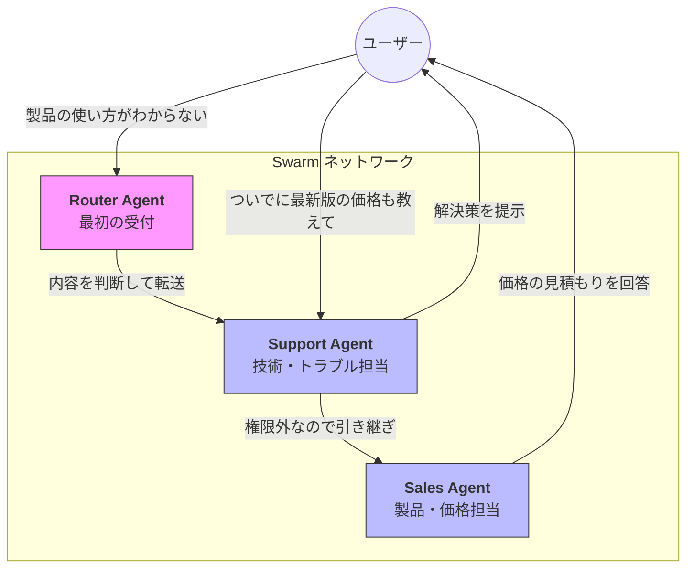

Strands SDKにおける**Swarm（スウォーム）** は、固定された上司・部下の関係ではなく、専門家エージェント同士が自律的に判断して担当を切り替えながら、一つのゴールを目指すマルチエージェント・パターンです。

# 概要

Swarm（群れ）とは、複数の専門エージェントが「ハンドオフ（引き継ぎ）」という仕組みを使って、対等な立場でバトンを渡し合う設計です。

親エージェントがすべてを管理する「階層型（Agents as Tools）」とは異なり、現在実行中のエージェントが「次はこの専門家に任せるべきだ」と判断した瞬間に、会話の主導権を次のエージェントへ移譲します。これにより、予測困難な会話の流れや、複数の専門知識が入り混じるタスクに対して、極めて柔軟に対応できます。

- **Router Agent**: ユーザーが最初に接触する窓口です。初期の意図を汲み取り、適切な専門家へ「ハンドオフ」します。
    
- **専門家エージェント (Sales / Support)**: 各々が特定の役割を持ちますが、自分の手に負えない話題が出た場合には、他の適切なエージェントへ主導権を渡すことができます。
    
- **ハンドオフ (Handoff)**: エージェントが別のエージェントを「呼び出す」のではなく、自分に代わって「担当させる」仕組みです。
    
- **シームレスな対話**: ユーザーから見ると、裏側で担当者が入れ替わっているにもかかわらず、文脈が維持された一貫したチャット体験が継続します。
    
# 実装のポイント

- **ハンドオフ関数**: 各エージェントに「他のエージェントへ転送する機能」をツールとして持たせます。これにより、LLMが自発的に「転送」を選択できるようになります。
    
- **コンテキストの共有**: 転送が行われる際、それまでの会話履歴（State）が次のエージェントに引き継がれるため、「同じ説明を二度させる」ことがありません。
    
- **軽量なオーケストレーション**: 厳格なワークフローをあらかじめ定義する必要がなく、エージェントの自律性に任せるため、開発コストを抑えつつ複雑な動線に対応できます。
    
- **終了条件の設計**: 会話がループしたり、たらい回しになったりしないよう、解決した際の終了処理（Done）を明確に定義しておくことが重要です。
    
# まとめ

Swarmは、AIエージェントによる「動的なチーム編成」を実現します。決められた手順をなぞるのではなく、状況に応じて最適な専門家がフロントに立つこのパターンは、カスタマーサポートやコンシェルジュサービス、複雑な要件定義のヒアリングなど、対話の自由度が高いユースケースで真価を発揮します。
