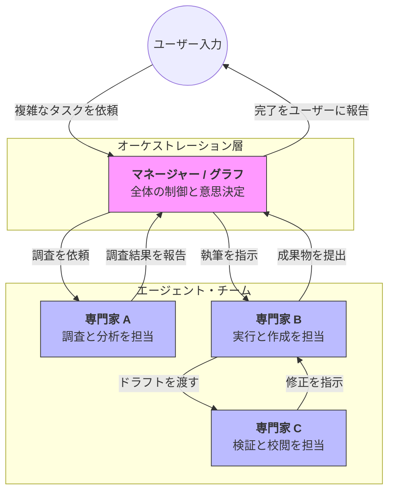

Strands SDKにおける**マルチエージェント（Multi-Agent）** は、単一のAIでは解決が困難な複雑な課題を、役割の異なる複数のエージェントを連携させて解決するためのフレームワークです。

# 概要

マルチエージェントとは、特定の専門知識を持つエージェント同士を組み合わせ、人間社会の「組織」や「チーム」のように働かせる設計思想です。Strandsでは、単純な「指示の委譲」から、自律的な「専門家同士のバトンタッチ」、厳格な「工程管理（ワークフロー）」まで、多様な連携スタイルを標準機能として提供しています。

---

- **ユーザー入力**: 一人のAIでは手に負えない、複数の工程が必要な大規模な依頼を受け取ります。
    
- **オーケストレーション層**: どのエージェントに何を任せるか、どの順番で動かすかを制御する「司令塔」です。
    
- **専門家エージェント**: 各エージェントは自分に与えられた役割（調査、執筆、プログラム実行など）に集中し、その結果をチームへ還元します。
    
- **データの受け渡し**: エージェント間でメッセージや状態（State）が共有され、前の工程の成果を次の工程が活用する「連携の連鎖」が発生します。
    

---

# 種類（連携の主要パターン）

Strandsでは、目的の柔軟性や確実性に応じて以下のスタイルを使い分けます。

| **パターン名**           | **特徴**              | **適したケース**       |
| ------------------- | ------------------- | ---------------- |
| **Agents as Tools** | 他のエージェントを「ツール」として使う | シンプルな階層構造、指示の委譲  |
| **Swarm**           | 専門家同士が自律的にバトンを回す    | ブレーンストーミング、柔軟な協力 |
| **Graph**           | ノードとエッジで厳格な経路を定義する  | 複雑な分岐、ループ、状態管理   |
| **Workflow**        | 固定の順序でタスクを実行する      | 決まった手順の自動化（定型業務） |
| **Agent-to-Agent**  | ネットワーク越しに別システムと通信する | サーバー間連携、分散システム   |
|                     |                     |                  |

---

# 実装のポイント

- **関心事の分離 (SoC)**: 各エージェントのプロンプトとツールを最小限に絞り込むことで、個々の精度を最大化し、システム全体のデバッグを容易にします。
    
- **共有メモリの設計**: エージェント間で何を共有し、何を秘匿するかを定義します。Strandsの「Shared State」を活用することで、文脈を壊さずに情報の受け渡しが可能です。
    
- **自律性と制御のバランス**: 全てをAI任せにする（Swarm）か、人間がルールを固める（Graph/Workflow）かを、業務の確実性ニーズに合わせて選択します。
    

---

# まとめ

マルチエージェントは、AIを「一人の助手」から「自律的な組織」へと進化させるための鍵です。Strands SDKを活用することで、これら複数の連携パターンを単一のコードベースで、かつ直感的に組み合わせることができ、真にスケーラブルなAIアプリケーションを構築できるようになります。
