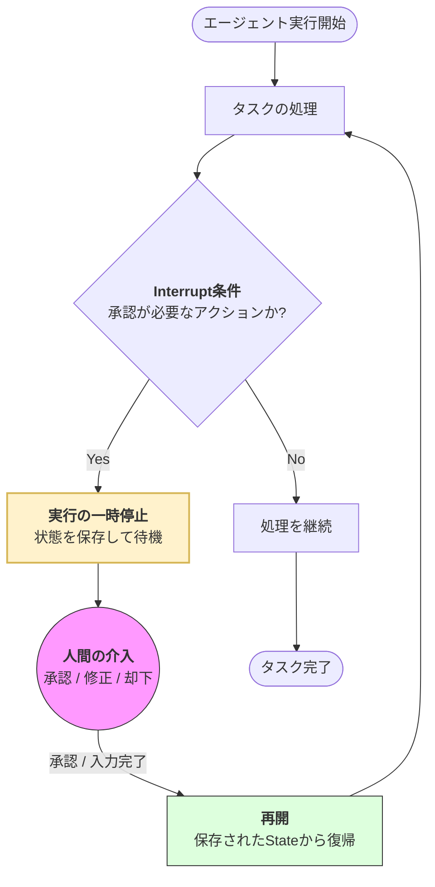

Strands SDKにおける**割り込み（Interrupts）** は、エージェントの自律的な実行プロセスを一時停止し、人間の介入や外部の確認を待機させるための重要な制御メカニズムです。

>[注]
>**Hookは「自動的な処理の追加」** であり、**Interruptは「強制的な停止と人間への確認」** 

# 概要

割り込みとは、エージェントが「判断に迷う場合」や「重要なアクション（送金、削除、外部公開など）を実行する前」に、処理を一時中断して**人間の承認（Human-in-the-loop）** を求める仕組みです。これにより、AIの暴走を防ぎ、最終的な決定権を人間が保持したまま、効率的にタスクを自動化できます。

---

- **実行の一時停止 (Suspend)**: 割り込みが発生すると、その時点の対話履歴や変数（State）がすべて保存され、エージェントのループが一旦停止します。
    
- **状態の永続化**: 停止している間、エージェントはメモリを消費し続けるのではなく、データベース等に保存された状態からいつでも復帰できる「ステートフル」な待機状態になります。
    
- **人間の介入 (Human-in-the-loop)**: 人間が内容を確認し、OKを出したり、追加の情報を与えたり、あるいは処理を中断させたりします。
    
- **再開 (Resume)**: 人間のフィードバックを取り込んだ状態で、中断した箇所から正確に処理を再開します。
    
# 実装のポイント

- **ガードレールとしての機能**: ツールの実行前に `interrupt=True` を設定することで、特定のアクション（例：データベースの書き換え）を必ず人間の承認制にできます。
    
- **ステート管理**: 割り込み中はセッションの状態が保持されるため、再開時に「これまでの経緯」をAIに説明し直す必要はありません。
    
- **柔軟なフィードバック**: 単なる「承認/却下」だけでなく、人間がAIのプロンプトを修正したり、ツールの引数を書き換えてから再開させることも可能です。
    
- **非同期対応**: Webアプリケーションなどでは、割り込みが発生したことをユーザーに通知（Push通知やチャット表示）し、ユーザーがアクションを起こすまで非同期に待機する構成が一般的です。
    
# まとめ

割り込み（Interrupts）は、AIの利便性と人間の責任を両立させるための「ブレーキ」と「対話」の機能です。

単にAIを自動で走らせるのではなく、**「ここからは人間が確認すべきだ」という境界線**をデザインすることで、ビジネスにおいて実用的で信頼性の高いエージェント・システムを構築できます。

