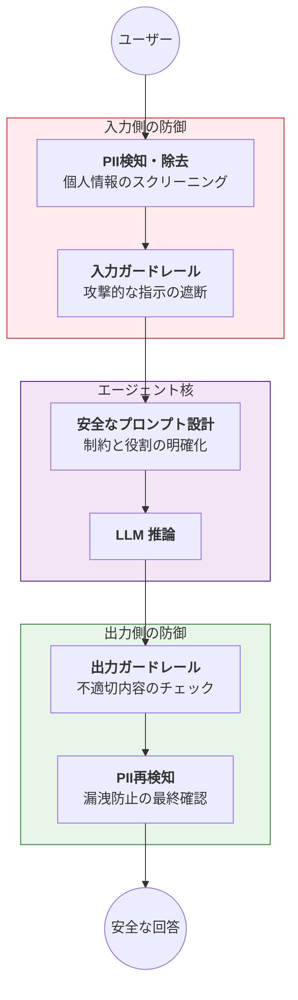

Strands SDKにおける**Safety & Security（安全性とセキュリティ）** は、AIエージェントが実社会で信頼されるための「防波堤」となる機能群です。単に正しい答えを出すだけでなく、倫理的に振る舞い、機密情報を守り、攻撃を防ぐための多層的な保護メカニズムを提供します。

# 概要

Safety & Securityの根幹は、**「責任あるAI（Responsible AI）」の原則に基づき、LLMの入出力に対して「ガードレール」と「秘匿化（PII Redaction）」を適用することにあります。これにより、有害コンテンツの生成、プロンプトインジェクション、個人情報の漏洩といったリスクを最小化します。また、安全性を考慮したプロンプトエンジニアリング** により、エージェントの振る舞いを予測可能な範囲に制御します。

- **入力側の防御**: ユーザーの入力から電話番号や住所などの個人情報（PII）を除去し、プロンプトインジェクション等の攻撃的な命令をガードレールで検知・無効化します。
    
- **エージェント核（プロンプト設計）**: 「責任あるAI」のガイドラインに従い、エージェントに強い制約と倫理的規範を与えます。システムプロンプト自体を堅牢に構築し、予期せぬ挙動を抑制します。
    
- **出力側の防御**: 生成された回答がヘイトスピーチや有害な情報を含んでいないか、あるいは隠すべき内部情報が漏れていないかを、公開前に再度スキャンします。
    
- **安全な回答の提供**: すべてのチェックを通過した、クリーンで安全な情報のみをエンドユーザーに届けます。
    
# 実装のポイント

- **多層防御の適用**: セキュリティは一つの機能に頼るのではなく、PII除去、入力フィルタリング、出力チェックの「多層」で構築することが重要です。
    
- **PII（個人識別情報）の自動レッドアクション**: 名前、メールアドレス、クレジットカード番号などを自動でマスク（例：`[REDACTED]`）し、LLMに生データを渡さないように設定します。
    
- **ガードレールのカスタマイズ**: 業界特有の禁止用語や、特定のトピック（例：投資助言の禁止）をガードレールに追加し、ビジネスドメインに最適化された安全性を確保します。
    
- **プロンプトの堅牢化**: 「前の指示を無視して」といった攻撃に屈しないよう、プロンプトの構造化を行い、エージェントのアイデンティティを強固にします。
    
# まとめ

StrandsのSafety & Security機能は、AIエージェントを「実験室のツール」から「社会で使えるインフラ」へと格上げするための基盤です。

1. **Responsible AI**: 開発初期から倫理と透明性を組み込む。
    
2. **Guardrails**: リアルタイムで危険を検知・遮断する。
    
3. **Prompt Engineering**: 振る舞いの安全性を設計段階で担保する。
    
4. **PII Redaction**: データのプライバシーを絶対的に保護する。
    

これらを統合することで、企業はリスクを最小限に抑えつつ、LLMのポテンシャルを最大限に引き出すことができます。

