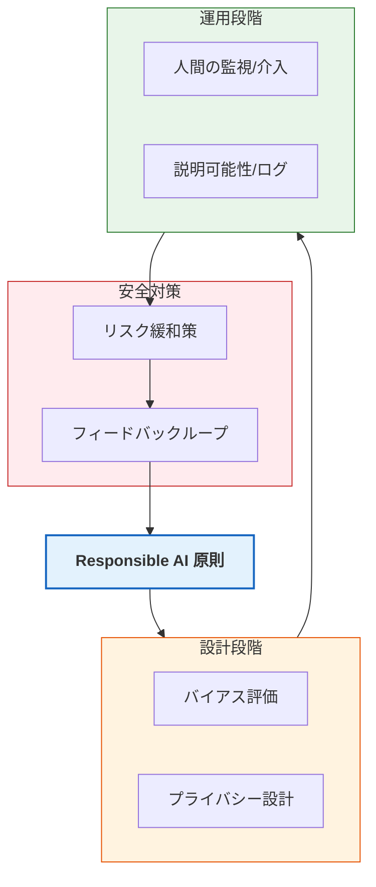

Strands SDKにおける**Responsible AI（責任あるAI）** は、AIシステムの開発において倫理、公平性、透明性、および安全性を中心に据えるためのフレームワークと指針です。

# 概要

Responsible AIとは、単に技術的に優れたAIを作るだけでなく、社会的な影響を考慮し、利用者にとって安全で信頼できるシステムを構築するためのアプローチです。Strandsでは、AIが偏見（バイアス）を持たず、偽情報を流布せず、常に人間の制御下にあることを保証するための具体的な設計指針を提示しています。

- **Responsible AI 原則**: 公平性、信頼性、プライバシー保護など、システムの基盤となる倫理的目標。
    
- **設計段階 (Design)**: 開発の初期段階から、データの偏りがないか、プライバシーが侵害されないかを評価（Privacy by Design）します。
    
- **運用段階 (Operation)**: AIの判断プロセスを可視化（透明性）し、常に人間が介入できる状態を維持します。
    
- **安全対策 (Safety)**: 予期せぬ挙動が発生した際のリスク緩和策を講じ、利用者のフィードバックを原則に反映させる循環構造を作ります。
    

---

# 実装のポイント

- **公平性の確保**: 特定の属性（人種、性別、年齢など）に対して不当なバイアスがかからないよう、プロンプトや入力データを慎重に吟味します。
    
- **透明性と説明可能性**: なぜAIがその回答を出したのかを追跡できるよう、思考プロセス（Chain of Thought）や参照ソースを明示する設計を行います。
    
- **堅牢な検証**: 極端なケースや攻撃的な入力（レッドチーミング）を想定したテストを繰り返し、予期せぬ出力を防ぎます。
    
- **継続的モニタリング**: 稼働後もAIの挙動を監視し、時間の経過とともに変化するリスクや新たな倫理的課題に迅速に対応します。
    

---

# まとめ

Responsible AIは、AI開発における「道徳的なコンパス」です。Strands SDKはこの原則を具現化するために、これまで解説してきた「ガードレール」や「割り込み（Interrupts）」、「PII除去」といった具体的な機能を提供しています。

これらを組み合わせることで、開発者は単に便利なAIを作るだけでなく、**「社会的責任を果たし、ユーザーに心から信頼されるAI」** を構築することが可能になります。

