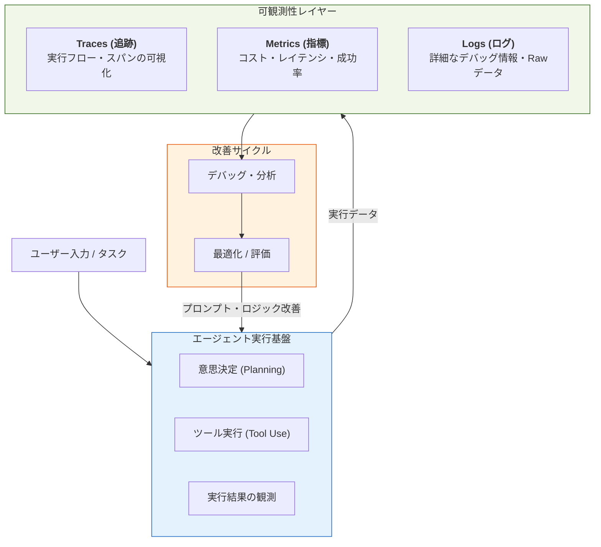

Strandsにおける**Observability（可観測性）とDebugging**は、複雑なAIエージェントの動作をブラックボックス化させず、実行の全行程を透明化するための基盤です。

##  概要

Strandsの可観測性は、単なるエラー監視ではありません。**「エージェントがなぜその判断をしたのか」**　を、思考プロセス（Traces）、定量的データ（Metrics）、詳細な記録（Logs）の3つの柱で紐解きます。

特に、非決定的な挙動を示しやすいLLMアプリケーションにおいて、推論のステップ（思考の連鎖）を可視化することで、デバッグの効率を飛躍的に高めるよう設計されています。

---

- **Agent Runtime**: ユーザーの入力を受け、エージェントが「思考・行動・観察」を繰り返す実行環境です。
    
- **Traces (追跡)**: エージェントの一連の動作を「スパン」単位で記録します。どのツールにどれだけ時間がかかったか、入れ子構造になった推論のどこで失敗したかをツリー形式で把握できます。
    
- **Metrics (指標)**: トークン消費量（コスト）、応答時間（レイテンシ）、成功率などの数値データです。システム全体の健康状態を定量的に判断します。
    
- **Logs (ログ)**: 個別のイベントやエラーメッセージ、LLMへの生の入出力など、最も粒度の細かい情報を記録し、問題発生時の原因特定をサポートします。
    
- **改善サイクル**: 可視化されたデータに基づき、プロンプトの調整やモデルの変更、ツールの定義修正を行い、エージェントの精度を向上させます。
    

---

# 実装のポイント

Strandsのドキュメントに沿った、実運用における重要ポイントは以下の通りです。

1. 分散トレーシングの活用 (Traces):
    
    エージェントの推論ステップごとにユニークなIDを付与し、非同期処理や外部API呼び出しが混在しても、一連の「思考の流れ」として繋ぎ合わせることが不可欠です。
    
2. コストとパフォーマンスの監視 (Metrics):
    
    LLMの利用料は実行回数に応じて増大するため、トークン使用量をリアルタイムで監視し、異常なループや非効率なプロンプトを早期に発見します。
    
3. コンテキストの保持 (Logs):
    
    デバッグ時には、エラーメッセージだけでなく「その時のプロンプト」と「モデルのメタデータ（Temperature等）」をセットで記録しておくことで、再現性を確保します。
    
4. 評価(Evaluation)との統合:
    
    可観測性データは、単に眺めるものではなく、評価指標（AccuracyやFaithfulnessなど）と照らし合わせることで、システムとしての信頼性を担保する材料になります。
    

---

# 4. まとめ

StrandsにおけるObservabilityは、**「不確実なAIの挙動を、確実なエンジニアリングの管理下に置く」**ための仕組みです。

- **Traces**で構造を理解し、
    
- **Metrics**で傾向を掴み、
    
- **Logs**で詳細を突き止める。
    

|**要素**|**役割**|**主な内容**|**主な利用シーン**|
|---|---|---|---|
|**可観測性 (Observability)**|**「全体像の把握」**      システム内部の挙動を外部から推測可能にする概念。|メトリクス、トレース、ログの統合的な運用。|安定稼働、デバッグ、品質向上、コスト最適化のすべての基盤。|
|**メトリクス (Metrics)**|**「数値による健康診断」**      定量的なデータを時系列で測定する。|トークン消費量、コスト、応答時間（レイテンシ）、成功率。|「先月よりコストが増えたか？」「最近応答が遅くなっていないか？」の監視。|
|**トレース (Traces)**|**「一連の流れの可視化」**      1つのリクエストが完了するまでの工程を連鎖として追う。|親スパン（実行全体）、子スパン（LLM呼び出し、ツール実行、思考ステップ）。|「全体の10秒のうち、どのツール実行に一番時間がかかったか？」の特定。|
|**ログ (Logs)**|**「詳細な事実の記録」**      特定の瞬間に起きた出来事をテキストで記す。|エラーメッセージ、生のプロンプト、ツールの引数/戻り値、システム警告。|「なぜこのツールがエラーになったのか？」という原因究明（トラブルシューティング）。|
