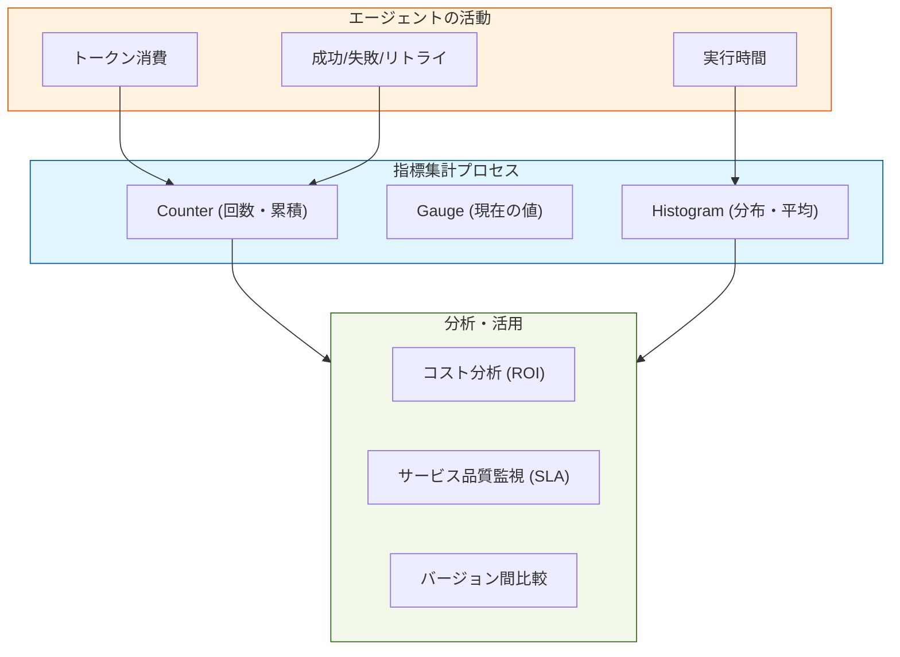

Strandsにおける**Metrics（指標）**は、エージェントのパフォーマンスを客観的・定量的に測定するためのデータ群です。可観測性の「3つの柱」の中で、システムの健康状態やコスト、効率を「数値」で把握する役割を担います。

---

#  概要

StrandsのMetrics機能は、エージェントの実行過程で発生する「時間」「コスト」「精度」などのデータを集計し、統計的な推移を可視化する仕組みです。

単一の実行を追うTracesとは異なり、Metricsは**「全体としてシステムは安定しているか？」「予算内に収まっているか？」** といったマクロな視点での意思決定を支えます。これにより、プロンプトの変更が全体のレイテンシにどう影響したか、といった定量的評価が可能になります。

---

- **Agent Activity**: 指標の元となる「イベント」です。LLMの呼び出しやツールの実行に伴い、生データが発生します。
    
- **Metrics Aggregator**: 生データを統計的に処理します。
    
    - **Counter**: 「何回実行されたか」などの累積。
        
    - **Histogram**: 「応答時間のバラツキ（95パーセンタイル値など）」の算出。
        
- **Analysis Dashboard**: 集計された数値に基づき、予算の管理（コスト）、ユーザー体験の維持（速度）、品質向上（ベンチマーク）といったビジネス・運用上の判断を行います。
    

---

# 実装のポイント

Strandsのドキュメントに即した、メトリクス実装における重要ポイントは以下の通りです。

1. トークン消費の監視 (Cost Tracking):
    
    LLMのモデル（GPT-4o, Claude 3.5等）ごとに異なる単価を考慮し、入出力トークン数を記録します。これにより、特定のプロンプトが予期せずコストを跳ね上げている箇所を特定できます。
    
2. レイテンシの分解 (Latency Breakdown):
    
    「全体の応答時間」だけでなく、「LLMの推論時間」と「ツールの実行時間」を分けて計測します。どこがボトルネックかを数値で証明することが、最適化への近道です。
    
3. カスタムメトリクスの定義:
    
    標準的な指標（成功率など）に加え、業務固有の指標（例：最終的な回答までにツールを何回叩いたか）を定義することで、エージェントの「賢さ」や「無駄な思考」を定量化します。
    

---

# まとめ

StrandsのMetricsは、エージェント運用のための**「計器飛行」**を可能にするデータ基盤です。

- **定量性**: 感覚ではなく数値で、システムの改善・改悪を判断できる。
    
- **効率性**: コストとパフォーマンスのバランス（費用対効果）を最適化できる。
    
- **継続性**: バージョンごとの比較を通じて、長期的な品質低下（モデルの劣化など）を検知できる。
    
