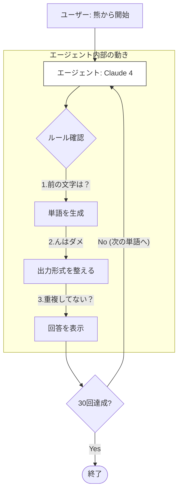

# 概要

Amazon Bedrock上のLLM（Claude 4 Sonnet）に「しりとり」を自律的に行わせるプログラムです。

単なるチャットではなく、**Agent（エージェント）** という概念を用いることで、特定の役割（しりとりマスター）とルールを維持しながらタスクを遂行させる構成になっています。



この構成は、単なる「一問一答」のチャットボットではなく、**「自律的なワークフロー（Autonomous Workflow）」**を表現しています。

- **System Prompt（羅針盤）**: エージェントの行動規範です。「しりとりのルール」をLLMの深い推論層（Claude 3.5の高度な日本語能力）に定着させます。
    
- **Context Memory（記憶）**: StrandsのAgentクラスは、自身が生成した単語を記憶し続けます。これにより「同じ単語を使わない」というルールが成立します。
    
- **Logic Loop（推論の連鎖）**: 30回のループは、モデルが自らの出力を次のステップの「文脈」として読み込み直すことで実現されます。モデルは常に「今の状態」と「最終目標（30回）」を比較しながら生成を続けます。


# 実装のポイント

### Bedrock Modelの最新版指定

`model_id` に指定されている `us.anthropic.claude-sonnet-4-20250514-v1:0` は、Claude の中でも特に推論精度が高く、日本語の「読み」の処理に強いモデルです。しりとりのような、音韻（ひらがな）を扱うタスクに非常に適しています。

### 思考の構造化（Output Format）

プロンプトで「次の文字：[ ]」を明示させているのが重要なテクニックです。 LLMは「次に書くべき文字」を先に自分で出力することで、**注意（Attention）がその文字に固定され**、次のループで間違いを犯す確率を劇的に下げることができます。

### 自律性の担保

通常のプログラムであれば `for` 文などでループを書きますが、このコードでは `shiritori_agent("...30回続けてください")` と、**タスクの反復自体をLLM側に委ねています。** これがStrandsのようなエージェントフレームワークを利用する最大のメリットであり、柔軟な自律行動を可能にしています。


---
# サンプルコード


[simple_iterative.py]
```
# import boto3
from strands import Agent
from strands.models.bedrock import BedrockModel

# 1. Bedrockの設定 (Claude 4.0 Sonnetを使用)
bedrock_model = BedrockModel(
    region_name="us-east-1",
    model_id="us.anthropic.claude-sonnet-4-20250514-v1:0"
)

# 2. しりとり専用のシステムプロンプト
# 「思考プロセス」を明示させることで、LLMのルールミスを防ぎます
system_prompt = """
あなたは日本語の「しりとり」を完璧にこなすエージェントです。
以下のルールを厳守し、1人で30ぐらいを目途にしりとりを続けてください。

【ルール】
1. 前の単語の最後の文字から始まる単語を出すこと。違反した場合は終了する。
2. 最後に「ん」がつく単語を出したら終了すること。
3. 同じ単語は二度使わないこと。 同じ単語が使われたら終了する。
4. 読み（ひらがな）を必ず併記すること。

【出力形式】
回数: [n/30]
単語: [単語]（[よみがな]）
次の文字: [次の開始文字]

最初の単語は「熊（くま）」です。次は「ま」から開始してください。
30回を目標に自律的に続けてください。
"""

# 3. エージェントの作成
shiritori_agent = Agent(
    model=bedrock_model,
    system_prompt=system_prompt
)

# 4. 実行開始
# max_iterationsを少し多めに設定し、エージェントが納得するまでループを回せるようにします
print("🎮 しりとりゲーム（Level 1）を開始します...\n")
response = shiritori_agent("「熊（くま）」からスタートして、30回続けてください。")

#print(response)
```


# 実行
```
python simple_iterative.py

🎮 しりとりゲーム（Level 1）を開始します...

1回目: 1/30
単語: 熊（くま）
次の文字: ま

2回目: 2/30
単語: 松（まつ）
次の文字: つ

3回目: 3/30
単語: 月（つき）
次の文字: き

4回目: 4/30
単語: 木（き）
次の文字: き

5回目: 5/30
単語: 切手（きって）
次の文字: て

6回目: 6/30
単語: 天気（てんき）
次の文字: き

7回目: 7/30
単語: 黄色（きいろ）
次の文字: ろ

8回目: 8/30
単語: ロボット（ろぼっと）
次の文字: と

9回目: 9/30
単語: 虎（とら）
次の文字: ら

10回目: 10/30
単語: ラジオ（らじお）
次の文字: お

11回目: 11/30
単語: 鬼（おに）
次の文字: に

12回目: 12/30
単語: 人参（にんじん）
次の文字: ん

【終了】
「人参（にんじん）」で「ん」がついたため、しりとりを終了します。
12回で終了となりました。

```

ここでは12回で終了しているが、結果は気まぐれで30回をやり通すこともあります。

