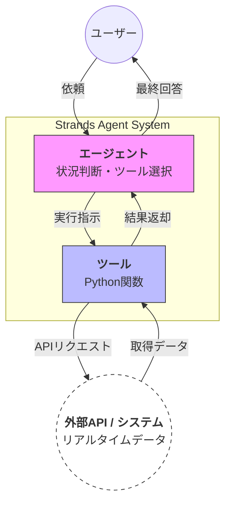

# 概要

**外部ツール連携（External Tool Integration）** は、AIエージェントに「手足」となるツール（Python関数）を与え、必要に応じて外部APIやシステムから最新データを取得・操作させるデザインパターンです。LLMの静的な知識では解決できない「現在の気温」「最新のニュース」「在庫状況」といった動的な課題を解決するために不可欠な、エージェント構築の基本モデルです。


**外部ツール連携パターン**を採用することで、AIは閉じた世界から解放され、現実世界のデータと同期した「実行可能な知能」へと進化します。Strands SDKを活用すれば、既存のPython関数をそのままツールとして公開できるため、レガシーなシステムや最新のWebサービスを問わず、あらゆる外部リソースをエージェントの能力として統合することが可能です。





- **依頼フェーズ**: ユーザーが自然言語で「〜を調べて」「〜を実行して」とエージェントに依頼します。
    
- **判断フェーズ**: エージェント（Brain）が現在のタスクを分析し、解決に最適な「ツール（Tool）」を自身のリストから選び出します。
    
- **外部アクセス**: ツール（Python関数）が実行され、インターネット上のAPIや社内システム（World）に対してリクエストを送信します。
    
- **還元フェーズ**: 外部システムから返ってきた生のデータがツールを介してエージェントに戻されます。
    
- **回答フェーズ**: エージェントはそのデータを解釈し、ユーザーにとって分かりやすい言葉に変換して最終回答を提示します。
- 
---

# 実装のポイント

- **Tool（機能の拡張）**: Python関数に `@tool` を付与するだけで、エージェントはその関数の役割（docstring）を理解し、必要な引数を自ら生成して実行できるようになります。
    
- **Prompt（戦略の定義）**: `system_prompt` によって、エージェントに「どのような役割」で「いつツールを使うべきか」という行動指針を与えます。
    
- **オーケストレーション**: 「Aを知るためにBを実行し、その結果を使ってCを行う」といった手順をプログラミングする必要はありません。エージェントが論理的に手順を組み立てて実行します。
    

---

# サンプルコード

このコードは、2つの独立したツールをエージェントが自律的に連携させる「マルチステップ連携」の例です。

[external_tool_ integration.py]
```
import requests
from strands import Agent, tool
from strands.models.bedrock import BedrockModel

# --- ツール1: エンティティ解決（地名 → 座標） ---
@tool
def get_coordinates(location: str):
    """地名から緯度と経度の座標を返します。"""
    # 実際はジオコーディングAPI等を叩きます
    if "東京" in location:
        return {"lat": 35.68, "lon": 139.76}
    return {"lat": 0, "lon": 0}

# --- ツール2: 外部データ取得（座標 → 最新情報） ---
@tool
def get_current_weather(lat: float, lon: float):
    """特定の座標（緯度・経度）から、現在の最新の天気を取得します。"""
    url = f"https://api.open-meteo.com/v1/forecast?latitude={lat}&longitude={lon}&current_weather=true"
    response = requests.get(url).json()
    return response["current_weather"]

# --- エージェントの構築 ---
model = BedrockModel(
    region_name="us-east-1",
    model_id="us.anthropic.claude-sonnet-4-20250514-v1:0",
)

agent = Agent(
    model=model,
    system_prompt="あなたはデータ分析のエキスパートです。ツールを活用して、事実に基づいた最新情報を報告してください。",
    tools=[get_coordinates, get_current_weather] # ツールをセット
)

# --- 実行 ---
# ユーザーは「手順」を指示せず「目的」だけを伝える
response = agent("東京の現在の天気を調べて。")
print(response)
```


# 実行

```
python external_tool_integration.py

東京の天気をお調べします。まず東京の座標を取得してから、天気情報を取得しますね。
Tool #1: get_coordinates

Tool #2: get_weather
東京の現在の天気情報をお知らせします：

**東京の現在の天気**（2025年12月31日 8時30分時点）
- **気温**: 9.4°C
- **風速**: 3.3 m/s
- **風向**: 北東（49度）
- **天候**: 部分的に曇り（天気コード：2）
- **時間帯**: 夜間

現在は夜明け前の時間帯で、気温は9.4度とやや肌寒く、軽い曇り空となっています。風は穏やかな北東の風が吹いています。外出される際は、防寒対策をおすすめします。
```


