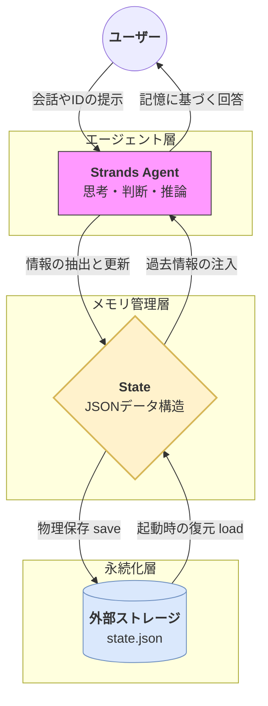

# 概要

**長期記憶（Long Term Memory）パターン**は、LLMの「一度会話が終わると忘れてしまう」という性質を克服し、ユーザー固有の情報（名前、ID、好みなど）を外部ストレージ（JSONファイル等）に永続化するパターンです。これにより、プログラムを再起動しても前回のコンテキストを完全に復元できます。




- **入力**: ユーザーがエージェントに対して情報（例：「私のIDはS001です」）を伝えます。
    
- **更新**: エージェントは入力を解析し、重要な情報を `State` オブジェクト（メモリ上の辞書）へ書き込みます。
    
- **保存**: `state.save()` メソッドを実行すると、メモリ上のデータが **JSONファイル** として物理ディスクに書き出されます。
    
- **復元**: 次回のプログラム起動時、`state.load()` によってファイルからデータが読み戻されます。
    
- **注入**: 復元されたデータはエージェントの「現在の知識」としてシステムプロンプトに組み込まれます。
    
- **回答**: 過去の記憶（名前、ID、好み）に基づき、エージェントは文脈に沿ったパーソナライズされた回答を生成します。
---

# 実装のポイント

- **セッションを跨ぐ永続化**: `agent.state.save("filename.json")` でディスクへ書き出し、起動時に `agent.state.load("filename.json")` で復元します。
    
- **状態に基づくガード（本人確認）**: `State` 内に保存された特定のキー（例：user_id）を参照し、入力された情報と一致するかを判断するロジックをプロンプトまたはツールで構築します。
    
- **情報の合成（A+B+C）**: 保存された過去の事実（A）に、新しい入力（B）を加え、分析結果（C）を出すという連続性を保証します。
    

# サンプルコード

このコードは、実行するたびにファイルを読み書きし、過去の記憶を確認します。

[long_term_memory.py]
```
import os
import json
from strands import Agent
from strands.models import BedrockModel
from strands.session.file_session_manager import FileSessionManager

USER_INDEX_FILE = "user_index.json"

def load_user_index():
    if os.path.exists(USER_INDEX_FILE):
        with open(USER_INDEX_FILE, "r", encoding="utf-8") as f:
            return json.load(f)
    return {"next_id": 1, "users": {}}

def save_user_index(index):
    with open(USER_INDEX_FILE, "w", encoding="utf-8") as f:
        json.dump(index, f, ensure_ascii=False, indent=2)

def register_user(name: str, hobby: str) -> str:
    index = load_user_index()
    user_id = f"S{index['next_id']:03d}"
    index["users"][user_id] = {"name": name, "hobby": hobby}
    index["next_id"] += 1
    save_user_index(index)
    return user_id

def lookup_user(user_id: str):
    index = load_user_index()
    return index["users"].get(user_id.upper())

model = BedrockModel(
    region_name="us-east-1",
    model_id="us.anthropic.claude-sonnet-4-20250514-v1:0"
)

def create_agent_for_user(user_id: str, user_info: dict = None):
    session_manager = FileSessionManager(
        session_id=user_id,
        storage_dir="./sessions"
    )
    
    context = ""
    if user_info:
        context = f"Current user: {user_info['name']} (hobby: {user_info['hobby']})"
    
    return Agent(
        model=model,
        system_prompt=f"You are a personal assistant with memory. Respond only in Japanese. {context}",
        session_manager=session_manager,
        callback_handler=None
    )

def get_text(response) -> str:
    for c in response.message.get("content", []):
        if "text" in c:
            return c["text"]
    return ""

def parse_registration(user_input: str):
    """名前と趣味を解析"""
    # 全角・半角カンマ両対応
    text = user_input.replace(",", "、")
    if "、" in text:
        parts = text.split("、")
        if len(parts) >= 2:
            name = parts[0].strip()
            hobby = parts[1].strip().rstrip("です。")
            return name, hobby
    return None, None

def main():
    if not os.path.exists(USER_INDEX_FILE):
        save_user_index({"next_id": 1, "users": {}})
        print("[INFO] ユーザーインデックスを初期化しました")
    
    os.makedirs("./sessions", exist_ok=True)
    
    print("=" * 50)
    print("パーソナルアシスタント（exitで終了）")
    print("=" * 50)
    print("\nIDをお持ちの方はIDを入力してください。")
    print("新規の方は「名前、趣味」の形式で入力してください。\n")

    current_agent = None
    current_user_id = None

    while True:
        user_input = input("あなた: ").strip()
        if user_input.lower() == "exit":
            print("\nさようなら！")
            break
        if not user_input:
            continue

        # IDパターン (S001など)
        if user_input.upper().startswith("S") and len(user_input) == 4:
            uid = user_input.upper()
            user_info = lookup_user(uid)
            if user_info:
                current_user_id = uid
                current_agent = create_agent_for_user(uid, user_info)
                msg_count = len(current_agent.messages)
                if msg_count > 0:
                    response = current_agent(f"I am {user_info['name']}. I'm back.")
                    print(f"\nアシスタント: {get_text(response)}")
                    print(f"[INFO] 過去の会話履歴: {msg_count}件\n")
                else:
                    response = current_agent(f"I am {user_info['name']}. My hobby is {user_info['hobby']}.")
                    print(f"\nアシスタント: {get_text(response)}\n")
            else:
                print(f"\n[ERROR] ID {uid} が見つかりません。\n")
            continue

        # 新規登録パターン
        if current_agent is None:
            name, hobby = parse_registration(user_input)
            if name and hobby:
                new_id = register_user(name, hobby)
                current_user_id = new_id
                current_agent = create_agent_for_user(new_id, {"name": name, "hobby": hobby})
                response = current_agent(f"I am {name}. My hobby is {hobby}. Nice to meet you.")
                print(f"\n[INFO] 登録完了！あなたのIDは {new_id} です。")
                print(f"アシスタント: {get_text(response)}\n")
                continue
            else:
                print("\n[INFO] IDを入力するか、「名前、趣味」の形式で登録してください。\n")
                continue

        # 通常の会話
        if current_agent:
            response = current_agent(user_input)
            print(f"\nアシスタント: {get_text(response)}\n")

if __name__ == "__main__":
    main()
```


# サンプルコードの実装イメージ

**実行結果イメージ:**
```
==================================================
パーソナルアシスタント（exitで終了）
==================================================

IDをお持ちの方はIDを入力してください。
新規の方は「名前、趣味」の形式で入力してください。

あなた: 李、筋トレ
[INFO] 登録完了！あなたのIDは S001 です。

アシスタント: はじめまして、李さん！筋トレがご趣味なんですね。
週に何回くらいトレーニングされていますか？

あなた: 週3回くらいかな
アシスタント: 週3回は理想的な頻度ですね！どの部位を重点的に鍛えていますか？

あなた: exit
さようなら！
```

**再起動後（セッション復元）**:

```
==================================================
パーソナルアシスタント（exitで終了）
==================================================

あなた: S001
[INFO] 過去の会話履歴: 4件

アシスタント: おかえりなさい、李さん！前回は週3回の筋トレについて
お話ししていましたね。最近のトレーニングはいかがですか？

あなた: 最近は有酸素も始めたよ
アシスタント: 素晴らしいですね！筋トレに有酸素を組み合わせると
脂肪燃焼効果も高まりますよ。
```

**ストレージ構造**:

```
./sessions/
  session_S001/
    session.json       ← セッション情報
    agents/
      agent_xxx/
        messages/      ← 会話履歴（Strands管理）

user_index.json        ← ID↔ユーザー情報（独自）
```

# 実行

**1回目の実行:**
```
python long_term_memory.py

==================================================
パーソナルアシスタント（exitで終了）
==================================================

IDをお持ちの方はIDを入力してください。
新規の方は「名前、趣味」の形式で入力してください。

あなた: 李、筋トレです。

[INFO] 登録完了！あなたのIDは S001 です。
アシスタント: はじめまして、李さん！お会いできて嬉しいです。

筋トレがご趣味なんですね。とても素晴らしい趣味だと思います！どのくらい筋トレを続けていらっしゃるのでしょうか？また、特に重点的に鍛えている部位はありますか？

何かお手伝いできることがあれば、遠慮なくおっしゃってくださいね。

あなた: exit

さようなら！

$ tree sessions/
sessions/
└── session_S002
    ├── agents
    │   └── agent_default
    │       ├── agent.json
    │       └── messages
    │           ├── message_0.json
    │           └── message_1.json
    ├── multi_agents
    └── session.json

5 directories, 4 files

```


**2回目の実行:**
```
python long_term_memory.py
==================================================
パーソナルアシスタント（exitで終了）
==================================================

IDをお持ちの方はIDを入力してください。
新規の方は「名前、趣味」の形式で入力してください。

あなた: S002

アシスタント: おかえりなさい、李さん！

今日も筋トレはされましたか？それとも休養日でしょうか？

何かお手伝いできることがあれば、お気軽にお声がけくださいね。トレーニングのことでも、他のことでも構いません！
[INFO] 過去の会話履歴: 2件

あなた: exit

さようなら！

$ tree sessions/
sessions/
└── session_S002
    ├── agents
    │   └── agent_default
    │       ├── agent.json
    │       └── messages
    │           ├── message_0.json
    │           ├── message_1.json
    │           ├── message_2.json
    │           └── message_3.json
    ├── multi_agents
    └── session.json

5 directories, 6 files
```

中身は、このようになっています。
```
cat sessions/session_S002/session.json
cat sessions/session_S002/agents/agent_default/agent.json
cat sessions/session_S002/agents/agent_default/messages/*.json


$ cat sessions/session_S002/session.json
{
  "session_id": "S002",
  "session_type": "AGENT",
  "created_at": "2025-12-30T22:14:31.390533+00:00",
  "updated_at": "2025-12-30T22:14:31.390559+00:00"
}

cat sessions/session_S002/agents/agent_default/agent.json
{
  "agent_id": "default",
  "state": {},
  "conversation_manager_state": {
    "__name__": "SlidingWindowConversationManager",
    "removed_message_count": 0
  },
  "_internal_state": {
    "interrupt_state": {
      "interrupts": {},
      "context": {},
      "activated": false
    }
  },
  "created_at": "2025-12-30T22:14:31.392139+00:00",
  "updated_at": "2025-12-30T22:16:52.635580+00:00"
}

$ cat sessions/session_S002/agents/agent_default/messages/*.json
{
  "message": {
    "role": "user",
    "content": [
      {
        "text": "I am 李. My hobby is 筋トレ. Nice to meet you."
      }
    ]
  },
  "message_id": 0,
  "redact_message": null,
  "created_at": "2025-12-30T22:14:31.393724+00:00",
  "updated_at": "2025-12-30T22:14:31.393730+00:00"
}{
  "message": {
    "role": "assistant",
    "content": [
      {
        "text": "はじめまして、李さん！筋トレがご趣味なんですね。私はあなたの個人アシスタントです。\n\n筋トレはとても素晴らしい趣味ですね！どのような種目がお気に入りですか？ベンチプレスやスクワット、デッドリフトなどの基本的な種目から、より専門的なトレーニングまで、何かお手伝いできることがあれば何でもお聞かせください。\n\nトレーニングメニューの相談や栄養管理のアドバイス、モチベーション維持のサポートなど、筋トレに関することでしたら喜んでお手伝いさせていただきます！"
      }
    ]
  },
  "message_id": 1,
  "redact_message": null,
  "created_at": "2025-12-30T22:14:39.889518+00:00",
  "updated_at": "2025-12-30T22:14:39.889525+00:00"
}{
  "message": {
    "role": "user",
    "content": [
      {
        "text": "I am 李. I'm back."
      }
    ]
  },
  "message_id": 2,
  "redact_message": null,
  "created_at": "2025-12-30T22:16:44.220628+00:00",
  "updated_at": "2025-12-30T22:16:44.220631+00:00"
}{
  "message": {
    "role": "assistant",
    "content": [
      {
        "text": "おかえりなさい、李さん！\n\n今日も筋トレはされましたか？それとも休養日でしょうか？\n\n何かお手伝いできることがあれば、お気軽にお声がけくださいね。トレーニングのことでも、他のことでも構いません！"
      }
    ]
  },
  "message_id": 3,
  "redact_message": null,
  "created_at": "2025-12-30T22:16:52.632191+00:00",
  "updated_at": "2025-12-30T22:16:52.632198+00:00"
```

ここでは、ローカルファイルに格納していますが、Strandsの公式セッションマネージャーは、他にも対応しています。

| ストレージ     | クラス                  | 状態             |
| --------- | -------------------- | -------------- |
| ローカルファイル  | `FileSessionManager` | 公式             |
| Amazon S3 | `S3SessionManager`   | 公式             |
| DynamoDB  | -                    | 未実装（カスタム実装可能）  |
| Redis     | -                    | 未実装（コミュニティ提案中） |


