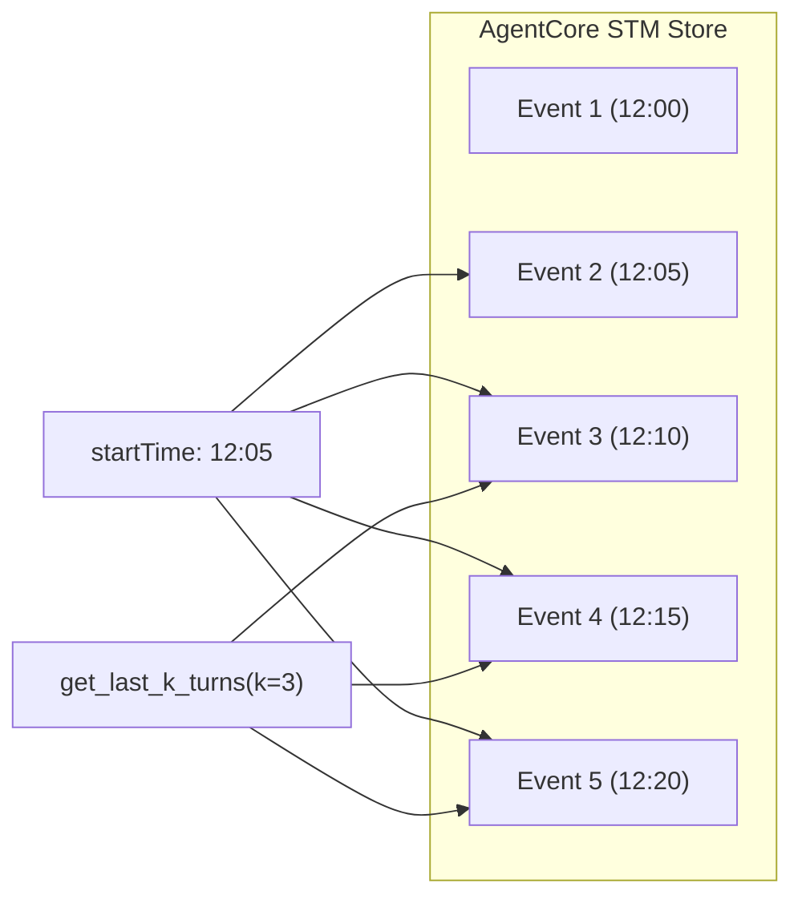

**短期記憶（STM）も非常に柔軟に検索・取得が可能**です。

Amazon Bedrock AgentCoreのSTMは、単なる「垂れ流しのログ」ではなく、インデックスされたイベントデータとして管理されているため、プログラムから条件を指定して取り出すことができます。

---

### 1. 短期記憶の検索・取得パターン

主に以下の3つの切り口で取得を制御できます。

| **取得方法**             | **具体的な指定形式**                        | **ユースケース**                        |
| -------------------- | ----------------------------------- | --------------------------------- |
| **最新の○件 (K-turns)**  | `get_last_k_turns(k=5)`             | 「直近のやり取りだけ」をコンテキストに含めて、推論の精度を高める。 |
| **全履歴の取得**           | `list_events(includePayloads=True)` | セッション終了時に、すべての会話を振り返って要約（LTM化）する。 |
| **時間指定 (Timestamp)** | `startTime` / `endTime` パラメータ       | 「今日の14時以降のやり取りだけ」を対象に分析を行う。       |

---

### 2. 短期記憶の検索構造図

コード スニペット



---

### 3. 実装コードでの指定例 (boto3 / SDK)

あなたのコードでも使われている `list_events` を使うと、SQLのクエリに近い形で詳細な絞り込みが可能です。

Python

```
# 短期記憶を「いつから」「何件」で検索する例
response = client.list_events(
    memoryId=config.memory_id,
    sessionId=config.session_id,
    actorId="tanaka",
    startTime=datetime(2026, 1, 3, 12, 0, 0), # 12時以降
    maxResults=10,                            # 最新10件
    includePayloads=True                      # 内容も含める
)
```

---

### 4. 運用のポイント：検索できる「期間」

短期記憶には **`event_expiry_days`（有効期限）** という概念があります。

- **設定例:** `event_expiry_days=7`
    
- **挙動:** 7日を過ぎた短期記憶の生ログは自動的に削除されます。
    
- **注意:** 「いつから」の検索も、この有効期限内のデータに限られます。それより古い「要旨」を検索したい場合は、LTM（長期記憶）の出番となります。
    

### 5. まとめ

- **最新件数:** 指定可能です。
    
- **時間指定:** 指定可能です。
    
- ** actorId指定:** 特定の参加者（田中さん等）の発言だけを抜き出すことも可能です。
    

この「短期記憶の柔軟な検索」ができるおかげで、討論バトルの最後に **「今日の田中さんの発言だけを抜き出して、これまでの主張の変遷を分析する」** といった高度な処理が容易になります。

次は、実際に特定の時間帯の短期記憶を抜き出して、別のエージェントに「この時の議論の問題点を指摘させる」ようなロジックを作ってみますか？