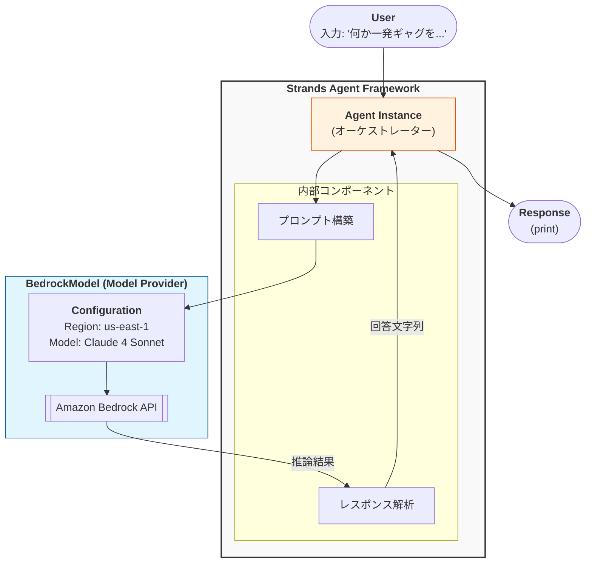

# 概要

この構成は最もシンプルな「**Single Agent**」構成です。
ここに `tools=[]` 引数を追加して関数を渡せば、エージェントが自律的に外部APIを叩く「**Tool Use（ReAct）**」構成へと拡張できるのがStrandsの設計の特徴です。





- **Agent (Orchestrator)**: `agent = Agent(model=bedrock_model)` で生成されたインスタンスです。ユーザーの入力を受け取り、背後のモデル（BedrockModel）へどう伝えるか、受け取った結果をどう処理するかを統括する「頭脳」のガワとなります。
    
- **Internal Components**: コード上では明示されていませんが、`Agent` クラスの内部では、入力されたテキストをLLMが理解しやすい形式に整える「プロンプト構築」や、LLMからの返答から純粋なテキストを取り出す「パース」が自動で行われています。
    
- **BedrockModel (Model Provider)**: `BedrockModel` インスタンスは、具体的な「計算リソース（LLM）」への接続インターフェースです。リージョンやモデルIDなどの接続設定を保持し、Strandsエージェントからの要求をAmazon BedrockのAPIコールへと変換します。
    
- **Execution Flow**: ユーザーが `agent("...")` と呼び出すことで一連のチェーンが起動し、Bedrock経由でClaudeが生成した回答が、再びエージェントを経由して `response` 変数に格納されるまでを表しています。

# サンプルコード
[first-agent.py]
```
from strands import Agent
from strands.models.bedrock import BedrockModel

bedrock_model = BedrockModel(
    region_name="us-east-1",
    model_id="us.anthropic.claude-sonnet-4-20250514-v1:0",
    # callback_handler=None,
)

agent = Agent(
    model=bedrock_model
)

response = agent("何か一発ギャグを教えてください。")
print(response)
```

# 実行
```
python first-agent.py

なぜコンピューターは風邪をひかないのでしょうか？

ウイルス対策ソフトがあるからです！
```


