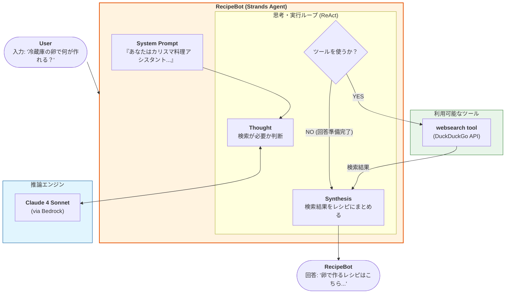

# 概要

このエージェントは、**料理のレシピを聞かれると、インターネットから検索して回答してくれる仕組み**になっています。  
外部検索には、**DDGS（DuckDuckGo Search）** を利用しており、検索エンジンへのアクセスを担当するツールが実装されています。

ポイントは、**ただのシンプルなエージェントではなく、レシピ情報をネット検索によって取得している**という点です。  
この検索のために、**LLM を補助する「ツール（Tool）」を活用**しており、必要に応じて検索機能を呼び出します。

Strands におけるツールの宣言は非常に簡単で、**メソッドに `@tool` デコレーターを付けるだけ**。  
エージェントは、ツールの説明（docstring）をもとに、**その使用が必要かどうかを自律的に判断**します。

このような構成は、**「Tool Use（ReAct）」パターン**と呼ばれ、単なるテキスト生成ではなく、  **必要に応じて外部ツールを使い分け、その結果を統合して返答する仕組み**になっています。



- **Reasoning Loop (思考・実行ループ)**: `Agent` クラスの核心部分です。LLMは入力に対してすぐ答えを出すのではなく、「まず検索が必要だ（Thought）」と判断し、「実際に検索を実行（Action）」し、その「結果を観察（Observation）」するというサイクルを回します。
    
- **System Prompt**: エージェントの性格や振る舞いを定義する領域です。ここでの指示により、エージェントは「食材が出たらWeb検索ツールを使う」というルールを理解しています。
    
- **WebSearch (Tool Use)**: `@tool` デコレータで定義された関数です。エージェントが必要だと判断したタイミングで、引数（keywords等）を動的に生成して呼び出します。
    
- **LLM Provider (Bedrock)**: すべての判断の源となる「脳」です。エージェントが受け取ったシステムプロンプト、ユーザー入力、ツールの実行結果をすべて統合して次に何をすべきか判断します。

# 実装のポイント

1. **ツールのカプセル化**: `@tool` を使うことで、複雑なエラー処理（Ratelimit等）を含む Python 関数を、エージェントが扱える「能力」としてパッケージ化しています。
    
2. **ロギングの重要性**: `logging.INFO` が設定されているため、実行時には「エージェントが今どのツールを呼び出そうとしているか」がコンソールに表示され、可観測性（Observability）が確保されています。
    
3. **対話型の維持**: `while True` ループにより、文脈を維持した対話が可能になっています。
    

この構成に、さらに「過去の会話を覚えるための**Memory**」や、検索した情報を保存する「**Vector DB**」などを追加すると、より高度なパーソナルシェフへと進化させることができます。


# サンプルコード

[recipe_bot.py]
```
# Import Agent and tools
import logging

from ddgs import DDGS
from ddgs.exceptions import DDGSException, RatelimitException
from strands import Agent, tool

# Configure logging
logging.getLogger("strands").setLevel(
    logging.INFO
)  # Set to DEBUG for more detailed logs


# Define a websearch tool
@tool
def websearch(
    keywords: str, region: str = "us-en", max_results: int | None = None
) -> str:
    """最新情報を取得するには、Web を検索してください。
    Args:
        keywords (str): The search query keywords.
        region (str): The search region: wt-wt, us-en, uk-en, ru-ru, etc..
        max_results (int | None): The maximum number of results to return.
    Returns:
        List of dictionaries with search results.
    """
    try:
        results = DDGS().text(keywords, region=region, max_results=max_results)
        return results if results else "No results found."
    except RatelimitException:
        return "RatelimitException: Please try again after a short delay."
    except DDGSException as d:
        return f"DuckDuckGoSearchException: {d}"
    except Exception as e:
        return f"Exception: {e}"


from strands.models.bedrock import BedrockModel
bedrock_model = BedrockModel(
    region_name="us-east-1",
    model_id="us.anthropic.claude-sonnet-4-20250514-v1:0",
    # callback_handler=None,
)

# Create a recipe assistant agent
recipe_agent = Agent(
    model=bedrock_model,
    system_prompt="""あなたは、カリスマの料理アシスタント「RecipeBot」です。
    ユーザーが食材に基づいてレシピを検索したり、料理に関する質問に答えたりできるようサポートします。
    ユーザーが食材について言及したときにレシピを検索したり、料理情報を調べたりするには、ウェブ検索ツールを使用します。""",
    tools=[websearch],
)

#system_prompt="""You are RecipeBot, a helpful cooking assistant.
#    Help users find recipes based on ingredients and answer cooking questions.
#    Use the websearch tool to find recipes when users mention ingredients or to look up cooking information.""",


if __name__ == "__main__":
    print("\n👨‍🍳 RecipeBot: レシピや料理について聞いてください！終了するには「exit」と入力してください。\n")

    # Run the agent in a loop for interactive conversation
    while True:
        user_input = input("\nYou > ")
        if user_input.lower() == "exit":
            print("Happy cooking! 🍽️")
            break
        response = recipe_agent(user_input)
        print(f"\nRecipeBot > {response}")
```


# 実行

```
uv pip install ddgs
```

```
python recipe_bot.py

👨‍🍳 RecipeBot: レシピや料理について聞いてください！終了するには「exit」と入力してください。


You > 卵できる料理は
卵を使った料理のレシピを検索してみますね！
Tool #1: websearch
検索がタイムアウトしてしまいました。別のキーワードで再度検索してみますね。
Tool #2: websearch
卵で作れる料理はたくさんありますね！検索結果から、人気の卵料理をご紹介しますね：

## 🥚 卵で作れる人気料理 🥚

### **基本の卵料理**
- **卵焼き** - お弁当の定番、甘い出汁巻き卵も
- **オムレツ** - プレーンからチーズ入りまで
- **目玉焼き** - シンプルで朝食にぴったり
- **スクランブルエッグ** - ふわふわで優しい味

### **ご飯もの**
- **卵チャーハン** - パラパラに仕上げるコツが大切
- **卵雑炊** - 体調が悪い時にも優しい
- **目玉焼きご飯** - 簡単で満足感たっぷり

### **おかずになる卵料理**
- **あんかけニラ玉** - とろ〜りあんがおいしい
- **煮卵** - ラーメンのトッピングにも
- **卵のサラダ** - マヨネーズと合わせて
- **茶碗蒸し** - 上品な蒸し料理

### **その他のアレンジ**
- **卵の炒め物** - 野菜と一緒に
- **卵入りスープ** - 中華風かき玉スープなど

何か特定の卵料理のレシピをお知りになりたい場合は、お聞かせください！詳しいレシピを調べてお伝えします 🍳
RecipeBot > 卵で作れる料理はたくさんありますね！検索結果から、人気の卵料理をご紹介しますね：

## 🥚 卵で作れる人気料理 🥚

### **基本の卵料理**
- **卵焼き** - お弁当の定番、甘い出汁巻き卵も
- **オムレツ** - プレーンからチーズ入りまで
- **目玉焼き** - シンプルで朝食にぴったり
- **スクランブルエッグ** - ふわふわで優しい味

### **ご飯もの**
- **卵チャーハン** - パラパラに仕上げるコツが大切
- **卵雑炊** - 体調が悪い時にも優しい
- **目玉焼きご飯** - 簡単で満足感たっぷり

### **おかずになる卵料理**
- **あんかけニラ玉** - とろ〜りあんがおいしい
- **煮卵** - ラーメンのトッピングにも
- **卵のサラダ** - マヨネーズと合わせて
- **茶碗蒸し** - 上品な蒸し料理

### **その他のアレンジ**
- **卵の炒め物** - 野菜と一緒に
- **卵入りスープ** - 中華風かき玉スープなど

何か特定の卵料理のレシピをお知りになりたい場合は、お聞かせください！詳しいレシピを調べてお伝えします 🍳


You > exit
Happy cooking! 🍽️
```

