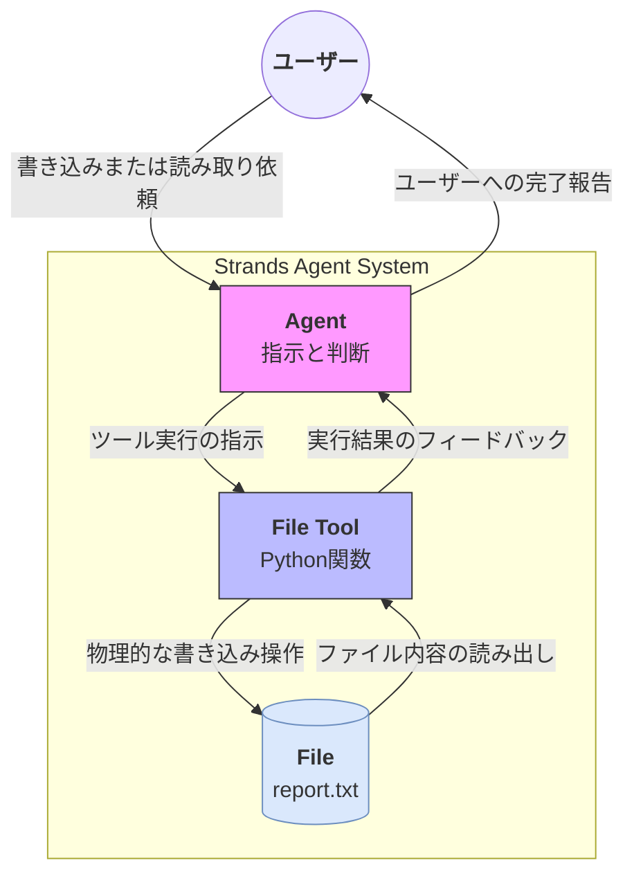

# 概要


　**ファイル操作（File Operation）** は、エージェントに「ファイルの読み書き」という実務能力を付与する構成です。AIが直接OSやファイルシステムを操作するのではなく、定義されたツールという安全な窓口（Proxy/Adapter）を介してのみ操作を行うことで、セキュリティと確実性を両立させています。



- **依頼**: ユーザーが「内容をファイルに保存して」または「特定の内容を読み取って」とエージェントに頼みます。
    
- **実行**: エージェントは自身の判断で、ファイル入出力を担当する「ツール（Python関数）」を起動します。
    
- **操作**: ツールがローカルまたはクラウド上のファイルシステムへアクセスし、データの保存や取得を直接行います。
    
- **報告**: 処理の結果（成功・失敗や、読み取った文字列）がエージェントに還元され、エージェントはそれを解釈してユーザーに「報告」を行います。

# 実装のポイント

- **サンドボックス化**: AIに許可する操作（例：特定のディレクトリ内での読み書きのみ）をツール側で制限することで、意図しない破壊的な操作を防ぎます。
    
- **構造化データの永続化**: AIが生成した複雑な分析結果を、JSONやテキスト形式でファイルとして書き出し、他のシステムや人間が利用できる成果物に変えます。
    
- **情報のインプット**: 大規模なログファイルや設定ファイルを読み込ませ、その内容に基づいた推論や要約をAIに行わせることができます 

# サンプルコード（ファイル作成・読み込み）

AIが「ファイルを新規作成」し、その後「中身を確認」する最小構成です。

[file_io.py]
```
import os
from strands import Agent, tool
from strands.models import BedrockModel

# --- 1. ファイル操作ツールの定義 ---

@tool
def write_text_file(filename: str, content: str):
    """指定したファイル名でテキストを保存します。"""
    with open(filename, "w", encoding="utf-8") as f:
        f.write(content)
    return f"ファイル '{filename}' を作成し、内容を書き込みました。"

@tool
def read_text_file(filename: str):
    """指定したファイルの内容を読み取ります。"""
    if not os.path.exists(filename):
        return "エラー: ファイルが見つかりません。"
    with open(filename, "r", encoding="utf-8") as f:
        return f.read()

# --- 2. エージェントの設定 ---

model = BedrockModel(region_name="us-east-1", model_id="us.anthropic.claude-sonnet-4-20250514-v1:0")

agent = Agent(
    model=model,
    system_prompt="あなたはファイル操作が可能なアシスタントです。指示に従ってファイルの作成や読み込みを行ってください。",
    tools=[write_text_file, read_text_file]
)

# --- 3. 実行テスト ---

print("--- 実行: ファイル作成 ---")
print(agent("hello.txtという名前で、'Hello Strands!' という内容のファイルを作って。"))

print("\n--- 実行: 内容確認 ---")
print(agent("先ほど作った hello.txt の中身を教えて。"))
```

# 実行

```
python file_io.py

--- 実行: ファイル作成 ---
hello.txtというファイルに'Hello Strands!'という内容を保存します。
Tool #1: write_text_file
hello.txtファイルが正常に作成されました。'Hello Strands!'という内容が保存されています。hello.txtファイルが正常に作成されました。'Hello Strands!'という内容が保存されています。


--- 実行: 内容確認 ---
hello.txtファイルの内容を読み取ります。
Tool #2: read_text_file
hello.txtファイルの中身は「Hello Strands!」です。hello.txtファイルの中身は「Hello Strands!」です。

(.venv) ubuntu@LAPTOP-DHL9LRBE:~/projects/strands-agents-test$ ls hello.txt
hello.txt
(.venv) ubuntu@LAPTOP-DHL9LRBE:~/projects/strands-agents-test$ cat hello.txt
Hello Strands!

```

