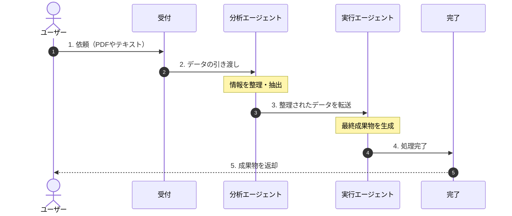

# 概要

**親子関係ワークフロー** は、一つの複雑なタスクを、役割の異なる複数のエージェント（親と子）による連携プロセスへ分解・構造化するパターンです。これにより、単一のエージェントでは迷子になりがちな「多段階の業務」を、チーム全体で正確に遂行することが可能になります。

ご提示いただいた図は、**「役割の異なる複数のAIを直列に繋ぎ、バケツリレー式に処理を完成させる」**という、ワークフロー型（パイプライン型）のマルチエージェント・システムを表しています。

単一のAIにすべてを任せるのではなく、分業させることで品質を高めるこの構造を、シーケンス図と解説で紐解きます。




---

### 司令塔としてのワークフロー管理

**開始・終了ノード**は、システムへの出入り口です。ユーザーの複雑な依頼を受け取り、適切な最初のエージェントにパスを出し、最後はバラバラな情報を1つの成果物としてまとめてユーザーに返却する「枠組み」の役割を果たします。

### 専門特化されたエージェントたち

- **Agent A (分析担当):** 情報を読み解き、ノイズを取り除き、次に何が必要かを整理します。いわば「設計図」を書く役割です。
- **Agent B (実行担当):** Agent Aが用意した設計図に従って、実際の作業（文章作成、プログラム実行、データ変換など）を行います。いわば「職人」の役割です。
    
### 成果物の連鎖

この仕組みでは、**「Aの出力がBの入力になる」**という連鎖が重要です。Aが情報を整理して渡すため、Bは余計な推論をせず、自分の専門作業だけに集中でき、結果としてハルシネーション（もっともらしい嘘）が減り、アウトプットの質が安定します。


## 補足

### 専門性の分離（エージェント設計）

一つの巨大なプロンプトですべてをこなそうとせず、**「単一責任の原則」** に基づいてエージェントを分けます。

- **特化型プロンプト**: 子エージェントには、その分野の専門用語や評価基準を詳しく書き込みます（例：コードレビュー担当には「セキュリティ、可読性、計算量」の観点を与える）。
    
- **モデルの使い分け**: 親（司令塔）には推論能力の高い「Claude 3.5 Sonnet」を使い、単純な翻訳や整形を担当する子にはコストの低いモデルを使うといった、リソースの最適化が可能です。
    
### ツールとしてのラップ（接続）

Strandsにおいて、エージェント同士を繋ぐ最も標準的な方法は、**「エージェントをツール関数として定義する」** ことです。

- **インターフェースの固定**: `@tool` で定義する関数の「説明文（Docstring）」を丁寧に書くことが重要です。親エージェントはこの説明文を読んで、いつその子エージェントを呼ぶべきかを判断します。
    
- **引数の受け渡し**: 親から子へ何を渡すか（クエリだけか、これまでの経緯もか）を明確にします。
    
### オーケストレーション（実行制御）

親エージェントがどのようにチームを動かすかを制御します。

- **逐次実行（Sequential）**: Aの回答をBに渡し、Bの回答をCに渡す「リレー形式」。
    
- **並列実行（Parallel）**: 複数の専門家に同時に意見を聞き、最後に親がまとめる「会議形式」。
    
- **ループ（Loop/Feedback）**: 子の回答が不十分な場合、親が「やり直し」を命じる「品質管理形式」。

# サンプルコード

以下の例では、**「企画者」**が**「市場分析担当」**と**「リスク評価担当」**の二人に指示を出し、最終的な回答をまとめるワークフローを構築しています。

[agent_workflow.py]
```
from strands import Agent, tool
from strands.models import BedrockModel

# 共通で使用するAIモデルの設定
model = BedrockModel(
    region_name="us-east-1", 
    model_id="us.anthropic.claude-sonnet-4-20250514-v1:0"
)

# --- STEP 1: 子エージェントの定義 ---

# 市場分析のスペシャリスト
market_analyst = Agent(
    model=model,
    system_prompt="あなたは市場分析の専門家です。指定されたビジネスアイデアの市場性とトレンドを分析してください。"
)

# リスク評価のスペシャリスト
risk_evaluator = Agent(
    model=model,
    system_prompt="あなたはリスク管理の専門家です。指定されたプランに潜む法的、経済的なリスクを指摘してください。"
)

# --- STEP 2: 子エージェントを「ツール」として定義 ---

@tool
def consult_market_expert(idea: str):
    """市場の動向やトレンドについて専門的な意見が必要な際に使用します。"""
    return market_analyst(idea)

@tool
def consult_risk_expert(plan: str):
    """計画のリスクや懸念事項を詳しく調査したい際に使用します。"""
    return risk_evaluator(plan)

# --- STEP 3: 親エージェント（司令塔）の定義 ---

planner_agent = Agent(
    model=model,
    system_prompt="""
あなたはシニア・プランナーです。
あなたの役割は、ユーザーのアイデアに対し、市場専門家とリスク専門家の意見を集約して、
最高品質のビジネスプランを提案することです。
必ず両方の専門家の意見を聞いた上で、総合的な判断を下してください。
""",
    tools=[consult_market_expert, consult_risk_expert]
)

# --- STEP 4: 実行 ---

def run_workflow():
    print("--- ワークフロー：ビジネスプラン分析を開始します ---")
    query = "日本での『AIを活用した無人カフェ』というビジネスアイデアについて、多角的に分析して。"
    
    # 親エージェントが自動的に適切な子エージェントを呼び出します
    final_report = planner_agent(query)
    
    print("\n--- 最終報告書 ---")
    print(final_report)

if __name__ == "__main__":
    run_workflow()
```

# 実行

```
python agent_workflow.py

--- ワークフロー：ビジネスプラン分析を開始します ---
「AIを活用した無人カフェ」というビジネスアイデアについて、多角的に分析いたします。まず、市場専門家とリスク専門家の両方から意見を伺い、総合的な判断をお示しします。
Tool #1: consult_market_expert

Tool #2: consult_risk_expert
# AIを活用した無人カフェ事業の市場分析

## 1. 市場環境分析

### 市場規模・成長性
- **カフェ市場**: 約2兆円規模（2023年）
- **無人店舗市場**: 年平均成長率15-20%で拡大中
- **コロナ後の非接触需要**: 継続的な成長トレンド
- **24時間営業ニーズ**: 都市部で特に高い需要

### ターゲット市場
- **立地**: オフィス街、住宅密集地、駅周辺、大学キャンパス
- **顧客層**:
  - 忙しいビジネスパーソン
  - 夜勤・早朝勤務者
  - 学生
  - デジタルネイティブ世代

## 2. 市場トレンド分析

### 追い風要因
✅ **労働力不足の深刻化**
- 飲食業界の人手不足は慢性的
- 最低賃金上昇による人件費圧迫

✅ **DX推進の加速**
- 政府のデジタル化政策
- 消費者のデジタル決済普及（95%以上がキャッシュレス利用）

✅ **ライフスタイルの多様化**
- 24時間社会のニーズ
- 個人化・効率化志向

✅ **AI技術の成熟**
- 音声認識、画像認識技術の向上
- クラウドAIサービスのコスト低下

### 課題・逆風要因
⚠️ **規制・法的制約**
- 食品衛生法上の管理者配置義務
- 深夜営業に関する条例

⚠️ **技術AI的課無題**
- システ人カフェ事業計ム障害時の対応
-画に 複関する主雑な注要なリスクを文への分対応限析い界

⚠️ **たします。

## 法社的リスク

### 食会的受品容性**
- 高齢者衛生・層安全関の利用連
- **食ハ品ード衛生法ル
- 人違反リ的サービスを重視する文化

## 3. 競合スク**: 食品取環境

### 直扱責任者の常駐義務違反の可能性
- **HACCP対応**:接競合
- **ファミリーマート**: 無 無人決済店人環舗実境での衛生管理記験録・中
- **ロートソレーサビリティ確ン**: AI保のレジ困難性
- **ア導入レルギー対応**: 拡大
- **Amazon顧客への Go型店適切な情舗**: 日本参報提供義入検務と討中

### 間接競合
- **緊急時対自動販応体売機**:制の 不備圧

### 営倒的な設置数（500万台以上）
- **コンビニ**: 業許可・届出
- **営業許可取得**: 自24時間営業、治体による無商品の人営多様性
- **従業の許可基来カ準がフェチェーン**: 未ブ整備のランド力可能性
- **深、接夜営業規客サ制**: 24ービス

## 時間営業に4. 市場機対する会の評価

### 高騒音規機会制や近隣住民への配慮義務

###セグメント
🎯 **オフィス街（平 データ日保特護・化型プ）**
- ライバシー
- **個朝・人情報保護法昼の**:集 顔中需認証・決要
- 高済データの適切な管理単価メと第三者提供制ニューの受限
- **監容視性カメラ設置**: プ

🎯 **ライバシー権住宅地（24時間型）**
- 侵害と早設朝・深夜の独置届占出義的務

## 経済的リニーズスク

### 初
- リピ期投資・ート利運用の期待

🎯営コスト
- **高 **交額通な設ハ備投資**: AIブ（利 システ便性重ム、自動化機視型）**
- 器の高導入費用（い1,通行000-量
- 時3短,000万円規ニーズの模）
- **メ高さ

### 収ンテナンス費用**:益性分 24析
**時間稼働による初期投資**:機 1器故障率,000-増2,000万円/店舗
-加と AI修理コスト
- ** システムシステ開発・ム更導入費新**: AI
- 店技舗改装・術の機器設置費急

**運速な営コ進スト削歩による減効果**
- 設人件費:備 70陳腐化リ-80%削減可スク

### 売能
- 24時間営業による売上・需上向上:要リ 30-50%増スク
- **顧客受

**容損益分性**: 無岐点**: 人サ開業ービスへからの心12理的抵抗による-18ヶ月利

## 5. 成用率功要低下
- **立因と地依推奨存性戦略

### **: 人重通要成功要因
1りの少ない時. **立間帯の地選売定の精上確度**
2. **AI システ保困難
- **競合ムの安激化**: 大定性・使手いやすさ**
3. **チ商品品ェーン質のの維持**
4類. **似サービス参入による価格競争

### 技術的リスク
- **緊急時対応体制の構築**
5. **段階的な店システ舗展ム障害**: AI開**

### 推奨戦・決略
**済システムの故フ障による営ェーズ1**: パ業停止とイロット店機舗（オ会フィス街1損失
- **セ-2店キュリティ侵害舗）
****: サフェーズイ2**: 検バー攻撃による営証結果を基に業データした改良・・拡大
**フェーズ3**: フ顧客情報ラン漏洩
- **在チャイズ展庫管理**: 需開の要予測精検討

## 度不6. 総合評足による機価

**会市場性**: 損失や⭐⭐⭐⭐廃棄☆ロス (4

## 推/5)
-奨対 高い成策

1長. **段ポテンシャル階的導入**: パとイロット店明確な市舗での場検ニーズ
- 技術・証後規制面でのの課題は本あるものの克服可能

**格展推開
2. **法的コ奨度**: **ンプライアンス**: 積専極的推進門家による事**
- 先行前調者査と許利可取得
3. **リ益のスク獲得可保能性が高い
- 社険**: システ会課題（ム障害・労働力不足サ）イバー攻撃に解決に対する包貢献する括的保険加事業性入
4. **

適緊急時体切な立地選定と制**: 24時間対段応可階的展開により、高能なサい成功ポート体制構確築

これ率が期待できるらのリスクを十ビ分に検ジネスアイデアです。討し、対策を講じることで事業成功確率を向上させることができます。## 総合的なビジネスプラン提案

両専門家の分析を踏まえ、「AIを活用した無人カフェ」事業について以下の総合的なビジネスプランを提案いたします。

### 🎯 **事業の魅力度評価：⭐⭐⭐⭐☆（4/5）**

## **1. 市場機会の優位性**

**✅ 強力な市場ドライバー**
- 深刻な人手不足（飲食業界）
- キャッシュレス化の進展（95%以上の普及率）
- 24時間社会のニーズ拡大
- コロナ後の非接触サービス需要

**✅ 高い収益性ポテンシャル**
- 人件費70-80%削減効果
- 24時間営業による売上30-50%向上
- 損益分岐点：12-18ヶ月

## **2. 重要リスクと対策**

### **法的リスク対策**
- **食品衛生法対応**：遠隔監視システムと定期巡回体制の構築
- **営業許可**：自治体との事前協議と段階的許可取得
- **データ保護**：プライバシーバイデザインの実装

### **技術的リスク対策**
- **システム冗長化**：複数の決済手段とバックアップシステム
- **24時間サポート**：遠隔監視センターと緊急対応チーム
- **セキュリティ強化**：多層防御とリアルタイム監視

## **3. 推奨実行戦略**

### **フェーズ1：検証期間（6-12ヶ月）**
- **パイロット店舗**：オフィス街1店舗での実証実験
- **投資規模**：1,500万円
- **検証項目**：技術安定性、顧客受容性、収益性

### **フェーズ2：拡大期間（12-24ヶ月）**
- **展開規模**：3-5店舗（多様な立地での検証）
- **投資規模**：4,000-6,000万円
- **改良項目**：AI精度向上、オペレーション最適化

### **フェーズ3：本格展開（24ヶ月以降）**
- **フランチャイズ展開**：初期費用とロイヤリティモデル
- **技術ライセンス**：他社への技術提供による収益多角化

## **4. 成功のカギ**

### **最重要要素**
1. **立地選定の精度**：人通りと24時間需要の的確な予測
2. **ユーザビリティ**：直感的で使いやすいAIインターフェース
3. **品質維持**：無人でも高品質な商品提供システム
4. **緊急対応**：顧客満足度を損なわない迅速な問題解決

### **差別化要因**
- **地域密着型AIカスタマイズ**：立地特性に応じたメニュー・営業時間最適化
- **健康志向メニュー**：AI による栄養価分析と個人最適化提案
- **コミュニティ機能**：地域住民の交流促進要素

## **5. 総合判断**

**推奨度：積極的推進**

この事業は、社会課題解決（労働力不足）と市場ニーズ（利便性・効率性）が合致する優れたビジネスモデルです。リスクは存在しますが、適切な対策により克服可能であり、先行者利益の獲得が期待できます。

**想定ROI：25-35%**（3年目以降）
**市場シェア目標：無人カフェ市場の10-15%**（5年以内）

段階的な展開により事業リスクを最小化しながら、大きな成長ポテンシャルを実現できる魅力的な事業機会だと判断いたします。
--- 最終報告書 ---
## 総合的なビジネスプラン提案

両専門家の分析を踏まえ、「AIを活用した無人カフェ」事業について以下の総合的なビジネスプランを提案いたします。

### 🎯 **事業の魅力度評価：⭐⭐⭐⭐☆（4/5）**

## **1. 市場機会の優位性**

**✅ 強力な市場ドライバー**
- 深刻な人手不足（飲食業界）
- キャッシュレス化の進展（95%以上の普及率）
- 24時間社会のニーズ拡大
- コロナ後の非接触サービス需要

**✅ 高い収益性ポテンシャル**
- 人件費70-80%削減効果
- 24時間営業による売上30-50%向上
- 損益分岐点：12-18ヶ月

## **2. 重要リスクと対策**

### **法的リスク対策**
- **食品衛生法対応**：遠隔監視システムと定期巡回体制の構築
- **営業許可**：自治体との事前協議と段階的許可取得
- **データ保護**：プライバシーバイデザインの実装

### **技術的リスク対策**
- **システム冗長化**：複数の決済手段とバックアップシステム
- **24時間サポート**：遠隔監視センターと緊急対応チーム
- **セキュリティ強化**：多層防御とリアルタイム監視

## **3. 推奨実行戦略**

### **フェーズ1：検証期間（6-12ヶ月）**
- **パイロット店舗**：オフィス街1店舗での実証実験
- **投資規模**：1,500万円
- **検証項目**：技術安定性、顧客受容性、収益性

### **フェーズ2：拡大期間（12-24ヶ月）**
- **展開規模**：3-5店舗（多様な立地での検証）
- **投資規模**：4,000-6,000万円
- **改良項目**：AI精度向上、オペレーション最適化

### **フェーズ3：本格展開（24ヶ月以降）**
- **フランチャイズ展開**：初期費用とロイヤリティモデル
- **技術ライセンス**：他社への技術提供による収益多角化

## **4. 成功のカギ**

### **最重要要素**
1. **立地選定の精度**：人通りと24時間需要の的確な予測
2. **ユーザビリティ**：直感的で使いやすいAIインターフェース
3. **品質維持**：無人でも高品質な商品提供システム
4. **緊急対応**：顧客満足度を損なわない迅速な問題解決

### **差別化要因**
- **地域密着型AIカスタマイズ**：立地特性に応じたメニュー・営業時間最適化
- **健康志向メニュー**：AI による栄養価分析と個人最適化提案
- **コミュニティ機能**：地域住民の交流促進要素

## **5. 総合判断**

**推奨度：積極的推進**

この事業は、社会課題解決（労働力不足）と市場ニーズ（利便性・効率性）が合致する優れたビジネスモデルです。リスクは存在しますが、適切な対策により克服可能であり、先行者利益の獲得が期待できます。

**想定ROI：25-35%**（3年目以降）
**市場シェア目標：無人カフェ市場の10-15%**（5年以内）

段階的な展開により事業リスクを最小化しながら、大きな成長ポテンシャルを実現できる魅力的な事業機会だと判断いたします。
```

# まとめ

- **精度の向上**: 1つのAIが長く考えると混乱しがちですが、役割を分けることで、各エージェントが自分のタスクに集中でき、回答の質が劇的に上がります。
    
- **メンテナンス性**: 「リスク評価のロジックだけを変えたい」という場合に、その子エージェントのプロンプトを修正するだけで済むため、開発が楽になります。
    
- **拡張性**: 新しい専門家（例えば「財務担当」）が必要になったら、新しいエージェントを作って `tools` リストに追加するだけで、チームを拡張できます。
    