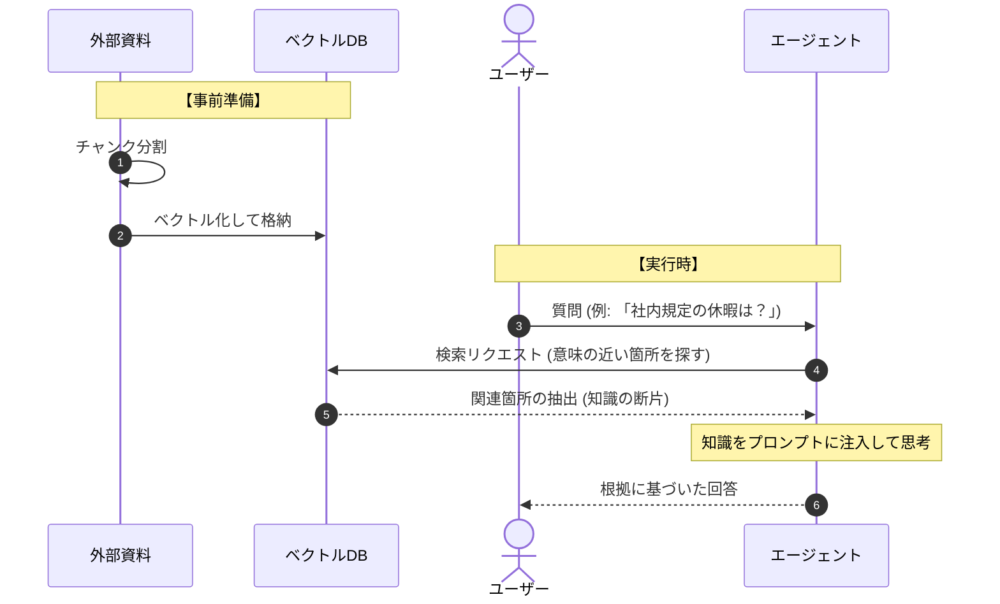

# 概要

**ナレッジベース・エージェント（Knowledge Base Agent）** は、エージェントが持つ一般的な知識だけでなく、特定の文書資産（PDF、テキスト、社内マニュアルなど）を「知識の図書館」として参照し、その根拠に基づいて回答を生成するパターンです。これにより、最新の専門情報やプライベートなデータに基づいた、正確で信頼性の高い応答が可能になります。



### 事前準備（インデックス化）
大量の資料（Docs）をそのままAIに読み込ませるのではなく、小さく切り分けて（チャンク分割）、コンピューターが計算しやすい数値（ベクトル）に変換して保存します。これが「逆引き辞典」のような役割を果たします。
### 実行時の検索（リトリーバル）
ユーザーから質問が来ると、エージェントは即座にデータベースへ「似たような内容が書いてある場所」を問い合わせます。このとき、単なるキーワード一致ではなく、文脈や意味が近いものを探し出せるのがこのシステムの強みです。

### 回答の生成（オーグメンテーション）*
抽出された知識をプロンプトに「カンニングペーパー」として貼り付け、AIに渡します。AIはその情報だけを元に回答を組み立てるため、もっともらしい嘘（ハルシネーション）を劇的に減らし、専門的な内容でも正確に答えられるようになります。


[docs/rules.txt]
```
夏季休暇は7月1日から9月30日です。
```

[kb_workflow.py]
```
import os
from strands import Agent, tool
from strands.models import BedrockModel

# 1. モデルの設定
model = BedrockModel(region_name="us-east-1", model_id="us.anthropic.claude-sonnet-4-20250514-v1:0")

# 2. 簡易ナレッジ検索ツールの定義 (RAGの代わり)
@tool
def search_documents(query: str):
    """社内規定やマニュアル(./docsフォルダ内)を検索して内容を返します。"""
    doc_path = "./docs/rules.txt"
    if not os.path.exists(doc_path):
        return "資料が見つかりません。"
    
    with open(doc_path, "r", encoding="utf-8") as f:
        content = f.read()
    
    # 実際にはここで query に関連する部分を抽出しますが、今回は全読み込み
    return f"【資料の内容】: {content}"

# 3. エージェントの作成
agent = Agent(
    model=model,
    system_prompt="""
あなたは当社の規定案内担当です。
質問を受けたら、まず `search_documents` ツールを使って最新の情報を確認してください。
確認した資料に記載がない場合は、勝手に推測せず「分かりかねます」と答えてください。
""",
    tools=[search_documents]
)

# --- 4. 実行テスト ---
# あらかじめ ./docs/rules.txt に「夏季休暇は7月1日から9月30日です。」と書いてある想定
print(agent("夏季休暇の期間について教えて。"))

```

# 実行
```
python kb_workflow.py

夏季休暇の期間について、社内規定を確認いたします。
Tool #1: search_documents
夏季休暇の期間についてお答えします。

**夏季休暇期間：7月1日～9月30日**

社内規定によると、夏季休暇の期間は7月1日から9月30日までと定められています。夏季休暇の期間についてお答えします。

**夏季休暇期間：7月1日～9月30日**

社内規定によると、夏季休暇の期間は7月1日から9月30日までと定められています。
```
