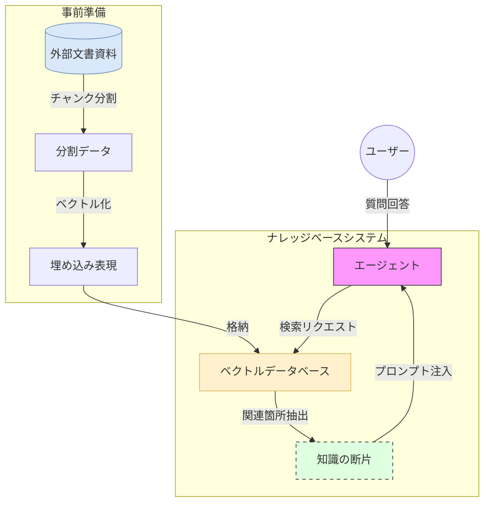

# 概要

**ナレッジベース・エージェント（Knowledge Base Agent）** は、エージェントが持つ一般的な知識だけでなく、特定の文書資産（PDF、テキスト、社内マニュアルなど）を「知識の図書館」として参照し、その根拠に基づいて回答を生成するパターンです。これにより、最新の専門情報やプライベートなデータに基づいた、正確で信頼性の高い応答が可能になります。



- **データ準備フェーズ**: 外部の文書資料を細かく分割（チャンク化）し、AIが検索可能な形式（ベクトル）に変換して「ナレッジベース（ベクトルDB）」に格納します。
    
- **検索フェーズ（分析）**: ユーザーからの質問に対し、エージェントがナレッジベース内を検索し、回答に必要となる「関連する知識の断片」を特定・抽出します。
    
- **コンテキスト注入（情報の受け渡し）**: 抽出された知識の断片が、ユーザーの質問と共に「参考情報」としてエージェントの入力（プロンプト）へ引き継がれます。
    
- **回答生成フェーズ（実行）**: エージェントは注入された知識に基づき、事実に基づいた正確な文章作成や情報整理を行い、回答を構成します。
    
- **アウトプットフェーズ**: 根拠となる資料に基づいた信頼性の高い最終回答が、ユーザーの手元に届けられます。

---

# 設計のポイント

| **設計項目**       | **内容**      | **実装上の注意点**                                               |
| -------------- | ----------- | --------------------------------------------------------- |
| **情報の整合性**     | 検索対象と質問の紐付け | ツール（`search_documents`）の説明文に検索可能な対象を明記し、AIが正しく呼び出せるようにする。 |
| **コンテキストの設計**  | 意味のまとまりの維持  | ツールが返すテキストに「前後 50 文字程度の重複（Overlap）」を持たせることで、情報の欠落を防ぐ。     |
| **インジェクション制御** | 回答精度の担保     | システムプロンプトで「資料に記載がない場合は推測しない」と制約をかけ、RAG特有の嘘を防止する。          |


# 実装のポイント：カスタム RAG の構築

Strands におけるナレッジベース実装の核心は、単にファイルを読み込むことではなく、**「AIが情報を引き出しやすい形で検索ツール（Retriever）を構成し、プロンプトへ注入する」** ことにあります。

### ■ドキュメントのチャンク（断片化）戦略

AIが一度に読み取れる量には限界があるため、巨大なPDFやテキストは小さな「チャンク（塊）」に分割されます。

- **チャンクサイズの設定**: ドキュメントを分割する際、単に文字数で切るのではなく、**意味のまとまり（段落など）**で切るように設定します。

>実装点**: `Knowledge(path=..., chunk_size=512, overlap=50)` のように、前後 50 文字程度を重複させることで、境界線にある情報の欠落を防ぎます。

- **オーバーラップ（重複）**: チャンクの継ぎ目で情報が欠落しないよう、前のチャンクの末尾と次のチャンクの先頭を少し重ねる設定が重要です。

### ■ ベクトル化（Embedding）と検索の質

Strands内部では、テキストを「意味の数値（ベクトル）」に変換して検索します。

- **意味検索（Semantic Search）**: キーワードの完全一致だけでなく、「夏休み」という問いに対して「夏季休暇」というキーワードが含まれる文書を見つけ出せるよう、適切なEmbeddingモデルが背後で動いているかを確認します。
    
- **Top-K パラメータ**: `top_k=3` のように、検索時に「上位何件のドキュメント片をAIに渡すか」を調整します。情報が複雑な場合はこの値を増やしますが、増やしすぎるとAIが混乱（迷子）になります。
    

### ■プロンプト内での「知識」の優先順位

エージェントが検索結果をどのように扱うかをシステムプロンプトで制御します。

- **出典の明示**: AIに「必ずナレッジベースにある情報に基づいて回答し、不明な場合は知らないと答えてください」と指示することで、嘘（ハルシネーション）を防ぎます。
    
- **知識の注入（Context Injection）**: Strandsは、検索した結果を自動的にシステムプロンプトの背後に付与します。この際、AIが「自分の知識」として扱うのか「外部資料」として扱うのかを明確にする指示がポイントです。
    

### ■同期と更新のライフサイクル

ナレッジベースは一度作って終わりではありません。

- **インデックスの更新**: ファイルを追加・削除した際、`KnowledgeBase` オブジェクトが正しく再スキャン（Re-index）されるよう実装します。
    
- **永続化**: `KnowledgeBase` 自体も、一度作成したインデックス（ベクトルのデータベース）をディスクに保存しておき、次回起動時に高速にロードできるように設計するのが実務上のポイントです。


# サンプルコード：社内ルールに答えるエージェント

この例では、カレントディレクトリにある `docs/` フォルダ内のファイルを知識源として、AIが回答を生成します。

>【注】
今回のサンプルコードでは、**RAG の代替として簡易的なツールを定義**しています。  
このようにAgent は、**ユーザ情報に基づいて推論し、回答を生成することが可能です。**

[docs/rules.txt]
```
夏季休暇は7月1日から9月30日です。
```


[kb_workflow.py]
```
import os
from strands import Agent, tool
from strands.models import BedrockModel

# 1. モデルの設定
model = BedrockModel(region_name="us-east-1", model_id="us.anthropic.claude-sonnet-4-20250514-v1:0")

# 2. 簡易ナレッジ検索ツールの定義 (RAGの代わり)
@tool
def search_documents(query: str):
    """社内規定やマニュアル(./docsフォルダ内)を検索して内容を返します。"""
    doc_path = "./docs/rules.txt"
    if not os.path.exists(doc_path):
        return "資料が見つかりません。"
    
    with open(doc_path, "r", encoding="utf-8") as f:
        content = f.read()
    
    # 実際にはここで query に関連する部分を抽出しますが、今回は全読み込み
    return f"【資料の内容】: {content}"

# 3. エージェントの作成
agent = Agent(
    model=model,
    system_prompt="""
あなたは当社の規定案内担当です。
質問を受けたら、まず `search_documents` ツールを使って最新の情報を確認してください。
確認した資料に記載がない場合は、勝手に推測せず「分かりかねます」と答えてください。
""",
    tools=[search_documents]
)

# --- 4. 実行テスト ---
# あらかじめ ./docs/rules.txt に「夏季休暇は7月1日から9月30日です。」と書いてある想定
print(agent("夏季休暇の期間について教えて。"))

```

# 実行
```
python kb_workflow.py

夏季休暇の期間について、社内規定を確認いたします。
Tool #1: search_documents
夏季休暇の期間についてお答えします。

**夏季休暇期間：7月1日～9月30日**

社内規定によると、夏季休暇の期間は7月1日から9月30日までと定められています。夏季休暇の期間についてお答えします。

**夏季休暇期間：7月1日～9月30日**

社内規定によると、夏季休暇の期間は7月1日から9月30日までと定められています。
```


