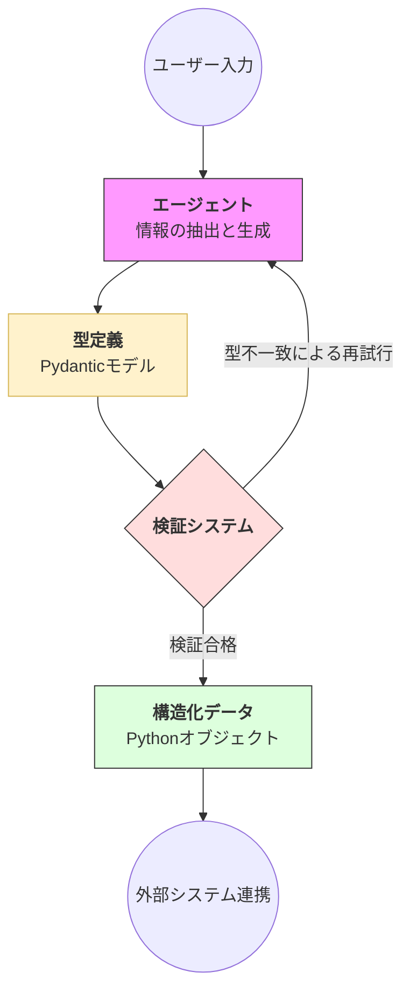

# 概要

**構造化出力（Structured Output）** は、AIが生成する自然言語の回答を、あらかじめ定義された特定のデータ構造（JSONやPythonのオブジェクトなど）に強制的に適合させるパターンです。これにより、AIの出力を「読むための文章」から「動かすためのデータ」へと変え、システム連携の信頼性を飛躍的に高めます。




- **入力フェーズ**: ユーザーからの自然言語による依頼（例：「このメールから日付と担当者を抜き出して」）をエージェントが受け取ります。
    
- **データ抽出プロセス（生成）**: エージェントは依頼内容を分析し、あらかじめ定義された「型（Schema）」に沿って情報を抽出・整理します。
    
- **型定義（Pydanticモデル）**: データの正確な構造（例：日付は文字列、金額は整数など）を定義した設計図です。これにより出力の「枠組み」が固定されます。
    
- **検証プロセス（バリデーション）**: 生成されたデータが設計図通りかを自動チェックします。型が違ったり必須項目が漏れている場合は、エージェントに「再試行（修正）」を指示します。
    
- **アウトプットフェーズ**: 検証をパスした「構造化データ」が出力され、そのままデータベース保存やAPI送信などの外部システム連携へとシームレスに引き継がれます。

# 実装のポイント

Strands における構造化出力の核心は、**「Pydantic」** というライブラリを利用してデータの「型」を定義することにあります。

- **Pydantic モデルによる型定義**: `BaseModel` を継承したクラスを作成し、必要なフィールド名とその型（文字列、数値、リストなど）を定義します。
    
- **Agent への出力形式の指定**: エージェント作成時、または実行時に `output_format`（あるいは `response_model`）を指定することで、AI はその形式に適合しない回答を生成しなくなります。
    
- **自動バリデーション（検証）**: AI が生成したデータが定義した型と一致するか Strands が自動でチェックします。不一致の場合は、自動的に再生成を試みるなどの制御が行われます。
    

# 特徴

- **型定義の明確化**: `Field(description="...")` を使って各項目の説明を詳しく書くほど、AI は正しくデータを抽出できるようになります。
    
- **複雑な構造**: ネスト（入れ子）構造や、列挙型（Enum）を用いた選択式の回答も定義可能です。
    
# サンプルコード：ユーザー情報の抽出

AI に自由な文章を入力し、そこから「名前」「年齢」「趣味」を抽出して、決まった JSON 形式で出力させる例です。

[structured_output.py]
```
from typing import List, Optional
from pydantic import BaseModel, Field
from strands import Agent, tool
from strands.models import BedrockModel

# 1. データの構造定義
class TaskInfo(BaseModel):
    task_name: str = Field(description="タスクの簡潔な名前")
    due_date: Optional[str] = Field(None, description="期限（例：2025-12-31）")
    priority: int = Field(description="優先度を1から5で評価")
    tags: List[str] = Field(default=[], description="カテゴリタグのリスト")

# 抽出結果を格納する変数
extracted_data = None

# 2. 抽出用ツールの自作（SDKのバグを回避）
@tool
def submit_task_data(task_name: str, priority: int, due_date: str = None, tags: List[str] = []):
    """
    抽出したタスクデータをシステムに登録します。
    すべての抽出が完了したら、必ずこのツールを呼び出してください。
    """
    global extracted_data
    extracted_data = TaskInfo(
        task_name=task_name,
        due_date=due_date,
        priority=priority,
        tags=tags
    )
    return "【システム】データの登録に成功しました。対話を終了してください。"

# 3. モデル設定
model = BedrockModel(
    region_name="us-east-1", 
    model_id="us.anthropic.claude-sonnet-4-20250514-v1:0"
)

# 4. エージェントの作成
agent = Agent(
    model=model,
    system_prompt="""
あなたはデータ抽出の専門家です。
ユーザーの入力からタスク情報を抽出し、必ず `submit_task_data` ツールを使用して報告してください。
ツールを呼び出したら、余計な説明はせず簡潔に終了してください。
""",
    tools=[submit_task_data]
)

# 5. 実行
print("--- 構造化出力実行 (Safe Custom Tool Version) ---")
user_msg = "来週の月曜日までに、プロジェクトAの進捗報告書を作成しないといけない。優先度は5。タグは仕事と報告で。"

response = agent(user_msg)

# 6. 結果の確認
if extracted_data:
    print("\n[抽出された構造化データ]")
    print(f"タスク名: {extracted_data.task_name}")
    print(f"優先度  : {extracted_data.priority}")
    print(f"期限    : {extracted_data.due_date}")
    print(f"タグ    : {extracted_data.tags}")
else:
    print("\nデータの抽出に失敗しました。")
    
```

# 実行

```
python structured_output.py

--- 構造化出力実行 (Safe Custom Tool Version) ---

Tool #1: submit_task_data
タスクデータの登録が完了しました。
[抽出された構造化データ]
タスク名: プロジェクトAの進捗報告書を作成
優先度  : 5
期限    : 来週の月曜日
タグ    : ['仕事', '報告']
```

