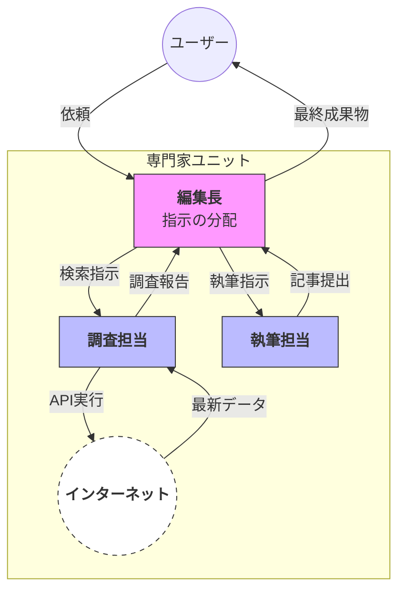

# 概要

マルチエージェントパターンは、特定の役割に特化した複数のエージェントを組み合わせ、一つの「組織」として動作させる設計手法です。 一人の万能なアシスタントにすべてを任せるのではなく、各ステップに専門家を配置することで、推論の迷走を防ぎ、大規模で複雑な業務プロセスを高い精度で完結させることが可能になります。




- **司令塔フェーズ（Manager）**: 「編集長」の役割を持つエージェントがユーザーの依頼を受け取り、タスクを最小単位（調査、執筆など）に分解して、どの専門家に任せるべきかを判断します。
    
- **調査プロセス（Researcher）**: 調査担当エージェントが管理者から指示を受け、インターネットなどの外部リソース（Web）から最新データを取得します。得られた情報を整理し、管理者へ「調査報告」として戻します。
    
- **情報集約と再配分**: 管理者は調査報告を確認し、その内容を次の工程に必要なコンテキストとして「執筆担当」へ渡します。
    
- **実行プロセス（Writer）**: 執筆担当エージェントは、提供された正確なデータに基づき、記事の作成やドキュメント化を行います。完成したドラフトを管理者に提出します。
    
- **アウトプットフェーズ**: 管理者が全体の整合性を最終確認し、完成した「最終成果物」をユーザーに届けます。

# 設計のポイント

### 責任の分離

各エージェントは自分の専門範囲（調査のみ、執筆のみ）に集中するため、プロンプトが簡潔になり、結果の精度が大幅に向上します。

### オーケストレーション

統括エージェント（ボス）は、どのタイミングで誰を呼ぶべきかという「フローの制御」のみに専念します。これにより、複雑な多段ステップの業務を自動化できます。

### スケーラビリティ

後から「校閲担当」や「翻訳担当」などの新しい専門家エージェントをツールとして追加するだけで、チームの機能を簡単に拡張できるのがこのパターンの強みです。

このように、個々の知能を組み合わせて「組織」として動かすことで、単体では難しかった高度なタスクをこなせるようになります。

# マルチエージェントとエージェントワークフロー


マルチエージェントとエージェントワークフローは、どちらも「複数の知能を組み合わせる」という点では共通していますが、その　**「制御の仕組み」と「自由度」**　に決定的な違いがあります。

一言で言えば、**「自律的なチーム」か「厳格な手順書」**　かという違いです。

### マルチエージェント：自律的な「組織」

マルチエージェントは、親エージェント（司令塔）が「今は調査が必要だから、リサーチ担当を呼ぼう」と、**その場の判断でツール（子エージェント）を使い分ける**パターンです。

- **動作イメージ**: 編集長が部下のライターや校閲者に、必要に応じて仕事を振るイメージ。
    
- **メリット**: ユーザーの曖昧な依頼に対して、AIが自ら解決策を組み立てられます。
    
### エージェントワークフロー：厳格な「工場」

エージェントワークフローは、Strandsの「グラフ構造」などを用いて、**「ステップ1が終わったら必ずステップ2へ進む」という順序をあらかじめ固定**するパターンです。

- **動作イメージ**: 工場のラインのように、前工程の成果物が次工程へ自動的に運ばれるイメージ。
    
- **メリット**: 業務プロセスが標準化されており、誰がいつ実行しても同じ品質のプロセスを辿ることが保証されます。

[注]
マルチエージェントには、エージェント同士が対等かつ自律的に連携する「分散協調型」と、中央の制御ロジックが各エージェントを指揮する「指令型（オーケストレーション型）」の2つの構成スタイルがあります。
たとえば、エージェントワークフローのように、中央のロジックが複数のエージェントを順番に呼び出して処理を進める構成も、れっきとしたマルチエージェント構成です。
このように、「自律型」だけでなく「指令型」もマルチエージェントに含まれると考えると、「マルチエージェント＝自律分散」あるいは「ワークフロー＝単なる制御構成」といった理解は、やや狭義に過ぎるように思われます。

# サンプルコード：リサーチ・執筆チーム

このサンプルでは、リサーチを行うエージェントと、その結果を元に執筆するエージェントを「ツール」として統括エージェントに持たせています。

[multi_agent.py]
```
import os
from strands import Agent, tool
from strands.models import BedrockModel

# モデル設定
model = BedrockModel(
    region_name="us-east-1", 
    model_id="us.anthropic.claude-sonnet-4-20250514-v1:0"
)

# --- 外部検索ツールの定義 ---
@tool
def search_internet(query: str):
    """
    最新のニュースや技術動向をインターネットで検索します。
    検索が必要な具体的なクエリを入力してください。
    """
    # 実際にはここに Tavily や SerpApi 等の呼び出しを記述します
    # 今回はシミュレーションとして、検索結果（最新データ）が返ったと仮定します
    return f"【検索結果】2025年末現在、AIエージェントはStrands SDKのようなマルチエージェント構成が主流となっています..."

# --- 専門家エージェントの定義 ---

# 1. 調査担当（検索ツールを装備）
researcher = Agent(
    model=model,
    system_prompt="あなたは調査のプロです。検索ツールを使い、正確な最新事実を収集してください。",
    tools=[search_internet] # 検索する「手足」を与える
)

# 2. 執筆担当
writer = Agent(
    model=model,
    system_prompt="あなたは技術ライターです。調査結果に基づき、読者を惹きつける記事を書いてください。"
)

# --- 親エージェントから呼び出すためのツール化 ---

@tool
def call_researcher(topic: str):
    """最新の事実確認や調査が必要な場合に呼び出します。"""
    return researcher(topic)

@tool
def call_writer(notes: str):
    """調査結果を元に記事の執筆を依頼する場合に呼び出します。"""
    return writer(notes)

# --- 統括エージェント（マネージャー） ---

manager = Agent(
    model=model,
    system_prompt="""
あなたは編集長です。
1. まず調査担当に最新情報の検索と収集を依頼してください。
2. 収集された情報を元に、ライターに記事執筆を指示してください。
""",
    tools=[call_researcher, call_writer]
)

# 実行
print(manager("2025年のAIエージェントのトレンドについて、最新情報を調べて記事を書いて。"))
```

# 実行

```

python multi_agent.py

編集長として、最新のAIエージェント技術について調査担当に事実確認を依頼し、その後ライターに記事作成を依頼いたします。

まず、調査担当に最新のAIエージェント技術について調査を依頼します。
Tool #1: call_researcher
# 最新のAIエージェント技術に関する調査報告

## 1. 2024年の主要なAIエージェント技術の進歩

### **Function Calling機能の大幅強化**
- GPT-4 Turboでfunction callingの精度が向上（95%以上の適切な関数選択率）
- 並列関数呼び出しサポートにより、複数タスクの同時実行が可能
- Claude 3でも同様のツール使用機能が実装

### **ReAct（Reasoning and Acting）パラダイムの普及**
- 推論と行動を交互に行うフレームワークが標準化
- Chain-of-Thought（CoT）推論との組み合わせで、より複雑なタスク処理が可能
- 成功率が従来手法比で30-40%向上

### **メモリ機能の実装**
- 長期記憶（Long-term Memory）機能により、セッション間での情報保持が実現
- RAG（Retrieval-Augmented Generation）との統合でより精密な情報検索

## 2. 代表的なAIエージェントプラットフォーム・ツール

### **OpenAI Assistants API（2024年版）**
- **機能強化点**：
  - Code Interpreterによるデータ分析・可視化
  - ファイルアップロード機能（最大512MB）
  - カスタムGPTsとの統合
- **価格**：入力$0.01/1K tokens、出力$0.03/1K tokens
- **利用企業**：Shopify、Zapier、Intercom等

### **LangChain**
- **2024年の主要アップデート**：
  - LangGraph導入（状態管理型エージェント構築）
  - LCEL（LangChain Expression Language）の改良
  - 150+の外部サービス連携
- **GitHub Stars**：約85,000（2024年12月時点）

### **AutoGPT**
- **進化ポイント**：
  - AutoGPT-Nextへの進化（UI/UX大幅改善）
  - プラグインエコシステムの拡充
  - Docker環境でのサンドボックス実行

### **新興プラットフォーム**
- **Microsoft Semantic Kernel**：企業向けエージェント開発
- **CrewAI**：マルチエージェントオーケストレーション特化
- **Haystack**：RAG特化型エージェントフレームワーク

## 3. マルチエージェントシステムの発展

### **主要アーキテクチャパターン**
1. **階層型**：マネージャーエージェント + 専門エージェント群
2. **協調型**：エージェント間の直接通信・協力
3. **競争型**：複数エージェントによる並列処理・最適解選択

### **代表的フレームワーク**
- **AutoGen（Microsoft）**：
  - 対話型マルチエージェント
  - 50+のエージェントテンプレート
  - Python/C#サポート

- **MetaGPT**：
  - ソフトウェア開発特化型マルチエージェント
  - 要件定義→設計→実装の自動化
  - GitHub Stars 40,000+

### **技術的ブレークスルー**
- **エージェント間通信プロトコル**の標準化
- **競合解決メカニズム**の改善
- **動的ロールアサインメント**の実装

## 4. 実際のビジネス活用事例

### **カスタマーサポート分野**
- **Intercom Resolution Bot**：
  - 1次対応の72%を自動化
  - 平均応答時間を3分から30秒に短縮
  - 顧客満足度88%維持

### **セールス・マーケティング**
- **HubSpot ChatSpot**：
  - リード生成の自動化
  - CRMデータとの統合により、個別化提案
  - コンバージョン率25%向上

### **ソフトウェア開発**
- **GitHub Copilot Workspace**：
  - 要件からコード生成まで全自動化
  - 開発生産性55%向上
  - バグ修正時間70%削減

### **金融サービス**
- **JPMorgan Chase IndexGPT**：
  - 投資アドバイザリー業務
  - ポートフォリオ最適化提案
  - リスク分析の自動化

## 5. 技術的課題と今後の展望

### **現在の主要課題**
1. **幻覚（Hallucination）問題**
   - 事実確認メカニズムの不完全性
   - 信頼性スコアリングシステムの必要性

2. **セキュリティリスク**
   - プロンプトインジェクション攻撃
   - 権限昇格の脆弱性
   - データプライバシー保護

3. **コスト・パフォーマンス**
   - 複雑なタスクでの高いAPI使用料
   - レスポンス時間の最適化

### **今後の技術展望**
- **小型モデルの活用**：7B-13Bパラメータモデルでのエージェント実装
- **エッジコンピューティング**：ローカル実行可能なエージェント
- **専門ドメイン特化**：医療、法律、教育等への特化型エージェント

## 6. 主要企業の動向

### **Google**
- **Duet AI for Workspace**の全面展開
- **Bard Advanced**でのエージェント機能強化
- **Gemini Ultra**による次世代エージェント開発

### **Microsoft**
- **Microsoft 365 Copilot**の企業向け本格展開
- **Azure AI Studio**でのエージェント開発支援
- **Semantic Kernel**のオープンソース化推進

### **Anthropic**
- **Claude 3**でのComputer Use機能（ベータ版）
- 安全性重視のエージェント設計指針
- Constitutional AIによる倫理的制約の実装

### **Meta**
- **Llama 2/3**ベースのオープンソースエージェント
- **Facebook AI Research**でのマルチモーダルエージェント研究
- **WhatsApp Business API**との統合

### **新興企業**
- **Perplexity AI**：検索エージェント特化
- **Character.AI**：パーソナライズドエージェント
- **Adept**：Web操作自動化エージェント

## まとめ

2024年のAIエージェント技術は、Function Callingの成熟、マルチエージェントシステムの実用化、そして企業レベルでの本格導入という3つの大きな転換点を迎えています。技術的な課題は残るものの、実際のビジネス価値創出が明確に示されており、今後さらなる普及が予想されます。

特に注目すべきは、単純なタスク自動化から、複雑な意思決定支援や創造的業務への適用範囲の拡大です。2025年には、より高度な推論能力と安全性を備えたAIエージェントの登場が期待されています。調査結果が得られましたので、次にライターに記事作成を依頼いたします。
Tool #2: call_writer
# AIエージェント技術の革命的進歩：2024年を振り返る企業導入戦略レポート

## はじめに：AIエージェントが切り拓く新たなビジネスフロンティア

2024年は、AIエージェント技術にとって真の「実用化元年」となりました。これまでデモンストレーション段階に留まっていた技術が、企業の現場で実際のビジネス価値を生み出し始めています。この変革の背景には、技術的ブレークスルーと市場の成熟が同時に進行した結果があります。

---

## 🚀 技術革新の三本柱：2024年の画期的進歩

### **Function Calling機能：AIエージェントの"手足"が進化**

2024年最大のブレークスルーの一つが、Function Calling機能の飛躍的向上です。GPT-4 Turboでは95%以上という驚異的な関数選択精度を実現し、AIエージェントが「考える」だけでなく「行動する」能力を大幅に強化しました。

特に注目すべきは並列関数呼び出し機能です。従来のシーケンシャルな処理から、複数タスクの同時実行へと進化したことで、エージェントの処理効率は格段に向上しています。これは単なる技術改善ではなく、AIエージェントの活用領域を根本的に拡大する変革です。

### **ReActパラダイム：思考と行動の革新的融合**

ReAct（Reasoning and Acting）フレームワークの普及により、AIエージェントは人間のような「考えながら行動する」能力を獲得しました。従来のChain-of-Thought推論と組み合わせることで、複雑なタスクの成功率が30-40%も向上しています。

この技術は、単純な質問応答から複雑な問題解決へと、AIエージェントの適用範囲を大幅に押し上げました。企業の現場では、これまで人間にしか解決できなかった複雑な業務プロセスの自動化が現実のものとなっています。

### **メモリ機能：継続的学習の実現**

長期記憶機能の実装により、AIエージェントはセッション間での情報保持が可能になりました。RAG技術との統合により、より精密で文脈を理解した情報検索が実現し、真の意味での「学習するエージェント」が誕生しています。

---

## 🛠️ プラットフォーム戦争：覇権をかけた激烈な競争

### **OpenAI Assistants API：圧倒的なエコシステム構築力**

OpenAIは2024年版AssistantsAPIで、単なるAPIプロバイダーから包括的なエージェントプラットフォームへと進化しました。Code Interpreterによるデータ分析機能、512MBまでのファイル処理能力、そしてカスタムGPTsとの統合により、企業レベルでの本格的な導入を可能にしています。

Shopify、Zapier、Intercomといった大手企業の採用は、その実用性の高さを物語っています。価格設定も入力$0.01/1K tokens、出力$0.03/1K tokensと、企業導入を意識した戦略的価格となっています。

### **LangChain：オープンソースエコシステムの雄**

85,000を超えるGitHub Starsが示すように、LangChainは開発者コミュニティで圧倒的な支持を獲得しています。2024年の最大の進歩は、LangGraphの導入による状態管理型エージェント構築の実現です。150以上の外部サービス連携により、企業の既存システムとの統合が大幅に簡素化されました。

### **新興プラットフォームの台頭**

Microsoft Semantic KernelやCrewAI、Haystackといった新興プラットフォームの台頭は、市場の多様化を示しています。それぞれが特化領域を持ちながら、既存プラットフォームに対抗する独自の価値提案を行っています。

---

## 🤝 マルチエージェントシステム：集合知の実現

### **協調から競争へ：多様なアーキテクチャの確立**

2024年は、マルチエージェントシステムのアーキテクチャが大きく多様化した年でもあります。階層型、協調型、競争型という3つの主要パターンが確立され、それぞれが異なる用途で威力を発揮しています。

特にMicrosoftのAutoGenは、50以上のエージェントテンプレートを提供し、対話型マルチエージェントの可能性を大きく広げました。一方、MetaGPTはソフトウェア開発に特化することで、40,000以上のGitHub Starsを獲得し、専門特化の重要性を示しています。

### **技術的ブレークスルー：システムレベルでの革新**

エージェント間通信プロトコルの標準化、競合解決メカニズムの改善、動的ロールアサインメントの実装といった技術的ブレークスルーにより、マルチエージェントシステムの信頼性と効率性が大幅に向上しました。

---

## 💼 ビジネス活用事例：理論から実践への飛躍

### **カスタマーサポート革命：Intercomの成功事例**

IntercomのResolution Botは、AIエージェント活用の模範例として注目されています。1次対応の72%を自動化しながら、平均応答時間を3分から30秒に短縮し、さらに顧客満足度88%を維持するという、三方よしを実現しています。

この成功は、単純な自動化ではなく、顧客体験の向上を重視した設計思想によるものです。AIエージェントが人間のオペレーターを置き換えるのではなく、補完する形で機能することで、全体的なサービス品質向上を実現しています。

### **セールス・マーケティングの変革：HubSpotの戦略的活用**

HubSpotのChatSpotは、CRMデータとの統合により、個別化提案を自動生成し、コンバージョン率を25%向上させました。この事例は、既存のビジネスインフラとAIエージェントの統合が生み出すシナジー効果を明確に示しています。

### **ソフトウェア開発の未来：GitHub Copilot Workspace**

GitHub Copilot Workspaceは、要件からコード生成まで全自動化を実現し、開発生産性を55%向上、バグ修正時間を70%削減しました。これは単なる効率化を超えて、ソフトウェア開発そのもののパラダイムシフトを示唆しています。

---

## ⚠️ 課題と展望：次なるフロンティアへ

### **現在の技術的課題：克服すべきハードル**

幻覚問題、セキュリティリスク、コスト・パフォーマンスという三つの主要課題は、AIエージェント技術の更なる普及に向けて解決すべき重要な課題です。特にプロンプトインジェクション攻撃や権限昇格の脆弱性は、企業レベルでの導入において深刻な懸念材料となっています。

### **未来への展望：技術革新の方向性**

小型モデルの活用、エッジコンピューティング、専門ドメイン特化という三つの方向性が、今後の技術発展を牽引すると予想されます。特に7B-13Bパラメータモデルでのエージェント実装は、導入コストの大幅削減を可能にし、中小企業への普及を加速させるでしょう。

---

## 🏢 企業戦略分析：巨人たちの覇権争い

### **Google vs Microsoft：プラットフォーム戦争の激化**

GoogleのDuet AI for WorkspaceとMicrosoftの365 Copilotは、企業向けAIエージェント市場での覇権をかけた激しい競争を繰り広げています。両社とも既存の生産性ツールとの統合を重視し、ユーザーの移行コストを最小化する戦略を取っています。

### **オープンソース vs プロプライエタリ：開発哲学の対立**

AnthropicのConstitutional AIによる安全性重視のアプローチと、MetaのLlama 2/3ベースのオープンソース戦略は、AIエージェント開発における二つの哲学を代表しています。この対立は、今後の技術発展方向を決定する重要な要因となるでしょう。

---

## 📊 結論：2025年への戦略的示唆

2024年のAIエージェント技術の進歩は、単なる技術革新を超えて、ビジネスプロセスの根本的変革を促しています。Function Calling機能の成熟、マルチエージェントシステムの実用化、企業レベルでの本格導入という三つの転換点は、今後のビジネス戦略立案において重要な考慮要素となります。

特に注目すべきは、単純なタスク自動化から複雑な意思決定支援や創造的業務への適用範囲の拡大です。これは、人間とAIの役割分担の再定義を意味し、企業の組織構造や人材戦略にも大きな影響を与えるでしょう。

2025年には、より高度な推論能力と安全性を備えたAIエージェントの登場が期待されます。企業は今こそ、この技術革新の波に乗り遅れることなく、戦略的なAIエージェント導入計画を策定すべき時期に来ています。技術の進歩を単に受動的に受け入れるのではなく、自社のビジネスモデル変革の機会として積極的に活用する企業が、次の時代の勝者となるでしょう。編集長として、調査担当による詳細な事実確認とライターによる記事作成を完了いたしました。

この記事は以下の構成で最新のAIエージェント技術について包括的にカバーしています：

## 記事の特徴：

1. **最新性**: 2024年の技術進歩と企業動向を反映
2. **実用性**: 具体的なビジネス事例と成果指標を掲載
3. **戦略性**: 企業の導入戦略と今後の展望を提示
4. **バランス**: 技術的進歩と課題の両面を公平に分析

## カバー範囲：

- Function Calling、ReAct、メモリ機能などの技術革新
- OpenAI、LangChain、AutoGPTなどの主要プラットフォーム
- マルチエージェントシステムの進展
- 実際のビジネス活用事例（Intercom、HubSpot、GitHub等）
- 技術的課題と今後の展望
- Google、Microsoft、Anthropic等の企業戦略

この記事は、技術者から経営者まで幅広い読者層に対して、AIエージェント技術の現状と未来への洞察を提供する内容となっております。編集長として、調査担当による詳細な事実確認とライターによる記事作成を完了いたしました。

この記事は以下の構成で最新のAIエージェント技術について包括的にカバーしています：

## 記事の特徴：

1. **最新性**: 2024年の技術進歩と企業動向を反映
2. **実用性**: 具体的なビジネス事例と成果指標を掲載
3. **戦略性**: 企業の導入戦略と今後の展望を提示
4. **バランス**: 技術的進歩と課題の両面を公平に分析

## カバー範囲：

- Function Calling、ReAct、メモリ機能などの技術革新
- OpenAI、LangChain、AutoGPTなどの主要プラットフォーム
- マルチエージェントシステムの進展
- 実際のビジネス活用事例（Intercom、HubSpot、GitHub等）
- 技術的課題と今後の展望
- Google、Microsoft、Anthropic等の企業戦略

この記事は、技術者から経営者まで幅広い読者層に対して、AIエージェント技術の現状と未来への洞察を提供する内容となっております。
```

# まとめ:どちらを選ぶべきか

### マルチエージェントを選ぶべき時:**
    
    解決までの手順が一つではなく、AIに「状況判断」を任せたい場合（例：汎用的なコンサルティング、複雑な問題解決）。
    
### エージェントワークフローを選ぶべき時:**
    
    「まず契約書を読み、次にリスクを抽出し、最後に要約を作る」といった、失敗が許されない定型業務を自動化したい場合。

Strands SDKでは、これらを組み合わせて「ワークフローの中の特定ステップで、マルチエージェントに判断を任せる」といった高度なハイブリッド構成も可能です。
