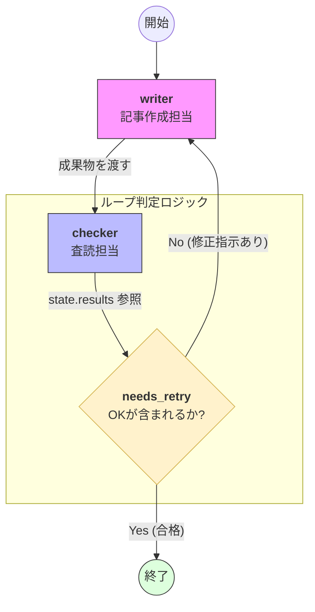

# 概要

グラフ・ループは、エージェントのワークフローを一本道（シーケンシャル）にするのではなく、特定の条件を満たすまで処理を繰り返させる設計パターンです。例えば、「文章の校閲」や「コードのデバッグ」のように、エラーや不備がなくなるまで「作成」と「検証」のステップを往復させることで、最終成果物の精度を極限まで高めることができます。





- **ノードの定義（writer / checker）**: `builder.add_node` によって定義された2つの専門家エージェントが、グラフ上の独立した処理ユニット（ノード）として配置されています。
    
- **順方向エッジ**: `writer` から `checker` への一方通行の線は、最初の原稿生成から査読へ進む標準的なフローを表しています。
    
- **条件付き戻りエッジ（needs_retry）**: ここがこのコードの肝です。`checker` の実行結果が格納された `state.results` をプログラムが読み取り、内容が不十分であれば `writer` へ処理を戻します。
    
- **自律的なブラッシュアップ**: このループは、査読担当が「OK」を出すまで（＝条件が `False` になるまで）自動的に繰り返され、最終的に高品質な成果物のみが `End` へ到達します。

---

# 実装のポイント


- **データの取得パス**: コード内で `state.results.get("checker").result.message["content"]` を正確に指定しているため、LLMの生のテキストに基づいた厳密な分岐が可能になっています。
    
- **エントリーポイント**: `set_entry_point("writer")` により、迷うことなく最初の作成工程からスタートします。
    
- **役割の分離**: Writerは「書くこと」に、Checkerは「評価すること」に専念しており、各エージェントのプロンプトがシンプルに保たれているため、推論の精度が最大化されています。
- 


# サンプルコード

StrandsのWorkflows機能を用いた、ループ構造の基本的な実装イメージです。

[graph_agent.py]
```
from strands import Agent
from strands.multiagent import GraphBuilder
from strands.models import BedrockModel

model = BedrockModel(model_id="us.anthropic.claude-sonnet-4-20250514-v1:0")

# 1. エージェントの定義
writer_agent = Agent(model=model, system_prompt="記事作成担当。修正指示を反映して最高品質の記事を書いてください。")
checker_agent = Agent(model=model, system_prompt="査読担当。不備があれば修正指示を、完璧なら 'OK' とだけ答えてください。")

# 2. グラフの構築
builder = GraphBuilder()

# ノード登録
writer = builder.add_node(writer_agent, node_id="writer")
checker = builder.add_node(checker_agent, node_id="checker")

builder.add_edge(writer, checker)

# --- 正確な条件判定関数 ---
def needs_retry(state):
    # node_results 辞書から 'checker' ノードの結果を取得
    checker_res = state.results.get("checker")
    
    if not checker_res:
        return False
        
    # checker_res.output に LLM の回答テキストが格納されています
    output_text = str(checker_res.result.message["content"])
    
    print(f"\n[査読フィードバック]:\n{output_text[:200]}...")
    
    # 'OK' が含まれていなければ再試行（Writerに戻る）
    return "OK" not in output_text

# checker から writer への戻りエッジに判定をセット
builder.add_edge(checker, writer, condition=needs_retry)

# エントリーポイント
builder.set_entry_point("writer")

# 3. 実行
graph = builder.build()
result = graph("AIエージェントの自律性について、専門的な記事を書いてください。")

print("\n--- 最終成果物 ---")
# print(result.results)

# 最後に実行されたノード（checker）の結果を取得
# print(result.results["checker"].result.message["content"][0]["text"])

# writer の記事本文を取得したい場合
print(result.results["writer"].result.message["content"][0]["text"])

```


# 実行

以下、実行結果です。
---

python cyclic_agent.py
[[20-080-1.実行結果]]
