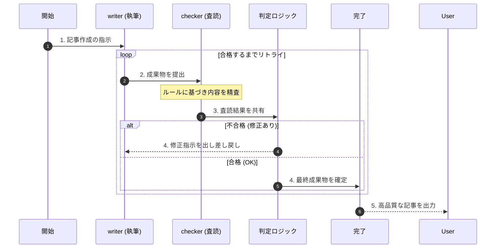

# 概要

グラフ・ループは、エージェントのワークフローを一本道（シーケンシャル）にするのではなく、特定の条件を満たすまで処理を繰り返させる設計パターンです。例えば、「文章の校閲」や「コードのデバッグ」のように、エラーや不備がなくなるまで「作成」と「検証」のステップを往復させることで、最終成果物の精度を極限まで高めることができます。





### 専門性の分離による品質担保

執筆担当（writer）は「書くこと」に、査読担当（checker）は「間違いを見つけること」に特化しています。人間が一人で書くと見落としがちなミスも、別の視点（checker）を入れることで確実に拾い上げることができ、アウトプットの質をプロレベルまで引き上げます。

### 条件分岐による自律的なループ

**needs_retry** という判定ロジックが、システムに「自律性」を与えています。AIが適当な回答をしても、判定ロジックが「OK」を認めない限り、何度でもやり直しを命じます。これにより、人間の手を通さずに「納得のいくまで改善を続ける」ことが可能になります。

### 状態管理（state.results）の重要性

査読の結果は **state（状態）** として共有されます。単に「ダメ」と言うのではなく、具体的な修正ポイントが記録されるため、次回の執筆プロセスでは「なぜ不合格だったか」を学習（コンテキストとして利用）した状態から改善をスタートできるのがこの仕組みの賢い点です。


# サンプルコード

StrandsのWorkflows機能を用いた、ループ構造の基本的な実装イメージです。

[graph_agent.py]
```
from strands import Agent
from strands.multiagent import GraphBuilder
from strands.models import BedrockModel

model = BedrockModel(model_id="us.anthropic.claude-sonnet-4-20250514-v1:0")

# 1. エージェントの定義
writer_agent = Agent(model=model, system_prompt="記事作成担当。修正指示を反映して最高品質の記事を書いてください。")
checker_agent = Agent(model=model, system_prompt="査読担当。不備があれば修正指示を、完璧なら 'OK' とだけ答えてください。")

# 2. グラフの構築
builder = GraphBuilder()

# ノード登録
writer = builder.add_node(writer_agent, node_id="writer")
checker = builder.add_node(checker_agent, node_id="checker")

builder.add_edge(writer, checker)

# --- 正確な条件判定関数 ---
def needs_retry(state):
    # node_results 辞書から 'checker' ノードの結果を取得
    checker_res = state.results.get("checker")
    
    if not checker_res:
        return False
        
    # checker_res.output に LLM の回答テキストが格納されています
    output_text = str(checker_res.result.message["content"])
    
    print(f"\n[査読フィードバック]:\n{output_text[:200]}...")
    
    # 'OK' が含まれていなければ再試行（Writerに戻る）
    return "OK" not in output_text

# checker から writer への戻りエッジに判定をセット
builder.add_edge(checker, writer, condition=needs_retry)

# エントリーポイント
builder.set_entry_point("writer")

# 3. 実行
graph = builder.build()
result = graph("AIエージェントの自律性について、専門的な記事を書いてください。")

print("\n--- 最終成果物 ---")
# print(result.results)

# 最後に実行されたノード（checker）の結果を取得
# print(result.results["checker"].result.message["content"][0]["text"])

# writer の記事本文を取得したい場合
print(result.results["writer"].result.message["content"][0]["text"])

```

# 実行

以下、実行結果です。
---

```
python cyclic_agent.py
```

[70-20-081.実行結果](70-20-081.実行結果.md)

