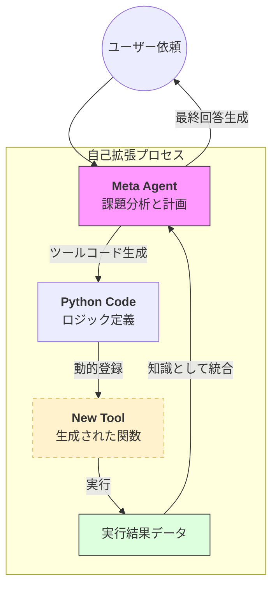

# 概要

メタツーリング(Meta Tooling)とは、エージェントが「既存のツールを使う」だけでなく、**「実行時に新しいツールを自分で作成（定義）し、それを利用する」** 仕組みを指します。

従来のエージェントは、開発者があらかじめ用意したツールの範囲内でしか動けませんでした。しかし、Meta Toolingを装備したエージェントは、未知の課題に直面した際、それを解決するためのPythonコードを自ら生成し、それを動的な「ツール」として即座に自分自身に組み込みます。





- **コード生成**: 解決策が既存のツールにない場合、エージェントはPythonのコードを書き出します。
    
-  **動的登録**: 書き出されたコードは、その場で「新しいツール」としてシステムに登録されます。
    
-  **実行と統合**: エージェントはこの自作ツールを実行し、得られた結果を元にユーザーへの最終回答を構成します。
    
    これにより、エージェントは「想定外の計算」や「複雑なデータ変換」にもその場で対応できるようになります。
    
# 実装のポイント

- **動的なツール定義**: Strandsでは `tool` デコレータを介して、実行時に生成された関数をエージェントの `tools` リストに追加する柔軟性を持っています。
    
- **サンドボックスの重要性**: エージェントが生成したコードを実行するため、セキュリティ上のリスク（無限ループやシステム破壊）を回避する安全な実行環境が求められます。
    
- **型定義の自動生成**: 生成されたツールが `Pydantic` などの型定義を持つようにすることで、他のエージェントとの連携もスムーズになります。
    
# サンプルコード

エージェントが「数学的な特殊計算ツール」を自作して解決するイメージの構成案です。

[meta_tooling.py]
```
from strands import Agent, tool
from strands.models import BedrockModel

model = BedrockModel(model_id="us.anthropic.claude-sonnet-4-20250514-v1:0")

# メタ・ツール生成用の特別なプロンプトを持つエージェント
meta_agent = Agent(
    model=model,
    system_prompt="""
    あなたは必要に応じて自らPythonツールを作成できるエンジニアです。
    既存のツールで解決できない場合、解決用のPython関数を生成し、
    それを実行して結果を報告してください。
    """
)

# 例：エージェントが内部で以下のような関数を動的に生成・登録する
@tool
def calculate_complex_metric(data: list[float]):
    """エージェントがその場で考え出した、データ分析用の特殊計算ツール"""
    import math
    return [math.sqrt(x) * math.log(x) for x in data if x > 0]

# 実行
response = meta_agent("この数値リストに対して、独自の相関スコアを計算するツールを作って適用して: [10, 20, 30]")
print(response)
```


# 実行
以下、実行結果です。
---

```
python meta_tooling.py
```

[70-20-091.実行結果](70-20-091.実行結果.md)


