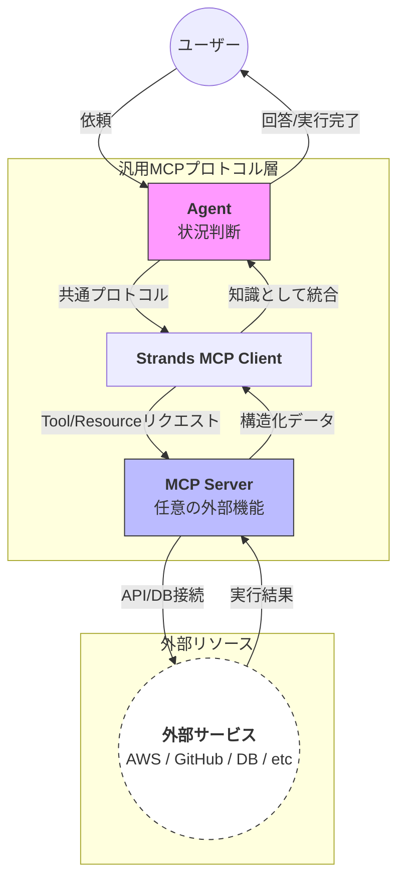

# 概要

MCPサーバー連携（MCP Server Integration） は、業界標準のプロトコルを用いて、AIエージェントに外部システムやデータソースへの「アクセス権」を与える汎用的なパターンです。

Strands SDKはMCPクライアントとして機能し、世界中で公開されている多様なMCPサーバーと接続することで、エージェントを「ただのチャットAI」から「実務を実行するオペレーター」へと変貌させます。



- **依頼フェーズ**: ユーザーからの依頼を受け、エージェントが「どの外部ツール（GitHub、AWS、DBなど）を使うべきか」を判断します。
    
- **プロトコル変換プロセス (MCP Client)**: エージェントの意図を、MCPという世界共通の通信規格に変換します。これにより、接続先が何であってもエージェントは同じ手順で対話できます。
    
- **ツール仲介プロセス (MCP Server)**: 汎用プロトコルを受け取り、実際の外部サービス（APIやデータベース）が理解できる命令に翻訳して実行します。
    
- **データ統合プロセス**: 外部サービスからの実行結果を、MCP Serverが「構造化データ」として整理します。これをClient経由でエージェントが受け取り、自身の知識の一部として取り込みます。
    
- **アウトプットフェーズ**: 外部リソースから得た確かな情報に基づき、エージェントが回答を作成、あるいは実行完了の報告をユーザーへ届けます。

# 実装のポイント

- **標準化されたツール同期**: MCPサーバーに接続すると、そのサーバーが提供するすべてのツール（Tools）とリソース（Resources）が自動的にエージェントへ登録されます。
    
- **トランスポートの柔軟性**: 標準入出力（stdio）やHTTP（SSE）など、サーバーの稼働環境に合わせた接続方式をStrands側で選択可能です。
    
- **マルチサーバー対応**: 一つのエージェントに複数のMCPサーバーを同時に接続できるため、「GitHubからコードを読み、AWSのドキュメントを参照して、Slackに報告する」といった横断的な業務が容易になります。
    
# サンプルコード

あらゆるMCPサーバーに適用できる汎用的な記述形式です。

[mcp_server.py]
```
from strands import Agent
from strands.mcp import MCPClient
from strands.models import BedrockModel

# 1. MCPサーバーへの接続設定
# npx (Node.js) を利用してサーバーを起動する例
aws_doc_mcp = MCPClient(
    command="npx",
    args=["-y", "@awslabs/aws-documentation-mcp-server"]
)

# 2. AWS専門エージェントの構築
# mcp_clients に登録するだけで、AWSドキュメント検索機能がツールとして追加される
agent = Agent(
    model=BedrockModel(model_id="us.anthropic.claude-sonnet-4-20250514-v1:0"),
    system_prompt="""
    あなたはAWS認定ソリューションアーキテクトです。
    AWS公式ドキュメントを検索して、最新かつ正確な技術情報を提供してください。
    もしドキュメントに記載がない場合は、推測せずその旨を伝えてください。
    """,
    mcp_clients=[aws_doc_mcp]
)

# 3. 実行
# エージェントは内部でドキュメントを検索し、回答を生成します
question = "Amazon Bedrockの最新のモデルインポート機能の制限事項について教えてください。"
response = agent(question)

print("--- AWS Expert の回答 ---")
print(response)
```

# 実行

```
python mcp_server.py

Installed 41 packages in 84ms
[12/30/25 22:27:06] INFO     Processing request of type ListToolsRequest                                                                                                                            server.py:713
Amazon Bedrockの最新のモデルインポート機能について調べます。まず関連するドキュメントを検索してみます。
Tool #1: search_documentation
[12/30/25 22:27:14] INFO     Processing request of type CallToolRequest                                                                                                                             server.py:713
[12/30/25 22:27:21] INFO     HTTP Request: POST                                                                                                                                                   _client.py:1740
                             https://proxy.search.docs.aws.amazon.com/search?session=1494000d-84f3-47ec-a1da-7c15b899168a&search_intent=Amazon+Bedrock%E3%81%AE%E3%83%A2%E3%83%87%E3%83%AB%E3%82%
                             A4%E3%83%B3%E3%83%9D%E3%83%BC%E3%83%88%E6%A9%9F%E8%83%BD%E3%81%AE%E5%88%B6%E9%99%90%E4%BA%8B%E9%A0%85%E3%81%AB%E3%81%A4%E3%81%84%E3%81%A6%E8%AA%BF%E3%81%B9%E3%82%8B
                              "HTTP/1.1 200 OK"
最初の検索結果から、モデルインポート機能に関する主要なドキュメントページが見つかりました。まず、基本的なモデルインポート機能のページを確認します。
Tool #2: read_documentation
[12/30/25 22:27:24] INFO     Processing request of type CallToolRequest                                                                                                                             server.py:713
                    INFO     HTTP Request: GET                                                                                                                                                    _client.py:1740
                             https://docs.aws.amazon.com/bedrock/latest/userguide/import-pre-trained-model.html?session=1494000d-84f3-47ec-a1da-7c15b899168a&query_id=e8c3404b-6f0d-41dd-9c2a-136
                             efc096cca "HTTP/1.1 200 OK"
次に、カスタムモデルインポートの詳細なドキュメントを確認して制限事項を調べます。
Tool #3: read_documentation
[12/30/25 22:27:26] INFO     Processing request of type CallToolRequest                                                                                                                             server.py:713
                    INFO     HTTP Request: GET                                                                                                                                                    _client.py:1740
                             https://docs.aws.amazon.com/bedrock/latest/userguide/model-customization-import-model.html?session=1494000d-84f3-47ec-a1da-7c15b899168a&query_id=e8c3404b-6f0d-41dd-
                             9c2a-136efc096cca "HTTP/1.1 200 OK"
続きを読んで、制限事項に関する詳細情報を取得します。
Tool #4: read_documentation
[12/30/25 22:27:29] INFO     Processing request of type CallToolRequest                                                                                                                             server.py:713
[12/30/25 22:27:30] INFO     HTTP Request: GET                                                                                                                                                    _client.py:1740
                             https://docs.aws.amazon.com/bedrock/latest/userguide/model-customization-import-model.html?session=1494000d-84f3-47ec-a1da-7c15b899168a&query_id=e8c3404b-6f0d-41dd-
                             9c2a-136efc096cca "HTTP/1.1 200 OK"
さらに制限事項の詳細を確認するため、前提条件に関するドキュメントも確認します。
Tool #5: read_documentation
[12/30/25 22:27:32] INFO     Processing request of type CallToolRequest                                                                                                                             server.py:713
[12/30/25 22:27:33] INFO     HTTP Request: GET https://docs.aws.amazon.com/bedrock/latest/userguide/custom-model-import-prereq.html?session=1494000d-84f3-47ec-a1da-7c15b899168a "HTTP/1.1 200    _client.py:1740
                             OK"
さらに詳細な制限事項を確認するため、APIリファレンスも調べてみます。
Tool #6: read_documentation
[12/30/25 22:27:35] INFO     Processing request of type CallToolRequest                                                                                                                             server.py:713
[12/30/25 22:27:36] INFO     HTTP Request: GET                                                                                                                                                    _client.py:1740
                             https://docs.aws.amazon.com/bedrock/latest/APIReference/API_CreateModelImportJob.html?session=1494000d-84f3-47ec-a1da-7c15b899168a&query_id=e8c3404b-6f0d-41dd-9c2a-
                             136efc096cca "HTTP/1.1 200 OK"
制限事項について調べるため、さらに詳細な情報を検索してみます。
Tool #7: search_documentation
[12/30/25 22:27:40] INFO     Processing request of type CallToolRequest                                                                                                                             server.py:713
[12/30/25 22:27:42] INFO     HTTP Request: POST                                                                                                                                                   _client.py:1740
                             https://proxy.search.docs.aws.amazon.com/search?session=1494000d-84f3-47ec-a1da-7c15b899168a&search_intent=Amazon+Bedrock%E3%83%A2%E3%83%87%E3%83%AB%E3%82%A4%E3%83%
                             B3%E3%83%9D%E3%83%BC%E3%83%88%E3%81%AE%E3%82%B5%E3%82%A4%E3%82%BA%E5%88%B6%E9%99%90%E3%82%84%E3%81%9D%E3%81%AE%E4%BB%96%E3%81%AE%E5%88%B6%E9%99%90%E3%81%AB%E3%81%A4
                             %E3%81%84%E3%81%A6%E8%A9%B3%E7%B4%B0%E6%83%85%E5%A0%B1%E3%82%92%E8%AA%BF%E3%81%B9%E3%82%8B "HTTP/1.1 200 OK"
Bedrockのクォータに関する情報を確認してみます。
Tool #8: search_documentation
[12/30/25 22:27:46] INFO     Processing request of type CallToolRequest                                                                                                                             server.py:713
[12/30/25 22:27:47] INFO     HTTP Request: POST                                                                                                                                                   _client.py:1740
                             https://proxy.search.docs.aws.amazon.com/search?session=1494000d-84f3-47ec-a1da-7c15b899168a&search_intent=Amazon+Bedrock%E3%81%AE%E3%82%B5%E3%83%BC%E3%83%93%E3%82%
                             B9%E5%88%B6%E9%99%90%E3%82%84%E3%82%AF%E3%82%A9%E3%83%BC%E3%82%BF%E6%83%85%E5%A0%B1%E3%82%92%E8%AA%BF%E3%81%B9%E3%82%8B "HTTP/1.1 200 OK"
Bedrockのクォータに関するドキュメントを確認します。
Tool #9: read_documentation
[12/30/25 22:27:50] INFO     Processing request of type CallToolRequest                                                                                                                             server.py:713
[12/30/25 22:27:51] INFO     HTTP Request: GET                                                                                                                                                    _client.py:1740
                             https://docs.aws.amazon.com/bedrock/latest/userguide/quotas.html?session=1494000d-84f3-47ec-a1da-7c15b899168a&query_id=97333be7-0be9-4cd2-97c8-981bc114ced2
                             "HTTP/1.1 200 OK"
制限事項についてより詳細な情報を取得するため、新機能のページもチェックしてみます。
Tool #10: recommend
[12/30/25 22:27:54] INFO     Processing request of type CallToolRequest                                                                                                                             server.py:713
[12/30/25 22:27:55] INFO     HTTP Request: GET                                                                                                                                                    _client.py:1740
                             https://contentrecs-api.docs.aws.amazon.com/v1/recommendations?path=https://docs.aws.amazon.com/bedrock/latest/userguide/model-customization-import-model.html&sessi
                             on=1494000d-84f3-47ec-a1da-7c15b899168a "HTTP/1.1 200 OK"
Amazon Bedrockの最新のモデルインポート機能の制限事項について、収集した情報をまとめてお答えします。

## Amazon Bedrockモデルインポート機能の制限事項

### **地域制限**
- カスタムモデルインポートは以下の地域でのみサポートされています：
  - `eu-central-1` (欧州 フランクフルト)
  - `us-east-1` (米国東部 バージニア北部)
  - `us-east-2` (米国東部 オハイオ)
  - `us-west-2` (米国西部 オレゴン)

### **対応アーキテクチャ制限**
以下のアーキテクチャのみサポートされています：
- **Mistral** - Sliding Window AttentionとGrouped Query Attentionオプション付き
- **Mixtral** - Mixture of Experts (MoE)モデル
- **Flan** - T5アーキテクチャベース
- **Llama 2, Llama 3, Llama 3.1, Llama 3.2, Llama 3.3, Mllama**
- **GPTBigCode** - Multi-Query action付きGPT-2最適化版
- **Qwen2, Qwen2.5, Qwen2-VL, Qwen2.5-VL, Qwen3** (Qwen3はQwen3ForCausalLMとQwen3MoeForCausalLMのみ)
- **GPT-OSS** - 20Bと120Bベース（米国東部バージニア北部のみ）

### **モデルサイズ制限**
- **マルチモーダルモデル**: 100GB未満
- **テキストモデル**: 200GB未満
- **最大コンテキスト長**: 128K未満の位置エンベディングまたは最大コンテキスト長

### **技術的制限**
- **Transformer版要件**: バージョン4.51.3の使用が必要
- **対応しない機能**:
  - Batch inference（バッチ推論）
  - CloudFormation
  - 埋め込みモデル（Embedding models）
  - Qwen3モデルでのConverse API

### **ファイル形式要件**
- **必須ファイル**:
  - `.safetensors` - Safetensor形式のモデル重み
  - `config.json` - モデル設定ファイル
  - その他Hugging Face transformerライブラリが生成するファイル

### **セキュリティとアクセス制限**
- **IAMサービスロール**: 適切な権限を持つサービスロールが必要
- **クロスアカウントアクセス**: S3バケットやKMSキーへのアクセス許可が必要
- **VPC設定**: オプションでVPC内でのジョブ保護が可能

### **料金モデル制限**
- **オンデマンドスループット**: インポートしたモデルはオンデマンドスループットでのみ使用可能
- **専用料金**: カスタムモデルインポートには専用の料金体系が適用

### **その他の制限**
- **ライセンス遵守**: インポートするモデルのライセンス条項への準拠が必要
- **ファイル配置**: Amazon S3での特定の形式でのファイル配置が必要
- **API制限**: 標準的なAPI呼び出し制限とクォータが適用

これらの制限事項は、Amazon Bedrockの最新のドキュメント（2024年12月現在）に基づいています。新しい機能や制限の変更については、AWS公式ドキュメントで最新情報を確認することをお勧めします。--- AWS Expert の回答 ---
Amazon Bedrockの最新のモデルインポート機能の制限事項について、収集した情報をまとめてお答えします。

## Amazon Bedrockモデルインポート機能の制限事項

### **地域制限**
- カスタムモデルインポートは以下の地域でのみサポートされています：
  - `eu-central-1` (欧州 フランクフルト)
  - `us-east-1` (米国東部 バージニア北部)
  - `us-east-2` (米国東部 オハイオ)
  - `us-west-2` (米国西部 オレゴン)

### **対応アーキテクチャ制限**
以下のアーキテクチャのみサポートされています：
- **Mistral** - Sliding Window AttentionとGrouped Query Attentionオプション付き
- **Mixtral** - Mixture of Experts (MoE)モデル
- **Flan** - T5アーキテクチャベース
- **Llama 2, Llama 3, Llama 3.1, Llama 3.2, Llama 3.3, Mllama**
- **GPTBigCode** - Multi-Query action付きGPT-2最適化版
- **Qwen2, Qwen2.5, Qwen2-VL, Qwen2.5-VL, Qwen3** (Qwen3はQwen3ForCausalLMとQwen3MoeForCausalLMのみ)
- **GPT-OSS** - 20Bと120Bベース（米国東部バージニア北部のみ）

### **モデルサイズ制限**
- **マルチモーダルモデル**: 100GB未満
- **テキストモデル**: 200GB未満
- **最大コンテキスト長**: 128K未満の位置エンベディングまたは最大コンテキスト長

### **技術的制限**
- **Transformer版要件**: バージョン4.51.3の使用が必要
- **対応しない機能**:
  - Batch inference（バッチ推論）
  - CloudFormation
  - 埋め込みモデル（Embedding models）
  - Qwen3モデルでのConverse API

### **ファイル形式要件**
- **必須ファイル**:
  - `.safetensors` - Safetensor形式のモデル重み
  - `config.json` - モデル設定ファイル
  - その他Hugging Face transformerライブラリが生成するファイル

### **セキュリティとアクセス制限**
- **IAMサービスロール**: 適切な権限を持つサービスロールが必要
- **クロスアカウントアクセス**: S3バケットやKMSキーへのアクセス許可が必要
- **VPC設定**: オプションでVPC内でのジョブ保護が可能

### **料金モデル制限**
- **オンデマンドスループット**: インポートしたモデルはオンデマンドスループットでのみ使用可能
- **専用料金**: カスタムモデルインポートには専用の料金体系が適用

### **その他の制限**
- **ライセンス遵守**: インポートするモデルのライセンス条項への準拠が必要
- **ファイル配置**: Amazon S3での特定の形式でのファイル配置が必要
- **API制限**: 標準的なAPI呼び出し制限とクォータが適用

これらの制限事項は、Amazon Bedrockの最新のドキュメント（2024年12月現在）に基づいています。新しい機能や制限の変更については、AWS公式ドキュメントで最新情報を確認することをお勧めします。

```
