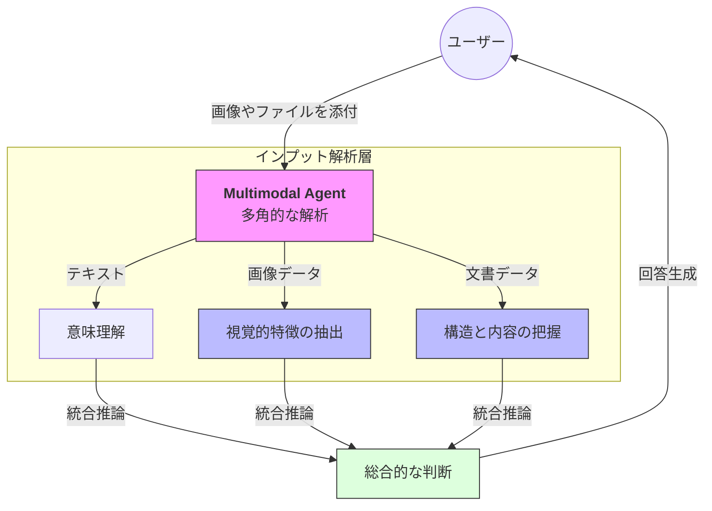

# 概要

マルチモーダル（Multimodal） とは、テキスト以外のデータ形式（画像、PDF、ドキュメントファイルなど）をAIエージェントが直接理解し、処理する能力を指します。

Strands SDKでは、Amazon Bedrockなどの強力なマルチモーダルモデルを活用し、エージェントに「画像を見て状況を判断させる」「複雑な図表を含むドキュメントを読み解かせる」といった、視覚的情報を伴う高度な推論タスクをシームレスに実装できます。


- **入力フェーズ**: ユーザーが言葉（テキスト）による指示と一緒に、写真、図解、あるいは数ページの文書ファイルをエージェントに渡します。
    
- **多角的解析プロセス（インプット解析層）**: エージェントは受け取ったデータをそれぞれの性質に合わせて並列に処理します。
    
    - **テキスト**: ユーザーが何を求めているかの意図を理解します。
        
    - **画像（Vision）**: 写真の中の物体、文字、あるいは構成図などの視覚的な特徴を抽出します。
        
    - **文書（Document）**: PDFやWord内の表、グラフ、テキスト構造を把握します。
        
- **統合推論プロセス（Reasoning）**: 分離して解析された「テキスト・視覚・文書」の情報が、一つの文脈として統合されます。「この画像に写っているエラーコードの解決策を、このマニュアルから探して」といった、情報の紐付けが行われます。
    
- **アウトプットフェーズ**: すべての情報を統合した「総合的な判断」に基づき、ユーザーの期待に沿った的確な回答や解決策が生成されます。
 

# 実装のポイント

- **ContentBlock の活用**: Strandsでは `ContentBlock` を使用して、テキスト、画像（JPEG/PNG）、ドキュメント（PDF等）を一つのメッセージとして構成します。
    
- **モデルの性能の引き出し**: Claude 3.5 Sonnetのようなマルチモーダル対応モデルを指定することで、画像内のテキスト抽出（OCR）や図解の論理的説明が可能になります。
    
- **シームレスな統合**: 開発者は画像解析のための別のAPIを呼ぶ必要はなく、エージェントにデータを「渡すだけ」で解析が始まります。
    
# サンプルコード

画像とテキストを同時にエージェントに渡し、内容を分析させる実装例です。

[multi_modal.py]
```
from strands import Agent
from strands.types.content import ContentBlock
from strands.models import BedrockModel
from pathlib import Path

model = BedrockModel(model_id="us.anthropic.claude-sonnet-4-20250514-v1:0")

# 1. マルチモーダル対応エージェントの構築
agent = Agent(
    model=model,
    system_prompt="あなたは画像やドキュメントを精密に分析する専門家です。"
)

# 2. データの準備
image_path = Path("Strands Agents with AWS services.png")
with open(image_path, "rb") as f:
    image_data = f.read()

# テキストと画像を ContentBlock のリストとして構成
input_content = [
    ContentBlock(text="この構成図におけるセキュリティ上の懸念点を抽出してください。"),
    ContentBlock(image={"format": "png", "source": {"bytes": image_data}})
]

# 3. 実行
response = agent(input_content)
print("--- 解析結果 ---")
print(response.message["content"][0]["text"])


```


[Strands Agents with AWS Services]
![[strands_agents_with_aws_services.png]]
[出典]
https://github.com/strands-agents/samples/blob/main/01-tutorials/01-fundamentals/03-connecting-with-aws-services/images/architecture.png

# 実行

```
python multi_modal.py

この構成図を分析して、以下のセキュリティ上の懸念点を特定しました：

## 🔐 認証・認可関連

**1. ユーザー認証の欠如**
- Customer（顧客）からの入力に対する認証メカニズムが明示されていない
- 不正なユーザーがシステムにアクセス可能

**2. サービス間認証**
- AWS CloudとAmazon Bedrock、OpenSearch間の認証方式が不明
- 内部サービス間の相互認証が確保されているか不透明

## 🛡️ データ保護関連

**3. データ暗号化**
- 顧客の予約情報やクエリの暗号化状態が不明
- DynamoDBやS3での保存時暗号化の設定が不透明
- 通信経路での暗号化（TLS/SSL）が明示されていない

**4. 個人情報保護**
- 予約データに含まれる個人情報（名前、連絡先等）の保護レベルが不明
- GDPR/個人情報保護法への準拠状況が不透明

## 🌐 ネットワークセキュリティ

**5. ネットワーク分離**
- VPCやセキュリティグループの設定が明示されていない
- パブリックアクセスとプライベートアクセスの境界が不明確

**6. API保護**
- Restaurant assistant agentへのAPI呼び出しに対する保護機能が不明
- レート制限やDDoS対策の有無が不透明

## 💾 データ管理

**7. アクセス制御**
- DynamoDB、S3、OpenSearchへの細かいアクセス権限設定が不明
- 最小権限の原則が適用されているか不明

**8. ログ・監査**
- システム全体の監査ログ取得状況が不明
- セキュリティインシデントの検出・対応体制が見えない

## 🔧 運用面

**9. データ保持期間**
- 顧客データや検索履歴の保持期間ポリシーが不明
- 不要データの自動削除メカニズムが不透明

**10. 障害時の対応**
- セキュリティインシデント発生時のデータ保護手順が不明
- バックアップデータのセキュリティ確保策が見えない

これらの点について、具体的なセキュリティ対策の実装状況を確認し、必要に応じて強化することを推奨します。--- 解析結果 ---
この構成図を分析して、以下のセキュリティ上の懸念点を特定しました：

## 🔐 認証・認可関連

**1. ユーザー認証の欠如**
- Customer（顧客）からの入力に対する認証メカニズムが明示されていない
- 不正なユーザーがシステムにアクセス可能

**2. サービス間認証**
- AWS CloudとAmazon Bedrock、OpenSearch間の認証方式が不明
- 内部サービス間の相互認証が確保されているか不透明

## 🛡️ データ保護関連

**3. データ暗号化**
- 顧客の予約情報やクエリの暗号化状態が不明
- DynamoDBやS3での保存時暗号化の設定が不透明
- 通信経路での暗号化（TLS/SSL）が明示されていない

**4. 個人情報保護**
- 予約データに含まれる個人情報（名前、連絡先等）の保護レベルが不明
- GDPR/個人情報保護法への準拠状況が不透明

## 🌐 ネットワークセキュリティ

**5. ネットワーク分離**
- VPCやセキュリティグループの設定が明示されていない
- パブリックアクセスとプライベートアクセスの境界が不明確

**6. API保護**
- Restaurant assistant agentへのAPI呼び出しに対する保護機能が不明
- レート制限やDDoS対策の有無が不透明

## 💾 データ管理

**7. アクセス制御**
- DynamoDB、S3、OpenSearchへの細かいアクセス権限設定が不明
- 最小権限の原則が適用されているか不明

**8. ログ・監査**
- システム全体の監査ログ取得状況が不明
- セキュリティインシデントの検出・対応体制が見えない

## 🔧 運用面

**9. データ保持期間**
- 顧客データや検索履歴の保持期間ポリシーが不明
- 不要データの自動削除メカニズムが不透明

**10. 障害時の対応**
- セキュリティインシデント発生時のデータ保護手順が不明
- バックアップデータのセキュリティ確保策が見えない

これらの点について、具体的なセキュリティ対策の実装状況を確認し、必要に応じて強化することを推奨します。
```
---
